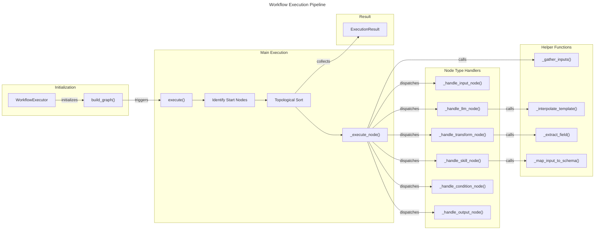
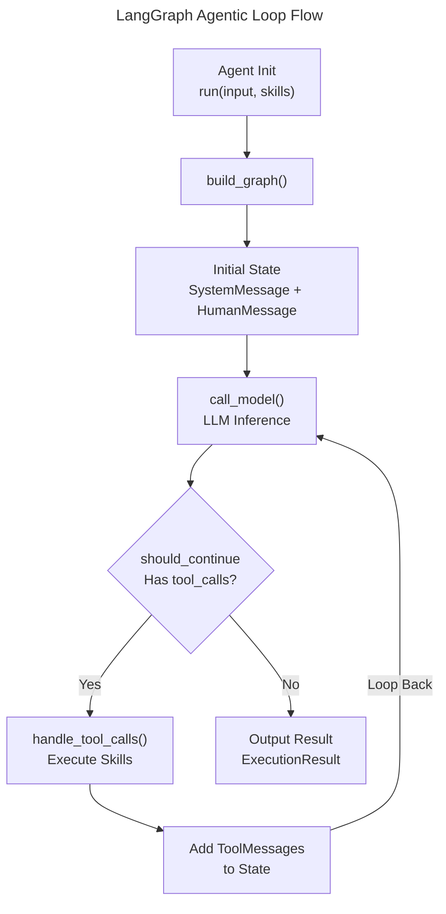
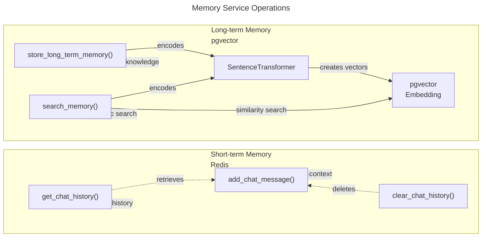

# C4 Code Level: Agent Service Core

## Overview

- **Name**: Agent Service Core Execution Engine
- **Description**: Core execution and orchestration layer for LangGraph-based autonomous agents and React Flow workflow execution
- **Location**: `/ainav-backend/services/agent_service/app/core`
- **Language**: Python 3.11+
- **Purpose**: Provides three complementary execution models for agent-based workflows: direct workflow execution from React Flow graphs, autonomous agent loops with function calling, and memory management for short-term (Redis) and long-term (pgvector) context

## Code Elements

### Classes

#### `NodeResult`
- **Location**: `executor.py:19-41`
- **Description**: Data class representing the result of executing a single node in a workflow
- **Signature**: `@dataclass class NodeResult`
- **Attributes**:
  - `node_id: str` - Unique identifier for the executed node
  - `node_type: str` - Type of node (input, output, llm, skill, transform, condition)
  - `status: str` - Execution status ('success', 'error', 'skipped')
  - `input_data: Any = None` - Data provided as input to the node
  - `output_data: Any = None` - Data produced by the node
  - `error_message: Optional[str] = None` - Error details if execution failed
  - `duration_ms: int = 0` - Time taken to execute in milliseconds
  - `timestamp: datetime = field(default_factory=...)` - Execution timestamp in UTC
- **Methods**:
  - `to_dict() -> dict` - Converts result to dictionary representation for serialization
- **Dependencies**: Python `dataclasses`, `datetime`, `typing`

#### `ExecutionResult`
- **Location**: `executor.py:44-52`
- **Description**: Data class representing the complete result of a full workflow execution
- **Signature**: `@dataclass class ExecutionResult`
- **Attributes**:
  - `output: Any` - Final output from the workflow
  - `logs: list[dict]` - Complete execution logs for all nodes
  - `token_usage: int = 0` - Total LLM tokens consumed
  - `api_calls: int = 0` - Total external API calls made
  - `success: bool = True` - Whether workflow executed successfully
  - `error_message: Optional[str] = None` - Error message if execution failed
- **Dependencies**: Python `dataclasses`, `typing`

#### `WorkflowExecutor`
- **Location**: `executor.py:55-579`
- **Description**: Executes agent workflows defined as React Flow graph JSON. Supports input, output, LLM, skill, transform, and condition node types with topological execution ordering.
- **Signature**: `class WorkflowExecutor`
- **Constructor**: `__init__(self, graph_json: dict, llm_config: dict = None) -> None`
  - `graph_json`: React Flow graph definition with nodes and edges
  - `llm_config`: Configuration for LLM behavior (model, temperature, system_prompt)
- **Instance Variables**:
  - `nodes: dict[str, dict]` - Mapping of node IDs to node definitions
  - `edges: list[dict]` - List of edges connecting nodes
  - `llm_config: dict` - LLM configuration parameters
  - `outgoing: dict[str, list[str]]` - Adjacency list for forward traversal
  - `incoming: dict[str, list[str]]` - Adjacency list for reverse traversal
  - `results: dict[str, NodeResult]` - Execution results keyed by node ID
  - `token_usage: int` - Accumulated token usage tracking
  - `api_calls: int` - Accumulated API call counter
- **Dependencies**: Internal (NodeResult, ExecutionResult), External (httpx for async HTTP, logging)

**Primary Methods**:

- **`async execute(self, initial_input: Any) -> ExecutionResult`** (lines 94-167)
  - **Purpose**: Main workflow execution orchestration using topological ordering
  - **Parameters**: `initial_input: Any` - Initial data to pass into the workflow
  - **Returns**: `ExecutionResult` - Complete execution result with logs and metrics
  - **Algorithm**:
    1. Identifies start nodes (no incoming edges or type='input')
    2. Executes start nodes with initial input
    3. Iteratively executes ready nodes where all predecessors are complete
    4. Gathers final output from output nodes or last executed node
    5. Returns ExecutionResult with logs, token usage, and API call counts
  - **Error Handling**: Catches all exceptions, returns ExecutionResult with error_message

- **`_get_ready_nodes(self, executed: set[str]) -> list[str]`** (lines 169-180)
  - **Purpose**: Identifies nodes whose all predecessors have been executed
  - **Parameters**: `executed: set[str]` - Set of already executed node IDs
  - **Returns**: `list[str]` - List of node IDs ready to execute
  - **Logic**: For each unexecuted node, checks if all incoming predecessors are in executed set

- **`_gather_inputs(self, node_id: str) -> Any`** (lines 182-196)
  - **Purpose**: Gathers and merges outputs from predecessor nodes as input
  - **Parameters**: `node_id: str` - ID of the node needing inputs
  - **Returns**: `Any` - Merged input data (None for no predecessors, single output for one predecessor, dict for multiple)
  - **Logic**:
    - No predecessors: returns None
    - One predecessor: returns its output
    - Multiple predecessors: returns dict with predecessor IDs as keys

- **`async _execute_node(self, node_id: str, input_data: Any) -> NodeResult`** (lines 198-241)
  - **Purpose**: Dispatcher for executing a single node based on its type
  - **Parameters**:
    - `node_id: str` - ID of node to execute
    - `input_data: Any` - Input data for the node
  - **Returns**: `NodeResult` - Result of node execution
  - **Node Types Dispatched**: input, output, llm, skill, transform, condition
  - **Error Handling**: Catches exceptions, returns NodeResult with error status and message
  - **Metrics**: Records execution duration in milliseconds

- **`_handle_input_node(self, node: dict, input_data: Any) -> NodeResult`** (lines 243-257)
  - **Purpose**: Handles input nodes - pass through initial data or use node default
  - **Parameters**:
    - `node: dict` - Node definition from React Flow
    - `input_data: Any` - Input data provided
  - **Returns**: `NodeResult` - Success result with passed-through data
  - **Logic**: If no input provided and node has default, uses default value

- **`_handle_output_node(self, node: dict, input_data: Any) -> NodeResult`** (lines 259-278)
  - **Purpose**: Handles output nodes - formats final result
  - **Parameters**:
    - `node: dict` - Node definition with optional format specification
    - `input_data: Any` - Data to format as output
  - **Returns**: `NodeResult` - Result with formatted output
  - **Formats Supported**: 'json' (JSON string), 'text' (plain string), passthrough

- **`async _handle_llm_node(self, node: dict, input_data: Any) -> NodeResult`** (lines 280-342)
  - **Purpose**: Invokes DeepSeek API for LLM processing
  - **Parameters**:
    - `node: dict` - Node config with prompt, system_prompt, model, temperature, json_output flag
    - `input_data: Any` - Input for prompt interpolation
  - **Returns**: `NodeResult` - LLM output as content
  - **API Details**:
    - Endpoint: `settings.DEEPSEEK_API_URL`
    - Authentication: Bearer token from `settings.DEEPSEEK_API_KEY`
    - Response Format: Supports optional JSON mode
    - Timeout: 60 seconds
  - **Prompt Interpolation**: Uses `_interpolate_template()` to inject input into prompt template
  - **Token Tracking**: Extracts and accumulates token usage from API response
  - **JSON Output**: Automatically parses JSON response if requested

- **`async _handle_skill_node(self, node: dict, input_data: Any) -> NodeResult`** (lines 344-429)
  - **Purpose**: Executes external API skills with parameter mapping and auth handling
  - **Parameters**:
    - `node: dict` - Skill config with api_endpoint, http_method, input_schema, auth_type, auth_config
    - `input_data: Any` - Input data to map to API parameters
  - **Returns**: `NodeResult` - API response parsed as JSON or text
  - **HTTP Methods**: GET, POST, PUT, PATCH support with appropriate parameter/body handling
  - **Authentication Types**:
    - Bearer: Reads token from environment variable, prepends "Bearer " prefix
    - API Key: Reads key from environment variable, sets custom header
  - **Parameter Mapping**: Uses `_map_input_to_schema()` to match input fields to API schema
  - **Error Handling**: Returns error result if API returns non-2xx status
  - **Timeout**: 30 seconds per request

- **`_handle_transform_node(self, node: dict, input_data: Any) -> NodeResult`** (lines 431-471)
  - **Purpose**: Applies data transformations without external API calls
  - **Parameters**:
    - `node: dict` - Transform config with transform_type and relevant parameters
    - `input_data: Any` - Data to transform
  - **Returns**: `NodeResult` - Transformed output
  - **Transform Types**:
    - `passthrough`: Returns input unchanged
    - `extract`: Extracts field using dot notation via `_extract_field()`
    - `template`: Applies string template interpolation via `_interpolate_template()`
    - `json_parse`: Parses JSON string to object
    - `json_stringify`: Converts object to JSON string
    - `array_join`: Joins array elements with separator
  - **Error Handling**: Catches transformation errors, returns error result

- **`_handle_condition_node(self, node: dict, input_data: Any) -> NodeResult`** (lines 473-507)
  - **Purpose**: Evaluates conditions for branching in workflows
  - **Parameters**:
    - `node: dict` - Condition config with condition_type, field, value
    - `input_data: Any` - Data to evaluate against
  - **Returns**: `NodeResult` - Result dict with boolean 'result' and extracted 'value'
  - **Condition Types**:
    - `equals`: exact equality
    - `not_equals`: inequality
    - `contains`: substring/value containment
    - `greater_than`: numeric greater than comparison
    - `less_than`: numeric less than comparison
    - `is_empty`: falsy check
    - `is_not_empty`: truthy check
  - **Field Extraction**: Uses `_extract_field()` for nested field access

**Helper Methods**:

- **`_interpolate_template(self, template: str, data: Any) -> str`** (lines 509-527)
  - **Purpose**: Replaces {{variable}} placeholders in templates
  - **Parameters**:
    - `template: str` - Template string with {{}} placeholders
    - `data: Any` - Data source for interpolation
  - **Returns**: `str` - Interpolated template string
  - **Features**:
    - {{input}} for main input
    - {{field.path}} for nested field access via flattened dict

- **`_flatten_dict(self, d: dict, parent_key: str = '', sep: str = '.') -> dict`** (lines 529-538)
  - **Purpose**: Flattens nested dictionary for template variable access
  - **Parameters**:
    - `d: dict` - Dictionary to flatten
    - `parent_key: str = ''` - Parent key prefix for recursion
    - `sep: str = '.'` - Separator for nested keys
  - **Returns**: `dict` - Flattened dictionary with dot-notation keys

- **`_extract_field(self, data: Any, field_path: str) -> Any`** (lines 540-560)
  - **Purpose**: Extracts nested field using dot notation (e.g., "response.data.items.0.name")
  - **Parameters**:
    - `data: Any` - Data source to extract from
    - `field_path: str` - Dot-notation path to field (supports array indexing)
  - **Returns**: `Any` - Extracted value or None if not found
  - **Features**:
    - Handles dict key access
    - Supports array indexing with integer parsing
    - Returns None for missing/invalid paths

- **`_map_input_to_schema(self, input_data: Any, schema: dict) -> dict`** (lines 562-578)
  - **Purpose**: Maps input data to API request schema using x-mapping directives
  - **Parameters**:
    - `input_data: Any` - Input data to map
    - `schema: dict` - JSON Schema with properties and optional x-mapping
  - **Returns**: `dict` - Mapped request body
  - **Mapping Logic**:
    - Checks for x-mapping directive in each property
    - Extracts field via `_extract_field()` if mapping specified
    - Falls back to direct matching for input dicts

---

#### `MemoryService`
- **Location**: `memory_service.py:14-125`
- **Description**: Manages short-term (Redis) and long-term (pgvector) memory for agent sessions with multilingual embedding support
- **Signature**: `class MemoryService`
- **Constructor**: `__init__(self) -> None`
  - Initializes Redis async connection from `settings.REDIS_URL`
  - Loads SentenceTransformer model 'paraphrase-multilingual-MiniLM-L12-v2' for embeddings
- **Instance Variables**:
  - `redis: redis.asyncio.Redis` - Async Redis client
  - `embedder: SentenceTransformer` - Embedding model for Chinese-English support
- **Dependencies**:
  - External: redis.asyncio, sqlalchemy, sentence_transformers
  - Internal: shared.config.settings, shared.models.AgentMemory

**Methods**:

- **`async add_chat_message(self, workflow_id: str, session_id: str, role: str, content: str) -> None`** (lines 24-41)
  - **Purpose**: Stores chat messages in Redis short-term history
  - **Parameters**:
    - `workflow_id: str` - Workflow identifier
    - `session_id: str` - Session identifier
    - `role: str` - Message role (user, assistant, system)
    - `content: str` - Message text content
  - **Storage**:
    - Key format: `chat_history:{workflow_id}:{session_id}`
    - Uses Redis RPUSH for list append
    - TTL: 7 days (604,800 seconds)
  - **Data Structure**: Stores as JSON with role, content, ISO timestamp

- **`async get_chat_history(self, workflow_id: str, session_id: str, limit: int = 50) -> List[Dict[str, Any]]`** (lines 43-49)
  - **Purpose**: Retrieves chat history from Redis
  - **Parameters**:
    - `workflow_id: str` - Workflow identifier
    - `session_id: str` - Session identifier
    - `limit: int = 50` - Maximum number of messages to retrieve
  - **Returns**: `List[Dict[str, Any]]` - List of message dicts with role, content, timestamp
  - **Redis Operation**: LRANGE with negative indices (last N items)

- **`async clear_chat_history(self, workflow_id: str, session_id: str) -> None`** (lines 51-56)
  - **Purpose**: Clears all chat history for a session
  - **Parameters**:
    - `workflow_id: str` - Workflow identifier
    - `session_id: str` - Session identifier
  - **Redis Operation**: DEL on chat_history key

- **`async store_long_term_memory(self, db: AsyncSession, workflow_id: str, content: str, content_type: str = "conversation", metadata: Optional[Dict[str, Any]] = None) -> None`** (lines 58-80)
  - **Purpose**: Stores content in pgvector long-term memory with embeddings
  - **Parameters**:
    - `db: AsyncSession` - SQLAlchemy async session
    - `workflow_id: str` - Workflow identifier
    - `content: str` - Content to store
    - `content_type: str = "conversation"` - Type of content (e.g., conversation, observation, insight)
    - `metadata: Optional[Dict[str, Any]] = None` - Additional metadata
  - **Processing**:
    - Encodes content using SentenceTransformer to 384-dim vector
    - Creates AgentMemory record with embedding
    - Persists to database via db.commit()
  - **Database**: PostgreSQL with pgvector extension

- **`async search_memory(self, db: AsyncSession, workflow_id: str, query: str, limit: int = 5) -> List[AgentMemory]`** (lines 82-123)
  - **Purpose**: Semantic similarity search over long-term memories using pgvector
  - **Parameters**:
    - `db: AsyncSession` - SQLAlchemy async session
    - `workflow_id: str` - Filter to workflow's memories only
    - `query: str` - Query string to search for
    - `limit: int = 5` - Maximum results to return
  - **Returns**: `List[AgentMemory]` - Matching memory records with metadata
  - **Algorithm**:
    1. Encodes query to 384-dim vector
    2. Uses pgvector <=> (cosine distance) operator
    3. Orders by similarity
    4. Limits results
  - **Database**: Raw SQL with pgvector vector type
  - **Return Format**: List of dicts with id, content, content_type, metadata

**Module-level**:
- `memory_service = MemoryService()` (line 125) - Singleton instance for application use

---

#### `AgentState`
- **Location**: `agentic_executor.py:25-33`
- **Description**: TypedDict defining the state that flows through the LangGraph agentic loop
- **Signature**: `class AgentState(TypedDict)`
- **Fields**:
  - `messages: Annotated[List[BaseMessage], operator.add]` - Message list with append operator (LangGraph accumulation)
  - `workflow_id: str` - Current workflow identifier
  - `session_id: str` - Current session identifier
  - `available_tools: List[Dict[str, Any]]` - OpenAI-format tool definitions
  - `execution_result: Optional[Dict[str, Any]]` - Result from most recent tool execution
  - `token_usage: int` - Accumulated token usage counter
  - `api_calls: int` - Accumulated API call counter
- **Dependencies**: typing (Annotated, TypedDict), operator, langchain_core.messages

#### `AgenticExecutor`
- **Location**: `agentic_executor.py:35-221`
- **Description**: Autonomous agent using LangGraph with DeepSeek function calling for dynamic tool selection and execution
- **Signature**: `class AgenticExecutor`
- **Constructor**: `__init__(self, workflow_id: str, session_id: str, llm_config: dict = None) -> None`
  - **Parameters**:
    - `workflow_id: str` - Workflow identifier for execution context
    - `session_id: str` - Session identifier for tracking
    - `llm_config: dict = None` - Optional LLM configuration (model, temperature, system_prompt)
  - **Initialization**: Creates ChatOpenAI client with DeepSeek API backend
- **Instance Variables**:
  - `workflow_id: str` - Workflow context
  - `session_id: str` - Session context
  - `llm_config: dict` - LLM configuration with defaults
  - `llm: ChatOpenAI` - DeepSeek LLM client
- **Dependencies**:
  - External: langchain_openai.ChatOpenAI, langchain_core.messages, langgraph.graph, httpx
  - Internal: shared.config.settings, shared.models.Skill

**Methods**:

- **`_get_openai_tools(self, skills: List[Skill]) -> List[Dict[str, Any]]`** (lines 54-72)
  - **Purpose**: Converts database Skill objects to OpenAI tool/function format
  - **Parameters**: `skills: List[Skill]` - Skill models from database
  - **Returns**: `List[Dict[str, Any]]` - OpenAI-format tool definitions
  - **Transformation**:
    - Type: "function"
    - Name: skill.slug with dashes replaced by underscores
    - Description: skill.description or skill.name
    - Parameters: Uses skill.input_schema or defaults to simple query parameter

- **`async _execute_skill(self, tool_call: Dict[str, Any]) -> Any`** (lines 74-124)
  - **Purpose**: Executes a tool skill call with HTTP request
  - **Parameters**: `tool_call: Dict[str, Any]` - Tool call from LLM with name and arguments
  - **Returns**: `Any` - API response (JSON dict/list) or error string
  - **Process**:
    1. Looks up Skill by slug in database
    2. Prepares HTTP request with method, endpoint, headers
    3. Handles Bearer and API key authentication from environment
    4. Executes async HTTP request with 30s timeout
    5. Returns JSON response or error message
  - **Error Handling**: Catches all exceptions, logs and returns exception message
  - **Authentication**: Reads tokens from environment variables specified in skill.auth_config

- **`async call_model(self, state: AgentState) -> Dict[str, Any]`** (lines 126-145)
  - **Purpose**: Invokes the LLM to process messages and potentially call tools
  - **Parameters**: `state: AgentState` - Current agent state with messages
  - **Returns**: `Dict[str, Any]` - State update with new message and updated token usage
  - **Process**:
    1. Binds available tools to LLM via bind_tools()
    2. Invokes LLM asynchronously with ainvoke()
    3. Extracts token usage from response metadata
    4. Returns state update with response message appended
  - **Token Tracking**: Accumulates from response_metadata.token_usage.total_tokens

- **`async handle_tool_calls(self, state: AgentState) -> Dict[str, Any]`** (lines 147-163)
  - **Purpose**: Executes tool calls from LLM's last message and returns results
  - **Parameters**: `state: AgentState` - Current agent state
  - **Returns**: `Dict[str, Any]` - State update with ToolMessage results
  - **Process**:
    1. Checks last message for tool_calls
    2. For each tool call, invokes _execute_skill()
    3. Creates ToolMessage with call ID and JSON-serialized result
    4. Returns state update with tool messages appended
  - **Message Format**: LangChain ToolMessage with tool_call_id linking to request

- **`def should_continue(self, state: AgentState) -> str`** (lines 165-170)
  - **Purpose**: Routing function to determine if loop should continue or end
  - **Parameters**: `state: AgentState` - Current agent state
  - **Returns**: `str` - "tools" to execute tools, "end" to finish
  - **Logic**:
    - If last message is AIMessage with tool_calls: route to "tools"
    - Otherwise: route to "end"

- **`def build_graph(self) -> StateGraph`** (lines 172-192)
  - **Purpose**: Constructs the LangGraph agentic loop
  - **Returns**: `StateGraph` - Compiled LangGraph workflow
  - **Graph Structure**:
    - Nodes: "agent" (LLM), "tools" (skill execution)
    - Entry point: "agent"
    - Conditional edges: From agent to tools or end based on should_continue()
    - Loop back: From tools to agent
  - **Compilation**: Returns app.compile() for ainvoke execution

- **`async run(self, input_text: str, skills: List[Skill]) -> Dict[str, Any]`** (lines 194-221)
  - **Purpose**: Main execution entry point for autonomous agent
  - **Parameters**:
    - `input_text: str` - User input/query to process
    - `skills: List[Skill]` - Available skills for agent use
  - **Returns**: `Dict[str, Any]` - Execution result with output, token_usage, api_calls, history
  - **Execution Flow**:
    1. Builds execution graph
    2. Gets system prompt from config or uses default
    3. Constructs initial state with system and user messages
    4. Executes graph asynchronously
    5. Extracts final message content as output
    6. Returns metrics and message history
  - **Return Format**:
    - `output`: Final message content string
    - `token_usage`: Total tokens consumed
    - `api_calls`: Total API calls made
    - `history`: Full message history as dicts

---

## Dependencies

### Internal Dependencies

From `/ainav-backend` shared layer:
- **`shared.config.settings`** - Configuration management with DEEPSEEK_API_KEY, DEEPSEEK_API_URL, REDIS_URL
- **`shared.database.get_async_session`** - Async SQLAlchemy session factory for database operations
- **`shared.models.Skill`** - ORM model representing tool capabilities (slug, description, input_schema, http_method, api_endpoint, auth_type, auth_config, headers_template)
- **`shared.models.AgentMemory`** - ORM model for storing vector embeddings (workflow_id, content, content_type, meta_data, embedding)

### External Dependencies

**LLM & Agent Framework**:
- `langchain_openai` (ChatOpenAI) - OpenAI-compatible LLM integration for DeepSeek
- `langchain_core.messages` (BaseMessage, HumanMessage, AIMessage, SystemMessage, ToolMessage) - Message types for conversation flow
- `langgraph.graph` (StateGraph, END) - Graph-based workflow orchestration
- `langgraph.prebuilt` (ToolNode) - Prebuilt tool execution node (imported but not used in current code)

**Database & Async**:
- `sqlalchemy` (select, text) - Query construction and raw SQL execution
- `sqlalchemy.ext.asyncio` (AsyncSession) - Async ORM session
- `redis.asyncio` - Asynchronous Redis client
- `sentence_transformers` (SentenceTransformer) - Multilingual embedding model

**HTTP & Utilities**:
- `httpx` (AsyncClient) - Asynchronous HTTP client for API calls
- `json` - JSON encoding/decoding
- `logging` - Application logging
- `operator` - For operator.add in LangGraph state annotation
- `datetime`, `timezone` - Timestamp management
- `typing` - Type hints (Annotated, Any, Dict, List, Optional, TypedDict, Union)

---

## Relationships

### Code Element Dependency Graph

```mermaid
---
title: Agent Service Core - Code-Level Relationships
---
classDiagram
    namespace WorkflowExecution {
        class WorkflowExecutor {
            -nodes: dict~str, dict~
            -edges: list~dict~
            -results: dict~str, NodeResult~
            +execute(initial_input: Any) ExecutionResult
            -_execute_node(node_id: str, input_data: Any) NodeResult
            -_handle_input_node(node: dict, input_data: Any) NodeResult
            -_handle_output_node(node: dict, input_data: Any) NodeResult
            -_handle_llm_node(node: dict, input_data: Any) NodeResult
            -_handle_skill_node(node: dict, input_data: Any) NodeResult
            -_handle_transform_node(node: dict, input_data: Any) NodeResult
            -_handle_condition_node(node: dict, input_data: Any) NodeResult
            -_gather_inputs(node_id: str) Any
            -_get_ready_nodes(executed: set~str~) list~str~
            -_interpolate_template(template: str, data: Any) str
            -_extract_field(data: Any, field_path: str) Any
            -_flatten_dict(d: dict) dict
            -_map_input_to_schema(input_data: Any, schema: dict) dict
        }
        class NodeResult {
            +node_id: str
            +node_type: str
            +status: str
            +input_data: Any
            +output_data: Any
            +error_message: Optional~str~
            +duration_ms: int
            +timestamp: datetime
            +to_dict() dict
        }
        class ExecutionResult {
            +output: Any
            +logs: list~dict~
            +token_usage: int
            +api_calls: int
            +success: bool
            +error_message: Optional~str~
        }
    }

    namespace AgenticLoop {
        class AgenticExecutor {
            -workflow_id: str
            -session_id: str
            -llm_config: dict
            -llm: ChatOpenAI
            +run(input_text: str, skills: List~Skill~) dict
            -_get_openai_tools(skills: List~Skill~) list~dict~
            -_execute_skill(tool_call: dict) Any
            +call_model(state: AgentState) dict
            +handle_tool_calls(state: AgentState) dict
            +should_continue(state: AgentState) str
            +build_graph() StateGraph
        }
        class AgentState {
            +messages: list~BaseMessage~
            +workflow_id: str
            +session_id: str
            +available_tools: list~dict~
            +execution_result: Optional~dict~
            +token_usage: int
            +api_calls: int
        }
    }

    namespace MemoryManagement {
        class MemoryService {
            -redis: redis.asyncio.Redis
            -embedder: SentenceTransformer
            +add_chat_message(workflow_id: str, session_id: str, role: str, content: str) None
            +get_chat_history(workflow_id: str, session_id: str, limit: int) list~dict~
            +clear_chat_history(workflow_id: str, session_id: str) None
            +store_long_term_memory(db: AsyncSession, workflow_id: str, content: str, content_type: str, metadata: dict) None
            +search_memory(db: AsyncSession, workflow_id: str, query: str, limit: int) list~dict~
        }
    }

    WorkflowExecutor --> NodeResult : produces
    WorkflowExecutor --> ExecutionResult : returns
    NodeResult --> "*" : composes

    AgenticExecutor --> AgentState : manages
    AgenticExecutor --> ChatOpenAI : uses for LLM
    AgenticExecutor --|> "*" Skill : queries/executes

    MemoryService --> AgentMemory : persists to
    MemoryService --> redis : reads/writes from
    MemoryService --> SentenceTransformer : uses for embeddings
```

### Execution Flow Relationships



### Agentic Loop Execution



### Memory Service Integration



---

## Technology Stack

### Core Technologies

| Component | Technology | Purpose |
|-----------|-----------|---------|
| LLM Integration | LangChain, ChatOpenAI | DeepSeek API integration with function calling |
| Agent Framework | LangGraph | Graph-based workflow orchestration and agentic loops |
| Embeddings | Sentence Transformers | Multilingual (Chinese-English) embedding generation |
| HTTP Client | httpx | Asynchronous HTTP requests to external APIs |
| Database ORM | SQLAlchemy 2.0 async | Async database operations with pgvector support |
| Vector Database | PostgreSQL + pgvector | Long-term memory with vector similarity search |
| Cache/Queue | Redis | Short-term chat history and session management |
| Languages | Python 3.11+ | Implementation language |
| Async Runtime | asyncio | Python async/await concurrency |

### Supported Node Types in Workflows

1. **Input Node** - Entry point with optional default values
2. **Output Node** - Exit point with optional JSON/text formatting
3. **LLM Node** - DeepSeek API calls with prompt templates
4. **Skill Node** - External REST API calls with schema mapping
5. **Transform Node** - Data transformation (extract, template, join, parse)
6. **Condition Node** - Branching logic with multiple comparison operators

### Agent Capabilities

- **Function Calling**: Dynamic tool selection from Skill definitions
- **Tool Integration**: Execute arbitrary HTTP-based APIs as skills
- **Context Management**: Short-term Redis and long-term pgvector memory
- **Message Tracking**: Full conversation history with token usage
- **Error Handling**: Graceful degradation with detailed error messages
- **Extensibility**: New node types and tool types can be added via handlers

---

## Notes

### Architecture Highlights

1. **Dual Execution Models**:
   - `WorkflowExecutor`: Deterministic React Flow graph execution for complex workflows
   - `AgenticExecutor`: Autonomous agent loop with dynamic tool selection

2. **Memory Strategy**:
   - Redis for ephemeral session-based chat history (7-day TTL)
   - pgvector for persistent semantic memory with similarity search
   - Multilingual embeddings for Chinese-English content

3. **Type Safety**:
   - TypedDict for LangGraph state definition
   - Dataclasses for NodeResult and ExecutionResult
   - Type hints throughout for IDE support

4. **Async-First Design**:
   - All I/O operations are async (database, Redis, HTTP)
   - Enables high concurrency for multi-workflow execution
   - Uses httpx.AsyncClient for skill API calls

5. **Extensibility Points**:
   - Node handlers in WorkflowExecutor can be extended
   - Skill types determined by OpenAI tool schema
   - Transform types support custom logic in _handle_transform_node

### Security Considerations

- **Authentication**: Bearer token and API key auth from environment variables
- **Isolation**: Separate workflow_id/session_id for user context isolation
- **Timeout Protection**: 30s for skill APIs, 60s for LLM calls
- **Error Messages**: Non-sensitive error details returned to users

### Performance Characteristics

- **Topological Execution**: Parallel-ready node execution in dependency order
- **Token Tracking**: Accurate LLM token usage aggregation
- **API Call Counting**: Enables rate limiting and cost analysis
- **Duration Metrics**: Per-node execution timing for profiling

### Database Schema Assumptions

The code assumes:
- `agent_memories` table with pgvector extension for embedding column
- `skills` table with slug as unique identifier
- PostgreSQL with asyncpg driver
- pgvector extension enabled for vector similarity (<=> operator)
