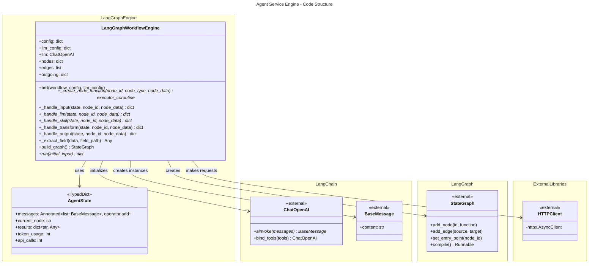

# C4 Code Level: Agent Service Engine

## Overview

- **Name**: LangGraph Workflow Engine
- **Description**: Compiles React Flow graph configurations into executable LangGraph workflows. Provides a declarative, visual approach to building multi-step agent workflows with support for LLM calls, external tool/skill invocations, data transformations, and state management.
- **Location**: `/home/dislove/document/ai 导航/ainav-backend/services/agent_service/app/engine`
- **Language**: Python 3.11+
- **Purpose**: Transforms visual workflow definitions (React Flow graphs in JSON format) into executable LangGraph state machines, enabling non-technical users to compose complex AI workflows through a drag-and-drop interface. Acts as the execution runtime for the agent workflow builder.

## Code Elements

### Modules

#### `engine/__init__.py`
- **Purpose**: Package initialization and public API exposure
- **Location**: `/home/dislove/document/ai 导航/ainav-backend/services/agent_service/app/engine/__init__.py`
- **Exports**: `LangGraphWorkflowEngine`

#### `engine/langgraph_engine.py`
- **Purpose**: Core workflow compilation and execution engine
- **Location**: `/home/dislove/document/ai 导航/ainav-backend/services/agent_service/app/engine/langgraph_engine.py`
- **Key Responsibilities**:
  - Parse React Flow graph JSON configurations
  - Create executable node functions for each workflow step
  - Build LangGraph state machines with proper edge connections
  - Execute workflows with state management and error handling

### Classes

#### `AgentState(TypedDict)`
```python
class AgentState(TypedDict):
    messages: Annotated[list[BaseMessage], operator.add]
    current_node: str
    results: dict[str, Any]
    token_usage: int
    api_calls: int
```

- **Description**: Type-safe state container that flows through the LangGraph workflow
- **Location**: `langgraph_engine.py:26-32`
- **Attributes**:
  - `messages`: List of conversation messages (chat history, accumulated across nodes)
  - `current_node`: Identifier of the currently executing node
  - `results`: Dictionary mapping node IDs to their output results (accumulates across execution)
  - `token_usage`: Total tokens consumed by LLM calls (cumulative)
  - `api_calls`: Total external API calls made (cumulative)
- **Pattern**: Uses operator.add for message aggregation to support LangGraph's reducer pattern

#### `LangGraphWorkflowEngine`
```python
class LangGraphWorkflowEngine:
    """
    Compiles React Flow graph configurations into executable LangGraph workflows.

    Supports node types:
    - input: Entry point, initializes state
    - output: Exit point, returns final results
    - llm: DeepSeek LLM call with prompt template
    - tool/skill: External API call
    - transform: Data transformation
    """
```

- **Description**: Main orchestrator that transforms visual workflow definitions into executable LangGraph state machines
- **Location**: `langgraph_engine.py:39-329`
- **Initialization**: `__init__(self, workflow_config: dict, llm_config: dict = None) -> None`
  - Parameters:
    - `workflow_config`: React Flow graph dict with "nodes" and "edges" keys
    - `llm_config`: Optional LLM configuration (model, temperature, system_prompt)
  - Side effects:
    - Initializes ChatOpenAI client with DeepSeek API credentials
    - Parses nodes and edges from config
    - Builds node ID -> node metadata mapping
    - Constructs adjacency list for outgoing edges
- **Location**: `langgraph_engine.py:51-74`

### Methods

#### `LangGraphWorkflowEngine._create_node_function(node_id: str, node_type: str, node_data: dict)`
```python
def _create_node_function(self, node_id: str, node_type: str, node_data: dict):
    async def node_executor(state: AgentState) -> dict:
```

- **Description**: Factory method that creates executable async functions for each visual node
- **Returns**: Coroutine function that executes the node logic
- **Location**: `langgraph_engine.py:76-110`
- **Responsibilities**:
  - Log node execution start
  - Dispatch to appropriate handler based on node_type
  - Catch and log exceptions with error context
  - Return state updates as dict
- **Error Handling**: Wraps exceptions in results dict with error key

#### `LangGraphWorkflowEngine._handle_input(state: AgentState, node_id: str, node_data: dict) -> dict`
- **Description**: Processes input node - entry point that initializes or passes through initial data
- **Returns**: Dict with updated current_node and results containing the input message
- **Location**: `langgraph_engine.py:112-118`
- **Logic**: Extracts the last message content from the state as the input

#### `LangGraphWorkflowEngine._handle_llm(state: AgentState, node_id: str, node_data: dict) -> dict`
```python
async def _handle_llm(self, state: AgentState, node_id: str, node_data: dict) -> dict
```

- **Description**: Processes LLM node - calls DeepSeek API with prompt template and context
- **Returns**: Dict with messages, current_node, results, token_usage, and api_calls updates
- **Location**: `langgraph_engine.py:120-155`
- **Parameters**:
  - `node_data["prompt"]`: Jinja2-style template (e.g., "{{input}}", "{{context}}")
  - `node_data["system_prompt"]`: Optional system message override
- **Logic**:
  1. Build prompt from template with context from previous results
  2. Construct message list with system prompt + history + human message
  3. Call LLM asynchronously
  4. Extract token usage from response metadata
  5. Return response message and updated state
- **Async**: Uses `await self.llm.ainvoke(messages)` for non-blocking execution

#### `LangGraphWorkflowEngine._handle_skill(state: AgentState, node_id: str, node_data: dict) -> dict`
```python
async def _handle_skill(self, state: AgentState, node_id: str, node_data: dict) -> dict
```

- **Description**: Processes tool/skill node - makes external HTTP API calls
- **Returns**: Dict with messages, current_node, results, and api_calls update
- **Location**: `langgraph_engine.py:157-210`
- **Configuration**:
  - `node_data["skill"]` or `node_data["tool"]`: Contains api_endpoint, http_method, headers_template
  - Supports: GET, POST, PUT, PATCH methods
- **Logic**:
  1. Extract endpoint URL and HTTP method from node config
  2. Get context from previous results
  3. Build headers from template
  4. Make async HTTP request with httpx.AsyncClient
  5. Parse JSON or text response
  6. Handle timeout (30s) and network errors
  7. Return result as AIMessage
- **Error Handling**: Catches exceptions and returns error dict

#### `LangGraphWorkflowEngine._handle_transform(state: AgentState, node_id: str, node_data: dict) -> dict`
- **Description**: Processes transform node - performs data manipulation on previous results
- **Returns**: Dict with updated current_node and results
- **Location**: `langgraph_engine.py:212-233`
- **Transform Types**:
  - `"extract"`: Extract nested field using dot notation (e.g., "data.items.0.name")
  - `"template"`: String interpolation using {{input}} placeholder
  - `"passthrough"`: Return input unchanged
- **Logic**: Gets last result, applies transformation, returns transformed output

#### `LangGraphWorkflowEngine._handle_output(state: AgentState, node_id: str, node_data: dict) -> dict`
- **Description**: Processes output node - collects final results for workflow completion
- **Returns**: Dict with final_output mapped to both node_id and "_final" key
- **Location**: `langgraph_engine.py:235-249`
- **Logic**: Scans through all accumulated results and returns the last non-None value

#### `LangGraphWorkflowEngine._extract_field(data: Any, field_path: str) -> Any`
- **Description**: Utility for nested field extraction using dot notation
- **Returns**: Extracted value or None if path invalid
- **Location**: `langgraph_engine.py:251-270`
- **Logic**:
  1. Split field path by "."
  2. Traverse nested dicts/lists
  3. Handle list indexing with integer conversion
  4. Return None if path breaks at any point
- **Examples**:
  - "data.results" -> accesses nested dict
  - "items.0.name" -> accesses list element [0] then dict key "name"

#### `LangGraphWorkflowEngine.build_graph() -> StateGraph`
- **Description**: Compiles the React Flow JSON config into a compiled LangGraph
- **Returns**: Compiled StateGraph ready for execution (not runnable, use .invoke)
- **Location**: `langgraph_engine.py:272-306`
- **Algorithm**:
  1. Create StateGraph with AgentState type
  2. Add all nodes from config with their executor functions
  3. Add all edges from config as node-to-node transitions
  4. Auto-detect entry point (node with no incoming edges)
  5. Auto-detect exit point(s) (nodes with no outgoing edges)
  6. Connect exit nodes to LangGraph END
  7. Compile the graph
- **Entry Point Resolution**: Falls back to first node if no entry detected

#### `LangGraphWorkflowEngine.run(initial_input: str) -> dict`
```python
async def run(self, initial_input: str) -> dict
```

- **Description**: Executes the compiled workflow with initial user input
- **Returns**: Dict with output, trace, token_usage, and api_calls
- **Location**: `langgraph_engine.py:308-329`
- **Parameters**:
  - `initial_input`: User's initial message/query to start the workflow
- **Logic**:
  1. Build the LangGraph
  2. Initialize AgentState with input message
  3. Execute graph asynchronously with ainvoke
  4. Extract final output from results
  5. Return execution summary with token/API tracking
- **Async**: Fully asynchronous execution for non-blocking operation
- **Return Structure**:
  ```python
  {
      "output": str,           # Final workflow result
      "trace": dict,           # All intermediate results by node_id
      "token_usage": int,      # Total LLM tokens consumed
      "api_calls": int         # Total external API calls
  }
  ```

## Dependencies

### Internal Dependencies

**Shared Modules** (from `/home/dislove/document/ai 导航/ainav-backend/shared/`):
- `shared.config.settings`: Configuration class with DEEPSEEK_API_KEY and DEEPSEEK_API_URL
- `shared.database`: Database connection (not directly used in engine, but used in calling code)
- `shared.models`: SQLAlchemy ORM models (not directly used, used by integration layer)

**Agent Service Modules**:
- `agent_service.app.core.agentic_executor`: Alternative executor using LangGraph function calling (sibling component)
- `agent_service.app.core.executor`: Base NodeResult class (potential reuse)
- `agent_service.app.routers.chat`: Calls engine for workflow execution
- `agent_service.app.routers.workflows`: Calls engine to build/test workflows
- `agent_service.app.routers.executions`: Calls engine to replay/debug executions

### External Dependencies

**LangChain Ecosystem**:
- `langchain_core.messages`: Message types (BaseMessage, HumanMessage, AIMessage, SystemMessage)
  - Purpose: Type-safe conversation state management
  - Used in: All node handlers, AgentState definition
- `langchain_openai.ChatOpenAI`: OpenAI-compatible LLM client
  - Purpose: Call DeepSeek API (OpenAI-compatible endpoint)
  - Configuration: API key, base URL, model, temperature
  - Used in: `__init__`, `_handle_llm`

**LangGraph**:
- `langgraph.graph.StateGraph`: Graph construction API
  - Purpose: Build executable state machines with typed state
  - Used in: `build_graph()`
- `langgraph.graph.END`: Sentinel for workflow termination
  - Purpose: Mark final nodes
  - Used in: `build_graph()` to connect exit nodes

**Standard Library**:
- `operator.add`: Reducer function for message accumulation
  - Purpose: Enable LangGraph's reducer pattern for list fields
  - Used in: AgentState type definition
- `typing`: Type hints (Annotated, Any, TypedDict)
- `datetime`: Timestamps for execution tracking
- `logging`: Event logging

**HTTP Client**:
- `httpx.AsyncClient`: Async HTTP client for external API calls
  - Purpose: Non-blocking HTTP requests for skill/tool nodes
  - Configuration: 30-second timeout, JSON/text response parsing
  - Used in: `_handle_skill()`

**Environment/Configuration**:
- Settings from `shared.config`:
  - `DEEPSEEK_API_KEY`: Required for LLM initialization
  - `DEEPSEEK_API_URL`: DeepSeek endpoint (default: https://api.deepseek.com/v1/chat/completions)

## Architecture Patterns

### 1. Factory Pattern
The `_create_node_function()` method uses a factory pattern to dynamically create executor functions for each node type. This allows:
- Different execution logic per node type
- Closure over node-specific configuration
- Lazy instantiation of node executors

### 2. Reducer Pattern (LangGraph)
The `AgentState` uses `Annotated[list[BaseMessage], operator.add]` to implement LangGraph's reducer pattern:
- Messages automatically accumulate across node transitions
- No explicit state merging needed
- Supports multi-turn conversations naturally

### 3. Async/Await for Concurrency
- `_handle_llm()` and `_handle_skill()` are async for non-blocking I/O
- `run()` is async to support concurrent workflow execution
- Uses `await self.llm.ainvoke()` and `httpx.AsyncClient` for non-blocking operations

### 4. Configuration-Driven Execution
- Entire workflow logic defined in JSON config (React Flow format)
- No hardcoded business logic in node handlers
- Enables visual workflow builder without code changes
- Supports custom templates and data transformations

### 5. Error Resilience
- Try-catch in node executor factory for graceful error handling
- Exception details captured in results dict
- Workflow continues even if individual nodes fail
- Enables debugging and error recovery

## Node Type Specifications

### Input Node
- **Purpose**: Entry point, initializes state with user input
- **Config**: Can contain prompt text or instructions
- **Output**: Passes through initial message

### LLM Node
- **Purpose**: Call DeepSeek for text generation/reasoning
- **Config Keys**:
  - `prompt`: Template with {{input}} and {{context}} placeholders
  - `system_prompt`: Optional system message
- **LLM Config**: model, temperature, system_prompt
- **Output**: LLM response text

### Tool/Skill Node
- **Purpose**: Call external HTTP APIs
- **Config Keys**:
  - `skill` or `tool`: Contains api_endpoint, http_method, headers_template
- **HTTP Methods**: GET (params), POST/PUT/PATCH (JSON body)
- **Output**: API response (JSON or text)

### Transform Node
- **Purpose**: Data manipulation
- **Config Keys**:
  - `transform_type`: "extract", "template", or "passthrough"
  - `field`: Dot-notation path for extract (e.g., "data.items.0.name")
  - `template`: String template with {{input}} placeholder
- **Output**: Transformed data

### Output Node
- **Purpose**: Final result collection
- **Config**: Optional formatting instructions
- **Output**: Final workflow result

## State Flow

```
Initial Input
    ↓
Entry Node (auto-detected first or node with no incoming edges)
    ↓
[Node Executor] → Updates AgentState
    • messages: accumulates with operator.add
    • results: {node_id: value}
    • token_usage: cumulative
    • api_calls: cumulative
    ↓
[Next Node via Edge] → Similar state update
    ↓
[Multiple passes through nodes possible]
    ↓
Exit Node (node with no outgoing edges) → END
    ↓
Final AgentState returned with all trace data
```

## Error Handling Strategy

1. **Node-Level Errors**: Caught in `_create_node_function()`, returned as error dict in results
2. **HTTP Errors**: Caught in `_handle_skill()`, returned as error dict
3. **LLM Errors**: Caught in `_handle_llm()` (via `ainvoke`), re-raised or returned as error
4. **Workflow-Level**: Graph execution returns final state regardless of individual node failures
5. **Logging**: All exceptions logged at ERROR level with node context

## Usage Example

```python
# Define workflow in React Flow JSON
workflow_config = {
    "nodes": [
        {
            "id": "input_1",
            "type": "input",
            "data": {}
        },
        {
            "id": "llm_1",
            "type": "llm",
            "data": {
                "prompt": "Analyze: {{input}}",
                "system_prompt": "You are an AI analyst"
            }
        },
        {
            "id": "output_1",
            "type": "output",
            "data": {}
        }
    ],
    "edges": [
        {"source": "input_1", "target": "llm_1"},
        {"source": "llm_1", "target": "output_1"}
    ]
}

# Create engine and execute
engine = LangGraphWorkflowEngine(
    workflow_config=workflow_config,
    llm_config={"model": "deepseek-chat", "temperature": 0.7}
)

result = await engine.run("Analyze this data...")
# Returns: {"output": "...", "trace": {...}, "token_usage": 150, "api_calls": 2}
```

## Performance Characteristics

- **State Management**: Minimal memory overhead (messages accumulated by LangGraph)
- **Concurrency**: Async I/O prevents blocking on LLM/API calls
- **Timeout**: External API calls timeout at 30 seconds
- **Message History**: Accumulates in state (consider pagination for long conversations)
- **Token Tracking**: Requires LLM to return token_usage in response_metadata

## Limitations and Future Enhancements

1. **No Conditional Logic**: Edges are static, cannot branch on results
2. **Limited Template Engine**: Only supports {{input}} and {{context}} placeholders
3. **No Retry Logic**: Failed API calls not automatically retried
4. **Memory Inefficient**: Full message history kept in state (consider sliding window)
5. **No Tool Result Validation**: External API responses not validated against schema
6. **Hardcoded Timeout**: 30-second timeout not configurable per node

## Integration Points

- **Input**: React Flow graph JSON from workflow builder UI
- **Output**: ExecutionLog stored in AgentExecution model
- **Consumers**:
  - `chat.py` router for interactive agent chat
  - `executions.py` router for workflow execution replays
  - `workflows.py` router for workflow testing/debugging
- **Configuration**: Settings from `shared.config.settings`
- **LLM Provider**: DeepSeek via OpenAI-compatible API

## Related Components

- **AgenticExecutor** (`core/agentic_executor.py`): Alternative executor using LangGraph function calling (more autonomous)
- **Executor** (`core/executor.py`): Lower-level node execution (potential base class)
- **MemoryService** (`core/memory_service.py`): Persists execution traces and chat history
- **Skill Model** (`shared/models.py`): Defines skill/tool metadata and configuration

## Relationships Diagram

The following diagram shows the code structure and relationships within the engine module:



## Function Call Flow Diagram

This diagram illustrates the execution flow from workflow run to node handling:


## Node Handler Dispatch Pattern

This diagram shows how different node types are dispatched to handlers:

```mermaid
---
title: Node Type Handler Dispatch
---
flowchart LR
    subgraph Config["Node Configuration"]
        NC["node_data dict"]
        NT["node_type string"]
    end

    subgraph Factory["Factory Pattern"]
        NF["_create_node_function<br/>creates executor<br/>via closure"]
    end

    subgraph Dispatch["Type Dispatch in Executor"]
        DI{{"node_type"}}
        DI -->|input| HI["_handle_input()"]
        DI -->|llm| HL["_handle_llm()"]
        DI -->|tool\|skill| HS["_handle_skill()"]
        DI -->|transform| HT["_handle_transform()"]
        DI -->|output| HO["_handle_output()"]
        DI -->|other| HU["log warning"]
    end

    subgraph Handlers["Handler Implementation"]
        HI --> R1["Returns state update"]
        HL --> R2["Calls LLM, returns response"]
        HS --> R3["Makes HTTP call, returns result"]
        HT --> R4["Transforms data, returns output"]
        HO --> R5["Collects final results"]
        HU --> R6["Returns error dict"]
    end

    subgraph Return["State Dict Return"]
        RET["current_node: str<br/>results: dict<br/>messages?: list<br/>token_usage?: int<br/>api_calls?: int"]
    end

    NC --> Factory
    NT --> Factory
    Factory --> NF
    NF --> Dispatch
    HI --> Handlers
    HL --> Handlers
    HS --> Handlers
    HT --> Handlers
    HO --> Handlers
    HU --> Handlers
    Handlers --> Return
```

## Data Transformation Pipeline

This diagram shows how data flows through transform and context nodes:


