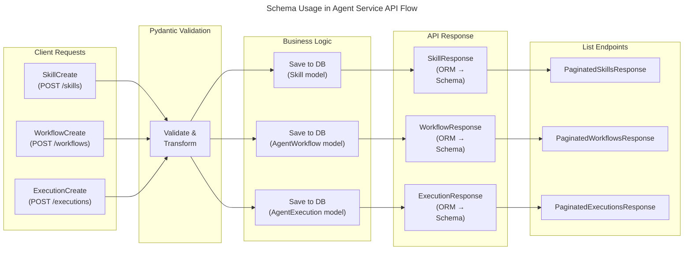

# C4 Code Level: Agent Service App Schemas

## Overview

- **Name**: Agent Service Pydantic Schemas Module
- **Description**: Comprehensive Pydantic schema definitions for Skills, Workflows, and Executions used throughout the Agent Service API. Provides data validation, serialization, and request/response modeling for the agentic platform.
- **Location**: `/ainav-backend/services/agent_service/app/schemas/`
- **Language**: Python
- **Purpose**: Define and validate data structures for agent workflow management, skill definition, and execution tracking. Ensures type safety, API documentation, and JSON serialization/deserialization across the Agent Service.

## Code Elements

### Skill Schemas

#### `SkillBase`
- **Type**: Pydantic BaseModel
- **Location**: `__init__.py:14-26`
- **Purpose**: Base schema for skill definitions. Defines common fields for API capabilities with bilingual support (English/Chinese).
- **Fields**:
  - `name: str` - Skill name (max 100 chars)
  - `name_zh: Optional[str]` - Chinese name (max 100 chars)
  - `slug: str` - URL-friendly identifier (max 100 chars)
  - `description: Optional[str]` - English description
  - `description_zh: Optional[str]` - Chinese description
  - `api_endpoint: Optional[str]` - HTTP API endpoint URL (max 512 chars)
  - `http_method: Optional[str]` - HTTP method: GET, POST, PUT, DELETE, PATCH (max 10 chars)
  - `input_schema: Optional[dict[str, Any]]` - JSON Schema for request parameters
  - `output_schema: Optional[dict[str, Any]]` - JSON Schema for response
  - `headers_template: Optional[dict[str, Any]]` - Template for HTTP request headers
  - `auth_type: str` - Authentication type: 'none', 'api_key', 'oauth2', 'bearer' (default: 'none', max 50 chars)
  - `auth_config: Optional[dict[str, Any]]` - Authentication configuration object

#### `SkillCreate`
- **Type**: Pydantic BaseModel (inherits from SkillBase)
- **Location**: `__init__.py:29-30`
- **Purpose**: Request schema for creating new skills. Extends SkillBase with required tool association.
- **Fields**:
  - Inherits all fields from SkillBase
  - `tool_id: UUID` - Required reference to parent Tool

#### `SkillUpdate`
- **Type**: Pydantic BaseModel
- **Location**: `__init__.py:33-45`
- **Purpose**: Request schema for updating existing skills. All fields are optional for partial updates.
- **Fields**:
  - `name: Optional[str]` - (max 100 chars)
  - `name_zh: Optional[str]` - (max 100 chars)
  - `description: Optional[str]`
  - `description_zh: Optional[str]`
  - `api_endpoint: Optional[str]` - (max 512 chars)
  - `http_method: Optional[str]` - (max 10 chars)
  - `input_schema: Optional[dict[str, Any]]`
  - `output_schema: Optional[dict[str, Any]]`
  - `headers_template: Optional[dict[str, Any]]`
  - `auth_type: Optional[str]` - (max 50 chars)
  - `auth_config: Optional[dict[str, Any]]`
  - `is_active: Optional[bool]` - Skill active status

#### `SkillResponse`
- **Type**: Pydantic BaseModel (inherits from SkillBase)
- **Location**: `__init__.py:48-58`
- **Purpose**: Response schema for skill API endpoints. Includes all skill metadata and usage statistics.
- **Fields**:
  - Inherits all fields from SkillBase
  - `id: UUID` - Unique skill identifier
  - `tool_id: UUID` - Associated tool ID
  - `is_active: bool` - Activation status
  - `usage_count: int` - Total times this skill has been used
  - `avg_latency_ms: float` - Average API response latency in milliseconds
  - `created_at: datetime` - Creation timestamp
  - `updated_at: datetime` - Last update timestamp
- **Config**:
  - `from_attributes = True` - Enables ORM model conversion

### Workflow Schemas

#### `ReactFlowNode`
- **Type**: Pydantic BaseModel
- **Location**: `__init__.py:65-69`
- **Purpose**: Represents a single node in a React Flow diagram (workflow visual representation).
- **Fields**:
  - `id: str` - Unique node identifier
  - `type: str` - Node type: 'input', 'llm', 'skill', 'output', 'condition'
  - `position: dict[str, float]` - 2D coordinates {x: number, y: number}
  - `data: dict[str, Any]` - Node configuration data (node-specific properties)

#### `ReactFlowEdge`
- **Type**: Pydantic BaseModel
- **Location**: `__init__.py:72-77`
- **Purpose**: Represents connection between nodes in a React Flow diagram.
- **Fields**:
  - `id: str` - Unique edge identifier
  - `source: str` - Source node ID
  - `target: str` - Target node ID
  - `sourceHandle: Optional[str]` - Output handle on source node (for multiple connections)
  - `targetHandle: Optional[str]` - Input handle on target node (for multiple connections)

#### `ReactFlowGraph`
- **Type**: Pydantic BaseModel
- **Location**: `__init__.py:80-83`
- **Purpose**: Complete workflow graph definition combining nodes and edges with viewport metadata.
- **Fields**:
  - `nodes: list[ReactFlowNode]` - Array of workflow nodes
  - `edges: list[ReactFlowEdge]` - Array of connections between nodes
  - `viewport: Optional[dict[str, float]]` - Camera viewport state {x: number, y: number, zoom: number}

#### `WorkflowBase`
- **Type**: Pydantic BaseModel
- **Location**: `__init__.py:86-92`
- **Purpose**: Base schema for workflow definitions. Defines common metadata fields.
- **Fields**:
  - `name: str` - Workflow name (max 255 chars)
  - `name_zh: Optional[str]` - Chinese workflow name (max 255 chars)
  - `slug: str` - URL-friendly identifier (max 255 chars, unique)
  - `description: Optional[str]` - English description
  - `description_zh: Optional[str]` - Chinese description
  - `icon: Optional[str]` - Emoji or icon identifier (max 100 chars)

#### `WorkflowCreate`
- **Type**: Pydantic BaseModel (inherits from WorkflowBase)
- **Location**: `__init__.py:95-104`
- **Purpose**: Request schema for creating new agent workflows. Includes graph definition and LLM configuration.
- **Fields**:
  - Inherits all fields from WorkflowBase
  - `graph_json: ReactFlowGraph` - Complete workflow graph definition (required)
  - `trigger_type: str` - How workflow is triggered: 'manual', 'schedule', 'webhook' (default: 'manual', max 50 chars)
  - `trigger_config: Optional[dict[str, Any]]` - Trigger-specific config (e.g., cron schedule)
  - `input_schema: Optional[dict[str, Any]]` - JSON Schema defining expected input parameters
  - `llm_model: str` - LLM model to use (default: 'deepseek-chat', max 100 chars)
  - `system_prompt: Optional[str]` - System instruction for the LLM
  - `temperature: float` - LLM temperature parameter (range: 0.0-2.0, default: 0.7)
  - `is_public: bool` - Whether workflow is publicly discoverable (default: false)
  - `is_template: bool` - Whether workflow is a reusable template (default: false)

#### `WorkflowUpdate`
- **Type**: Pydantic BaseModel
- **Location**: `__init__.py:107-121`
- **Purpose**: Request schema for updating existing workflows. All fields are optional for partial updates.
- **Fields**:
  - `name: Optional[str]` - (max 255 chars)
  - `name_zh: Optional[str]` - (max 255 chars)
  - `description: Optional[str]`
  - `description_zh: Optional[str]`
  - `icon: Optional[str]` - (max 100 chars)
  - `graph_json: Optional[ReactFlowGraph]`
  - `trigger_type: Optional[str]` - (max 50 chars)
  - `trigger_config: Optional[dict[str, Any]]`
  - `input_schema: Optional[dict[str, Any]]`
  - `llm_model: Optional[str]` - (max 100 chars)
  - `system_prompt: Optional[str]`
  - `temperature: Optional[float]` - (range: 0.0-2.0)
  - `is_public: Optional[bool]`
  - `is_template: Optional[bool]`

#### `WorkflowResponse`
- **Type**: Pydantic BaseModel (inherits from WorkflowBase)
- **Location**: `__init__.py:124-144`
- **Purpose**: Complete response schema for workflow API endpoints. Includes all metadata, graph data, and statistics.
- **Fields**:
  - Inherits all fields from WorkflowBase
  - `id: UUID` - Unique workflow identifier
  - `user_id: UUID` - Creator user ID
  - `graph_json: dict[str, Any]` - Stored workflow graph definition
  - `trigger_type: str` - Trigger configuration type
  - `trigger_config: Optional[dict[str, Any]]`
  - `input_schema: Optional[dict[str, Any]]`
  - `llm_model: str` - Selected LLM model
  - `system_prompt: Optional[str]`
  - `temperature: float` - LLM temperature setting
  - `is_public: bool` - Public visibility flag
  - `is_template: bool` - Template flag
  - `forked_from_id: Optional[UUID]` - Original workflow ID if this is a fork
  - `fork_count: int` - Number of times this workflow has been forked
  - `run_count: int` - Number of times this workflow has been executed
  - `star_count: int` - Number of user favorites
  - `created_at: datetime` - Creation timestamp
  - `updated_at: datetime` - Last update timestamp
- **Config**:
  - `from_attributes = True` - Enables ORM model conversion

#### `WorkflowSummary`
- **Type**: Pydantic BaseModel
- **Location**: `__init__.py:147-163`
- **Purpose**: Lightweight response schema for workflow listing endpoints. Includes essential metadata and statistics but excludes full graph definition.
- **Fields**:
  - `id: UUID` - Unique workflow identifier
  - `name: str` - Workflow name
  - `name_zh: Optional[str]` - Chinese name
  - `slug: str` - URL-friendly slug
  - `description: Optional[str]` - English description
  - `icon: Optional[str]` - Icon/emoji identifier
  - `trigger_type: str` - Trigger type
  - `is_public: bool` - Public visibility flag
  - `fork_count: int` - Fork count
  - `run_count: int` - Execution count
  - `star_count: int` - Favorite count
  - `created_at: datetime` - Creation timestamp
- **Config**:
  - `from_attributes = True` - Enables ORM model conversion

### Execution Schemas

#### `NodeExecutionLog`
- **Type**: Pydantic BaseModel
- **Location**: `__init__.py:170-178`
- **Purpose**: Represents the execution record of a single workflow node. Used in execution trace logging.
- **Fields**:
  - `node_id: str` - React Flow node identifier
  - `node_type: str` - Type of node (input, llm, skill, output, condition)
  - `status: str` - Execution status: 'pending', 'running', 'success', 'error', 'skipped'
  - `input_data: Optional[Any]` - Input data passed to this node
  - `output_data: Optional[Any]` - Output data returned by this node
  - `error_message: Optional[str]` - Error description if status is 'error'
  - `duration_ms: Optional[int]` - Execution time in milliseconds
  - `timestamp: datetime` - When this node execution occurred

#### `ExecutionCreate`
- **Type**: Pydantic BaseModel
- **Location**: `__init__.py:181-185`
- **Purpose**: Request schema for triggering a new workflow execution.
- **Fields**:
  - `workflow_id: UUID` - Workflow to execute (required)
  - `input_data: Optional[dict[str, Any]]` - Input parameters for the workflow
  - `trigger_type: str` - How execution was triggered: 'manual', 'schedule', 'webhook' (default: 'manual', max 50 chars)
  - `trigger_metadata: Optional[dict[str, Any]]` - Additional context about the trigger

#### `ExecutionResponse`
- **Type**: Pydantic BaseModel
- **Location**: `__init__.py:188-206`
- **Purpose**: Complete response schema for workflow execution endpoints. Includes full execution state and detailed trace logs.
- **Fields**:
  - `id: UUID` - Unique execution identifier
  - `workflow_id: UUID` - Associated workflow ID
  - `user_id: UUID` - User who triggered execution
  - `status: str` - Execution status: 'pending', 'running', 'completed', 'failed', 'cancelled'
  - `input_data: Optional[dict[str, Any]]` - Input provided to workflow
  - `output_data: Optional[dict[str, Any]]` - Final workflow output
  - `error_message: Optional[str]` - Error description if execution failed
  - `execution_log: Optional[list[dict[str, Any]]]` - Array of node execution logs (ordered by execution)
  - `token_usage: int` - LLM tokens consumed during execution
  - `total_api_calls: int` - Number of external API calls made
  - `duration_ms: Optional[int]` - Total execution time in milliseconds
  - `trigger_type: Optional[str]` - What triggered this execution
  - `trigger_metadata: Optional[dict[str, Any]]` - Trigger context information
  - `created_at: datetime` - Execution start timestamp
  - `updated_at: datetime` - Last status update timestamp
- **Config**:
  - `from_attributes = True` - Enables ORM model conversion

#### `ExecutionSummary`
- **Type**: Pydantic BaseModel
- **Location**: `__init__.py:209-220`
- **Purpose**: Lightweight response schema for execution listing endpoints. Includes essential execution metadata without detailed trace logs.
- **Fields**:
  - `id: UUID` - Unique execution identifier
  - `workflow_id: UUID` - Associated workflow ID
  - `status: str` - Current execution status
  - `duration_ms: Optional[int]` - Execution time in milliseconds
  - `token_usage: int` - LLM tokens consumed
  - `trigger_type: Optional[str]` - Execution trigger type
  - `created_at: datetime` - Execution start timestamp
- **Config**:
  - `from_attributes = True` - Enables ORM model conversion

### Paginated Response Schemas

#### `PaginatedSkillsResponse`
- **Type**: Pydantic BaseModel
- **Location**: `__init__.py:227-232`
- **Purpose**: Paginated list response for skill endpoints.
- **Fields**:
  - `items: list[SkillResponse]` - Array of skill objects
  - `total: int` - Total number of skills (across all pages)
  - `page: int` - Current page number (1-indexed)
  - `page_size: int` - Number of items per page
  - `pages: int` - Total number of pages

#### `PaginatedWorkflowsResponse`
- **Type**: Pydantic BaseModel
- **Location**: `__init__.py:235-240`
- **Purpose**: Paginated list response for workflow endpoints.
- **Fields**:
  - `items: list[WorkflowSummary]` - Array of lightweight workflow objects
  - `total: int` - Total number of workflows (across all pages)
  - `page: int` - Current page number (1-indexed)
  - `page_size: int` - Number of items per page
  - `pages: int` - Total number of pages

#### `PaginatedExecutionsResponse`
- **Type**: Pydantic BaseModel
- **Location**: `__init__.py:243-248`
- **Purpose**: Paginated list response for execution endpoints.
- **Fields**:
  - `items: list[ExecutionSummary]` - Array of lightweight execution objects
  - `total: int` - Total number of executions (across all pages)
  - `page: int` - Current page number (1-indexed)
  - `page_size: int` - Number of items per page
  - `pages: int` - Total number of pages

## Dependencies

### Internal Dependencies

**Shared Models**:
- `shared.models.Skill` - ORM model for skill definitions mapped to SkillResponse schema
- `shared.models.AgentWorkflow` - ORM model for workflow definitions mapped to WorkflowResponse and WorkflowSummary schemas
- `shared.models.AgentExecution` - ORM model for execution records mapped to ExecutionResponse and ExecutionSummary schemas
- `shared.models.Tool` - Referenced via Skill.tool_id foreign key
- `shared.models.User` - Referenced via AgentWorkflow.user_id and AgentExecution.user_id

**Router Modules**:
- `routers.skills` - Uses SkillCreate, SkillUpdate, SkillResponse, PaginatedSkillsResponse
- `routers.workflows` - Uses WorkflowCreate, WorkflowUpdate, WorkflowResponse, WorkflowSummary, PaginatedWorkflowsResponse
- `routers.executions` - Uses ExecutionCreate, ExecutionResponse, ExecutionSummary, PaginatedExecutionsResponse
- `routers.chat` - Uses ExecutionResponse, ExecutionSummary

### External Dependencies

**Pydantic**:
- `pydantic.BaseModel` - Base class for all schema validation
- `pydantic.Field` - Field configuration with validation constraints (max_length, constraints, defaults)

**Python Standard Library**:
- `typing.Optional` - Type hints for nullable fields
- `typing.Any` - Generic type for flexible dict/list fields
- `datetime.datetime` - Timestamp fields
- `uuid.UUID` - Unique identifier types

## Relationships

### Schema Hierarchy and Composition

```mermaid
---
title: Code Diagram for Agent Service Schemas
---
classDiagram
    namespace SkillSchemas {
        class SkillBase {
            +name str
            +name_zh Optional[str]
            +slug str
            +description Optional[str]
            +description_zh Optional[str]
            +api_endpoint Optional[str]
            +http_method Optional[str]
            +input_schema Optional[dict]
            +output_schema Optional[dict]
            +headers_template Optional[dict]
            +auth_type str
            +auth_config Optional[dict]
        }
        class SkillCreate {
            +tool_id UUID
        }
        class SkillUpdate {
            +name Optional[str]
            +name_zh Optional[str]
            +description Optional[str]
            +description_zh Optional[str]
            +api_endpoint Optional[str]
            +http_method Optional[str]
            +input_schema Optional[dict]
            +output_schema Optional[dict]
            +headers_template Optional[dict]
            +auth_type Optional[str]
            +auth_config Optional[dict]
            +is_active Optional[bool]
        }
        class SkillResponse {
            +id UUID
            +tool_id UUID
            +is_active bool
            +usage_count int
            +avg_latency_ms float
            +created_at datetime
            +updated_at datetime
        }
    }

    namespace WorkflowSchemas {
        class ReactFlowNode {
            +id str
            +type str
            +position dict[str, float]
            +data dict[str, Any]
        }
        class ReactFlowEdge {
            +id str
            +source str
            +target str
            +sourceHandle Optional[str]
            +targetHandle Optional[str]
        }
        class ReactFlowGraph {
            +nodes list[ReactFlowNode]
            +edges list[ReactFlowEdge]
            +viewport Optional[dict[str, float]]
        }
        class WorkflowBase {
            +name str
            +name_zh Optional[str]
            +slug str
            +description Optional[str]
            +description_zh Optional[str]
            +icon Optional[str]
        }
        class WorkflowCreate {
            +graph_json ReactFlowGraph
            +trigger_type str
            +trigger_config Optional[dict]
            +input_schema Optional[dict]
            +llm_model str
            +system_prompt Optional[str]
            +temperature float
            +is_public bool
            +is_template bool
        }
        class WorkflowUpdate {
            +name Optional[str]
            +name_zh Optional[str]
            +description Optional[str]
            +description_zh Optional[str]
            +icon Optional[str]
            +graph_json Optional[ReactFlowGraph]
            +trigger_type Optional[str]
            +trigger_config Optional[dict]
            +input_schema Optional[dict]
            +llm_model Optional[str]
            +system_prompt Optional[str]
            +temperature Optional[float]
            +is_public Optional[bool]
            +is_template Optional[bool]
        }
        class WorkflowResponse {
            +id UUID
            +user_id UUID
            +graph_json dict
            +trigger_type str
            +trigger_config Optional[dict]
            +input_schema Optional[dict]
            +llm_model str
            +system_prompt Optional[str]
            +temperature float
            +is_public bool
            +is_template bool
            +forked_from_id Optional[UUID]
            +fork_count int
            +run_count int
            +star_count int
            +created_at datetime
            +updated_at datetime
        }
        class WorkflowSummary {
            +id UUID
            +name str
            +name_zh Optional[str]
            +slug str
            +description Optional[str]
            +icon Optional[str]
            +trigger_type str
            +is_public bool
            +fork_count int
            +run_count int
            +star_count int
            +created_at datetime
        }
    }

    namespace ExecutionSchemas {
        class NodeExecutionLog {
            +node_id str
            +node_type str
            +status str
            +input_data Optional[Any]
            +output_data Optional[Any]
            +error_message Optional[str]
            +duration_ms Optional[int]
            +timestamp datetime
        }
        class ExecutionCreate {
            +workflow_id UUID
            +input_data Optional[dict]
            +trigger_type str
            +trigger_metadata Optional[dict]
        }
        class ExecutionResponse {
            +id UUID
            +workflow_id UUID
            +user_id UUID
            +status str
            +input_data Optional[dict]
            +output_data Optional[dict]
            +error_message Optional[str]
            +execution_log Optional[list]
            +token_usage int
            +total_api_calls int
            +duration_ms Optional[int]
            +trigger_type Optional[str]
            +trigger_metadata Optional[dict]
            +created_at datetime
            +updated_at datetime
        }
        class ExecutionSummary {
            +id UUID
            +workflow_id UUID
            +status str
            +duration_ms Optional[int]
            +token_usage int
            +trigger_type Optional[str]
            +created_at datetime
        }
    }

    namespace PaginationSchemas {
        class PaginatedSkillsResponse {
            +items list[SkillResponse]
            +total int
            +page int
            +page_size int
            +pages int
        }
        class PaginatedWorkflowsResponse {
            +items list[WorkflowSummary]
            +total int
            +page int
            +page_size int
            +pages int
        }
        class PaginatedExecutionsResponse {
            +items list[ExecutionSummary]
            +total int
            +page int
            +page_size int
            +pages int
        }
    }

    SkillCreate --|> SkillBase : inherits
    SkillResponse --|> SkillBase : inherits

    WorkflowCreate --|> WorkflowBase : inherits
    WorkflowResponse --|> WorkflowBase : inherits

    WorkflowCreate --> ReactFlowGraph : uses
    WorkflowUpdate --> ReactFlowGraph : optionally uses
    WorkflowResponse --> ReactFlowGraph : contains as dict

    ReactFlowGraph --> ReactFlowNode : composes nodes
    ReactFlowGraph --> ReactFlowEdge : composes edges

    ExecutionResponse --> NodeExecutionLog : contains in execution_log

    PaginatedSkillsResponse --> SkillResponse : wraps
    PaginatedWorkflowsResponse --> WorkflowSummary : wraps
    PaginatedExecutionsResponse --> ExecutionSummary : wraps
```

### API Usage Flow

## Notes

### Design Patterns

**CRUD Schemas Pattern**: Each entity follows a consistent pattern:
- `Base` - Common fields shared across create/read operations
- `Create` - Input schema with required fields for creation
- `Update` - Input schema with all optional fields for patching
- `Response` - Output schema with all fields including IDs and timestamps
- `Summary` - Lightweight response for list operations (excludes heavy data like graph_json)

**Bilingual Support**: All user-facing text fields support both English and Chinese:
- `name` + `name_zh`
- `description` + `description_zh`
- Follows the `_zh` suffix convention used throughout the platform

**Flexible Configuration Objects**: Uses `dict[str, Any]` for flexible, extensible configuration:
- `input_schema` - JSON Schema validations
- `output_schema` - Expected output structure
- `headers_template` - HTTP headers template
- `auth_config` - Authentication parameters
- `trigger_config` - Trigger-specific settings
- `graph_json` - React Flow diagram definition

**ORM Integration**: Schemas use `from_attributes = True` (Pydantic v2) to enable automatic conversion from SQLAlchemy ORM models to response schemas.

### Field Validation

**Max Length Constraints**:
- Resource names (skill, workflow): max 100-255 characters
- URLs/endpoints: max 512 characters
- HTTP methods/slugs: max 50-100 characters
- Authentication type: max 50 characters

**Value Ranges**:
- Temperature (LLM): 0.0-2.0 (0.7 default)
- Pagination: page >= 1, page_size 1-100

**Node Types** in React Flow:
- `'input'` - Workflow input node
- `'llm'` - LLM processing node (uses Deepseek model)
- `'skill'` - Skill execution node (calls external API)
- `'output'` - Workflow output node
- `'condition'` - Conditional branching node

**Execution Status Values**:
- `'pending'` - Awaiting execution
- `'running'` - Currently executing
- `'completed'` - Finished successfully
- `'failed'` - Encountered error
- `'cancelled'` - User cancelled or timeout

**Skill Authentication Types**:
- `'none'` - No authentication required
- `'api_key'` - API key in header
- `'oauth2'` - OAuth 2.0 flow
- `'bearer'` - Bearer token in Authorization header

### Performance Considerations

**Pagination**: All list endpoints support pagination to handle large datasets:
- Default page_size: 20 items
- Max page_size: 100 items

**Summary Schemas**: WorkflowSummary and ExecutionSummary exclude heavy data (e.g., graph_json, execution_log) to reduce response size for list operations.

**Vector Embeddings**: While AgentMemory supports pgvector for semantic search, the schemas module focuses on workflow/skill/execution APIs. Memory embeddings are handled separately in the agentic platform Phase 3.

### Extension Points

**Flexible Data Structures**:
- `data: dict[str, Any]` in ReactFlowNode allows nodes to store arbitrary configuration
- `trigger_metadata: dict[str, Any]` supports extensible trigger context
- `execution_log: list[dict[str, Any]]` allows flexible node execution records

**LLM Configuration**:
- `llm_model` field allows switching between different LLM providers (default: deepseek-chat)
- `system_prompt` and `temperature` enable prompt engineering and output control
- Easily extensible to support additional LLM parameters

