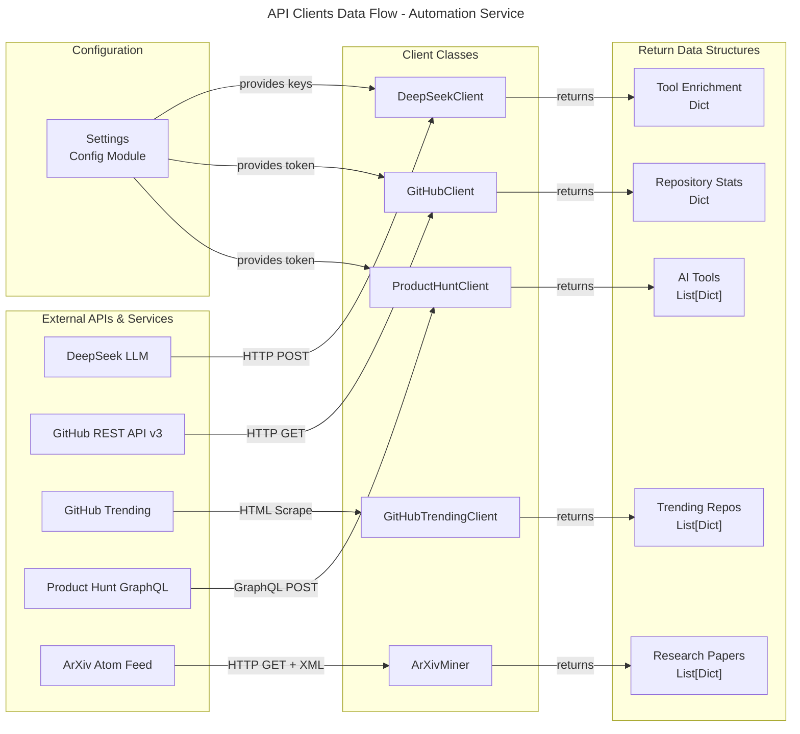

# C4 Code Level: Automation Service API Clients

## Overview

- **Name**: Automation Service API Clients Module
- **Description**: Collection of specialized HTTP clients for integrating with external APIs and services, including LLM enrichment, GitHub repository data, product hunting platforms, and academic paper mining
- **Location**: `ainav-backend/services/automation_service/app/clients`
- **Language**: Python 3.11+
- **Purpose**: Provides abstracted, reusable client classes for consuming third-party APIs in the automation service, enabling data aggregation and enrichment tasks for the AI Navigation platform

## Code Elements

### Classes

#### `DeepSeekClient`
- **Location**: `ainav-backend/services/automation_service/app/clients/deepseek.py`
- **Description**: Async HTTP client for DeepSeek LLM API integration. Handles AI-powered enrichment of tool information with Chinese translations and metadata generation.
- **Methods**:
  - `__init__(self) -> None`
    - Initializes the client with API URL, API key, and HTTP headers from configuration
    - Sets up Bearer token authentication

  - `async enrich_tool_info(self, name: str, description: str) -> Optional[Dict]`
    - **Parameters**:
      - `name: str` - Tool name to enrich
      - `description: str` - Tool description to enrich
    - **Returns**: `Optional[Dict]` - Dictionary with keys:
      - `name_zh: str` - Chinese name translation
      - `description_zh: str` - Chinese description translation
      - `tags: List[str]` - 3-5 relevant Chinese keywords
      - `pricing_type: str` - One of 'free', 'freemium', 'paid'
      - `summary: str` - One-sentence Chinese summary
    - **Description**: Makes an async POST request to DeepSeek API with a structured prompt requesting JSON output for tool enrichment. Handles JSON parsing and error logging.
    - **Error Handling**: Returns `None` on exception, logs error

#### `GitHubClient`
- **Location**: `ainav-backend/services/automation_service/app/clients/github.py`
- **Description**: Async HTTP client for GitHub REST API v3. Fetches repository statistics from GitHub URLs.
- **Methods**:
  - `__init__(self) -> None`
    - Initializes GitHub API client with base URL and headers
    - Conditionally adds authorization token if GITHUB_TOKEN is available in configuration

  - `_extract_repo_path(self, url: str) -> Optional[str]`
    - **Parameters**:
      - `url: str` - GitHub repository URL in various formats
    - **Returns**: `Optional[str]` - String in format 'owner/repo' or None if extraction fails
    - **Description**: Uses regex to extract owner/repo path from GitHub URLs in multiple formats (.git suffix, with trailing slash, etc.)

  - `async get_repo_stats(self, url: str) -> Optional[Dict]`
    - **Parameters**:
      - `url: str` - GitHub repository URL
    - **Returns**: `Optional[Dict]` - Dictionary with keys:
      - `stars: int` - Star count
      - `forks: int` - Fork count
      - `last_updated: str` - ISO timestamp of last update
      - `license: Optional[str]` - License name if available
      - `language: Optional[str]` - Primary programming language
    - **Description**: Extracts repo path, makes async GET request to GitHub API, parses JSON response, and returns normalized statistics
    - **Error Handling**: Returns `None` on exception, logs error with URL context

#### `GitHubTrendingClient`
- **Location**: `ainav-backend/services/automation_service/app/clients/github_trending.py`
- **Description**: Web scraper for GitHub Trending page. Extracts trending AI-related repositories using HTML parsing.
- **Methods**:
  - `__init__(self) -> None`
    - Initializes scraper with base URL and User-Agent header for requests

  - `async get_trending_repos(self, language: str = "python") -> List[Dict]`
    - **Parameters**:
      - `language: str = "python"` - Programming language to filter trending repos
    - **Returns**: `List[Dict]` - List of repository dictionaries with keys:
      - `name: str` - Repository name only
      - `full_name: str` - Full repository path (owner/name)
      - `description: str` - Repository description from GitHub
      - `url: str` - Full GitHub URL
      - `stars_today: int` - Stars gained today
    - **Description**: Makes async GET request to GitHub trending page URL, parses HTML with BeautifulSoup, filters for AI-related keywords in description/name, extracts metrics
    - **AI Keyword Filtering**: Filters repos containing keywords: "ai", "llm", "gpt", "model", "inference", "agent", "rag", "intelligence", "transformer"
    - **Error Handling**: Returns empty list on exception, logs error

#### `ProductHuntClient`
- **Location**: `ainav-backend/services/automation_service/app/clients/producthunt.py`
- **Description**: Async GraphQL client for Product Hunt API. Fetches daily AI tool posts from the platform.
- **Methods**:
  - `__init__(self) -> None`
    - Initializes Product Hunt GraphQL API client with API URL and Bearer token authentication

  - `async get_daily_ai_tools(self) -> List[Dict]`
    - **Parameters**: None
    - **Returns**: `List[Dict]` - List of Product Hunt post edges containing:
      - `node.id: str` - Post unique identifier
      - `node.name: str` - Tool/product name
      - `node.tagline: str` - Short description
      - `node.description: str` - Full description
      - `node.url: str` - Product Hunt post URL
      - `node.website: str` - Official website URL
      - `node.votesCount: int` - Number of votes received
      - `node.createdAt: str` - ISO timestamp of creation
    - **Description**: Executes GraphQL query to fetch first 10 posts with "artificial-intelligence" topic, handles pagination support (cursor parameter in query)
    - **Error Handling**: Returns empty list on exception, logs error

#### `ArXivMiner`
- **Location**: `ainav-backend/services/automation_service/app/clients/arxiv_miner.py`
- **Description**: Async HTTP client for ArXiv API. Mines academic papers from arXiv repository using Atom feed protocol.
- **Methods**:
  - `__init__(self) -> None`
    - Initializes ArXiv API base URL

  - `async get_latest_papers(self, category: str = "cs.AI", days: int = 1) -> List[Dict]`
    - **Parameters**:
      - `category: str = "cs.AI"` - ArXiv category code (e.g., "cs.AI", "cs.LG", "cs.NE")
      - `days: int = 1` - Unused parameter, kept for API consistency
    - **Returns**: `List[Dict]` - List of paper dictionaries with keys:
      - `name: str` - Paper title (truncated to 100 chars)
      - `title: str` - Full paper title
      - `description: str` - Paper abstract/summary
      - `url: str` - ArXiv paper ID URL
      - `published_at: str` - ISO timestamp of submission
      - `category: str` - Fixed value "Scientific Paper"
    - **Description**: Makes async GET request to ArXiv Atom API with category filter, parses XML response, extracts paper metadata, returns tool-like structure for consistency
    - **ArXiv Categories**: Supports standard ArXiv categories (cs.AI for AI, cs.LG for Machine Learning, etc.)
    - **Error Handling**: Returns empty list on exception, logs error

## Dependencies

### Internal Dependencies

- **Module**: `shared.config`
  - **Used By**: `DeepSeekClient`, `GitHubClient`, `ProductHuntClient`
  - **Purpose**: Provides `Settings` singleton with API keys and configuration
  - **Configuration Variables Accessed**:
    - `DEEPSEEK_API_URL` - DeepSeek LLM endpoint
    - `DEEPSEEK_API_KEY` - DeepSeek API authentication key
    - `GITHUB_TOKEN` - GitHub API token (optional)
    - `PRODUCTHUNT_TOKEN` - Product Hunt API token

- **Module**: `logging`
  - **Used By**: All client classes
  - **Purpose**: Provides structured logging for error tracking and debugging

### External Dependencies

#### HTTP/Network
- **httpx** v0.24+
  - **Used By**: `DeepSeekClient`, `GitHubClient`, `GitHubTrendingClient`, `ProductHuntClient`, `ArXivMiner`
  - **Purpose**: Async HTTP client for making requests with timeout support
  - **Usage Pattern**: `httpx.AsyncClient()` context manager for connection pooling

#### Web Scraping
- **beautifulsoup4** v4.11+
  - **Used By**: `GitHubTrendingClient`
  - **Purpose**: HTML parsing and DOM traversal
  - **Selector**: `BeautifulSoup(response.text, "lxml")` with CSS class selectors

- **lxml** v4.9+
  - **Used By**: `GitHubTrendingClient`
  - **Purpose**: Fast HTML/XML parsing backend for BeautifulSoup

#### Standard Library
- **xml.etree.ElementTree**
  - **Used By**: `ArXivMiner`
  - **Purpose**: XML parsing for ArXiv Atom feed response

- **re** (regular expressions)
  - **Used By**: `GitHubClient`
  - **Purpose**: GitHub URL pattern matching and extraction

- **datetime**
  - **Used By**: `ArXivMiner`
  - **Purpose**: Date/time handling (imported but not actively used in current implementation)

- **typing**
  - **Used By**: `GitHubTrendingClient`, `ArXivMiner`
  - **Purpose**: Type hints for `List`, `Dict` return types

### Configuration Requirements

The clients depend on environment variables (loaded via `shared.config.Settings`):

```
# LLM Enrichment
DEEPSEEK_API_KEY=your_deepseek_api_key
DEEPSEEK_API_URL=https://api.deepseek.com/v1/chat/completions

# GitHub Integration
GITHUB_TOKEN=your_github_token (optional, rate limits lower without it)

# Product Hunt
PRODUCTHUNT_TOKEN=your_producthunt_api_token
```

## Relationships

### Data Flow Diagram



### Class Dependency Diagram

```mermaid
---
title: Client Classes Structure - Automation Service Clients
---
classDiagram
    namespace APIClients {
        class DeepSeekClient {
            -api_url: str
            -api_key: str
            -headers: Dict[str, str]
            +enrich_tool_info(name: str, description: str) Dict
        }

        class GitHubClient {
            -api_url: str
            -headers: Dict[str, str]
            -_extract_repo_path(url: str) str
            +get_repo_stats(url: str) Dict
        }

        class GitHubTrendingClient {
            -base_url: str
            -headers: Dict[str, str]
            +get_trending_repos(language: str) List[Dict]
        }

        class ProductHuntClient {
            -api_url: str
            -headers: Dict[str, str]
            +get_daily_ai_tools() List[Dict]
        }

        class ArXivMiner {
            -base_url: str
            +get_latest_papers(category: str, days: int) List[Dict]
        }
    }

    namespace ExternalDependencies {
        class httpx {
            <<library>>
        }

        class BeautifulSoup {
            <<library>>
        }

        class ElementTree {
            <<library>>
        }

        class Settings {
            <<config>>
        }
    }

    namespace StandardLibrary {
        class logging {
            <<library>>
        }

        class re {
            <<library>>
        }

        class typing {
            <<library>>
        }
    }

    DeepSeekClient --> Settings: uses
    DeepSeekClient --> httpx: uses
    DeepSeekClient --> logging: uses

    GitHubClient --> Settings: uses
    GitHubClient --> httpx: uses
    GitHubClient --> re: uses
    GitHubClient --> logging: uses

    GitHubTrendingClient --> httpx: uses
    GitHubTrendingClient --> BeautifulSoup: uses
    GitHubTrendingClient --> logging: uses

    ProductHuntClient --> Settings: uses
    ProductHuntClient --> httpx: uses
    ProductHuntClient --> logging: uses

    ArXivMiner --> httpx: uses
    ArXivMiner --> ElementTree: uses
    ArXivMiner --> logging: uses
    ArXivMiner --> typing: uses
```



## API Integration Patterns

### Async Pattern
All client methods use `async/await` pattern with `httpx.AsyncClient()` context manager:
```python
async with httpx.AsyncClient() as client:
    response = await client.post/get(...)
    response.raise_for_status()
    data = response.json()
```

### Error Handling Pattern
Consistent error handling across all clients:
```python
try:
    # API call
except Exception as e:
    logger.error(f"Error context: {e}")
    return None/[]  # Returns None or empty list
```

### Configuration Pattern
API credentials loaded from environment via shared Settings singleton:
```python
from shared.config import settings
self.api_key = settings.DEEPSEEK_API_KEY
self.api_url = settings.DEEPSEEK_API_URL
```

## Response Data Structures

### Tool Enrichment Response (DeepSeekClient)
```json
{
  "name_zh": "中文名称",
  "description_zh": "中文描述",
  "tags": ["tag1", "tag2", "tag3"],
  "pricing_type": "free|freemium|paid",
  "summary": "一句话总结"
}
```

### Repository Stats Response (GitHubClient)
```json
{
  "stars": 1234,
  "forks": 567,
  "last_updated": "2024-01-10T15:30:00Z",
  "license": "MIT",
  "language": "Python"
}
```

### Trending Repo Response (GitHubTrendingClient)
```json
{
  "name": "repository_name",
  "full_name": "owner/repository_name",
  "description": "Repository description",
  "url": "https://github.com/owner/repository_name",
  "stars_today": 123
}
```

### Product Hunt Response (ProductHuntClient)
```json
{
  "node": {
    "id": "1234",
    "name": "Product Name",
    "tagline": "Short tagline",
    "description": "Full description",
    "url": "https://www.producthunt.com/posts/...",
    "website": "https://product-website.com",
    "votesCount": 500,
    "createdAt": "2024-01-10T10:00:00Z"
  }
}
```

### Research Paper Response (ArXivMiner)
```json
{
  "name": "Paper Title (max 100 chars)",
  "title": "Full Paper Title",
  "description": "Abstract text",
  "url": "https://arxiv.org/abs/2401.xxxxx",
  "published_at": "2024-01-10T12:30:00Z",
  "category": "Scientific Paper"
}
```

## Notes

- **Timeout Configuration**: All clients use explicit timeout values (10-60 seconds) appropriate to expected response times
- **Authorization**: GitHub and Product Hunt clients support optional token-based authentication; GitHub client gracefully degrades without token
- **User-Agent Handling**: GitHub Trending client uses realistic User-Agent string to avoid blocking by GitHub
- **HTML Parsing**: GitHub Trending uses CSS class selectors specific to GitHub's current HTML structure; may need updates if GitHub changes DOM
- **XML Namespaces**: ArXiv client correctly handles Atom feed XML namespaces for reliable parsing
- **Charset Handling**: All clients rely on httpx's automatic charset detection for response decoding
- **Rate Limiting**: No built-in rate limiting; relies on external service rate limits and error handling
- **Pagination**: Product Hunt client query supports cursor-based pagination but single page (10 results) fetched by default
- **Shared Configuration**: All clients use centralized settings from `shared.config` module for credentials and endpoints
- **Logging**: All clients use Python logging module for error tracking; logger names follow module path pattern
