# C4 Code Level: Automation Service Workers

## Overview
- **Name**: Automation Service Celery Task Workers
- **Description**: Asynchronous task processing system that implements automated content discovery, enrichment, and synchronization pipelines for AI tools across multiple sources (Product Hunt, GitHub, ArXiv) with LLM enrichment and search index synchronization
- **Location**: `/home/dislove/document/ai 导航/ainav-backend/services/automation_service/app/workers`
- **Language**: Python 3.11+
- **Purpose**: Provides scheduled and on-demand task execution for discovering new AI tools from external sources, enriching tool metadata with Chinese translations and pricing information via LLM, synchronizing GitHub statistics, and maintaining search index consistency across the platform

## Code Elements

### Celery Task Functions

#### 1. `crawl_and_enrich_daily()`
- **Signature**: `crawl_and_enrich_daily() -> Dict[str, Any]`
- **Description**: Main daily pipeline task that fetches trending AI tools from Product Hunt, enriches them with DeepSeek LLM, saves to PostgreSQL, and triggers Meilisearch synchronization. Implements quality filtering (votes > 100) for 2026 strategy.
- **Location**: `/home/dislove/document/ai 导航/ainav-backend/services/automation_service/app/workers/tasks.py:21-24`
- **Decorator**: `@celery_app.task(name="crawl_and_enrich_daily")`
- **Execution**: Asynchronous via `asyncio.run(_crawl_and_enrich_pipeline())`
- **Dependencies**:
  - `ProductHuntClient.get_daily_ai_tools()` - fetches Product Hunt data
  - `DeepSeekClient.enrich_tool_info()` - LLM enrichment service
  - `AsyncSessionLocal()` - async database session
  - `Category`, `Tool` ORM models
  - `sync_to_meilisearch` - chained task for search sync
- **Return Value**: `{"status": str, "added": int}` - status and count of newly added tools

#### 2. `crawl_github_trending_daily()`
- **Signature**: `crawl_github_trending_daily() -> Dict[str, Any]`
- **Description**: Daily task to discover trending open-source AI repositories from GitHub, enrich with DeepSeek LLM, persist to database with star count, and synchronize to search index.
- **Location**: `/home/dislove/document/ai 导航/ainav-backend/services/automation_service/app/workers/tasks.py:92-95`
- **Decorator**: `@celery_app.task(name="crawl_github_trending_daily")`
- **Execution**: Asynchronous via `asyncio.run(_crawl_github_trending_pipeline())`
- **Dependencies**:
  - `GitHubTrendingClient.get_trending_repos()` - GitHub trend scraping
  - `DeepSeekClient.enrich_tool_info()` - LLM enrichment
  - `AsyncSessionLocal()` - database session
  - `Category`, `Tool` ORM models
  - `sync_to_meilisearch` - chained task
- **Return Value**: `{"status": str, "added": int}` - operation result

#### 3. `mine_arxiv_papers_daily()`
- **Signature**: `mine_arxiv_papers_daily() -> Dict[str, Any]`
- **Description**: Daily task to mine latest AI research papers from ArXiv, enrich with DeepSeek LLM, store as tools in research category, and maintain search index. Truncates long summaries to 500 characters.
- **Location**: `/home/dislove/document/ai 导航/ainav-backend/services/automation_service/app/workers/tasks.py:148-151`
- **Decorator**: `@celery_app.task(name="mine_arxiv_papers_daily")`
- **Execution**: Asynchronous via `asyncio.run(_mine_arxiv_papers_pipeline())`
- **Dependencies**:
  - `ArXivMiner.get_latest_papers()` - ArXiv paper fetching
  - `DeepSeekClient.enrich_tool_info()` - LLM enrichment
  - `AsyncSessionLocal()` - database session
  - `Category`, `Tool` ORM models
  - `sync_to_meilisearch` - chained task
- **Return Value**: `{"status": str, "added": int}` - operation result

#### 4. `sync_github_stats()`
- **Signature**: `sync_github_stats() -> Dict[str, Any]`
- **Description**: Task that periodically syncs GitHub repository statistics (star count) for all tools with GitHub URLs. Updates pricing type to 'open_source' if not already set. Triggers search index synchronization if changes made.
- **Location**: `/home/dislove/document/ai 导航/ainav-backend/services/automation_service/app/workers/tasks.py:203-206`
- **Decorator**: `@celery_app.task(name="sync_github_stats")`
- **Execution**: Asynchronous via `asyncio.run(_sync_github_stats_pipeline())`
- **Dependencies**:
  - `GitHubClient.get_repo_stats()` - GitHub API stats retrieval
  - `AsyncSessionLocal()` - database session
  - `Tool` ORM model
  - `sync_to_meilisearch` - chained task
- **Return Value**: `{"status": str, "synced": int}` - number of synced tools

#### 5. `enrich_single_tool(tool_id: str)`
- **Signature**: `enrich_single_tool(tool_id: str) -> Dict[str, Any]`
- **Description**: On-demand task to manually enrich a single tool with DeepSeek LLM, fetch GitHub stats if applicable, update database, and trigger search index refresh. Used for individual tool enrichment from API.
- **Location**: `/home/dislove/document/ai 导航/ainav-backend/services/automation_service/app/workers/tasks.py:237-240`
- **Decorator**: `@celery_app.task(name="enrich_single_tool")`
- **Parameters**: `tool_id` (str/UUID) - unique tool identifier
- **Execution**: Asynchronous via `asyncio.run(_enrich_single_tool_pipeline(tool_id))`
- **Dependencies**:
  - `DeepSeekClient.enrich_tool_info()` - LLM enrichment
  - `GitHubClient.get_repo_stats()` - GitHub stats for GitHub tools
  - `AsyncSessionLocal()` - database session
  - `Tool` ORM model
  - `sync_to_meilisearch` - chained task
- **Return Value**: `{"status": str, "tool": str}` or `{"status": "not_found"}` - result with tool name or error

#### 6. `sync_to_meilisearch()`
- **Signature**: `sync_to_meilisearch() -> Dict[str, Any]`
- **Description**: Task that synchronizes all tools from PostgreSQL to Meilisearch search index. Fetches tools with relationships (categories, scenarios), generates vector embeddings for semantic search, configures searchable/filterable attributes, and performs bulk upsert operation.
- **Location**: `/home/dislove/document/ai 导航/ainav-backend/services/automation_service/app/workers/tasks.py:279-282`
- **Decorator**: `@celery_app.task(name="sync_to_meilisearch")`
- **Execution**: Asynchronous via `asyncio.run(_sync_to_meilisearch_pipeline())`
- **Dependencies**:
  - `AsyncSessionLocal()` - database session with eager loading
  - `Tool`, `Category`, `Scenario` ORM models
  - `embedding_service.generate_embedding()` - vector embedding generation
  - `MeiliClient` - Meilisearch HTTP client
- **Return Value**: `{"status": str, "synced": int}` or `{"status": "no_tools"}` - sync result

### Pipeline Implementation Functions

#### `_crawl_and_enrich_pipeline()`
- **Signature**: `async _crawl_and_enrich_pipeline() -> Dict[str, Any]`
- **Description**: Core async implementation of Product Hunt crawl and enrich pipeline. Implements duplicate detection, quality filtering, and batch database operations.
- **Location**: `/home/dislove/document/ai 导航/ainav-backend/services/automation_service/app/workers/tasks.py:26-90`
- **Workflow**:
  1. Initialize Product Hunt and DeepSeek clients
  2. Fetch daily AI tools from Product Hunt
  3. Get or create "ai-tools" category
  4. Filter tools with vote count >= 100
  5. Check for existing tools by slug (duplicate detection)
  6. Enrich with DeepSeek for Chinese translations and pricing
  7. Create and persist Tool objects
  8. Trigger async Meilisearch sync

#### `_crawl_github_trending_pipeline()`
- **Signature**: `async _crawl_github_trending_pipeline() -> Dict[str, Any]`
- **Description**: Core async implementation of GitHub trending repository crawl. Discovers open-source AI projects with enrichment.
- **Location**: `/home/dislove/document/ai 导航/ainav-backend/services/automation_service/app/workers/tasks.py:97-146`
- **Workflow**:
  1. Initialize GitHub Trending and DeepSeek clients
  2. Fetch trending repositories
  3. Get or create "open-source" category
  4. Duplicate detection by repository name slug
  5. DeepSeek enrichment for Chinese metadata
  6. Create Tool with pricing_type="open_source" and star count
  7. Persist and trigger search sync

#### `_mine_arxiv_papers_pipeline()`
- **Signature**: `async _mine_arxiv_papers_pipeline() -> Dict[str, Any]`
- **Description**: Core async implementation of ArXiv paper mining. Discovers latest AI research papers with summary truncation.
- **Location**: `/home/dislove/document/ai 导航/ainav-backend/services/automation_service/app/workers/tasks.py:153-201`
- **Workflow**:
  1. Initialize ArXiv miner and DeepSeek clients
  2. Fetch latest papers from ArXiv
  3. Get or create "research" category
  4. Duplicate detection by arxiv slug
  5. Enrich papers with DeepSeek
  6. Truncate descriptions to 500 chars
  7. Create Tool objects with free pricing
  8. Persist and trigger search sync

#### `_sync_github_stats_pipeline()`
- **Signature**: `async _sync_github_stats_pipeline() -> Dict[str, Any]`
- **Description**: Core async implementation of GitHub stats synchronization. Queries all tools with GitHub URLs and updates star counts.
- **Location**: `/home/dislove/document/ai 导航/ainav-backend/services/automation_service/app/workers/tasks.py:208-235`
- **Workflow**:
  1. Initialize GitHub client
  2. Query all tools with "github.com" in URL
  3. Fetch repo stats for each tool
  4. Update star count and pricing type
  5. Batch commit updates
  6. Trigger Meilisearch sync if changes made

#### `_enrich_single_tool_pipeline(tool_id: str)`
- **Signature**: `async _enrich_single_tool_pipeline(tool_id: str) -> Dict[str, Any]`
- **Description**: Core async implementation of single tool enrichment. On-demand enrichment with optional GitHub stats.
- **Location**: `/home/dislove/document/ai 导航/ainav-backend/services/automation_service/app/workers/tasks.py:242-272`
- **Workflow**:
  1. Query tool by ID
  2. Return error if not found
  3. Call DeepSeek enrichment
  4. If GitHub URL, fetch and update stats
  5. Commit changes
  6. Trigger Meilisearch sync

#### `_sync_to_meilisearch_pipeline()`
- **Signature**: `async _sync_to_meilisearch_pipeline() -> Dict[str, Any]`
- **Description**: Core async implementation of search index synchronization. Prepares documents with embeddings and performs bulk upsert.
- **Location**: `/home/dislove/document/ai 导航/ainav-backend/services/automation_service/app/workers/tasks.py:284-340`
- **Workflow**:
  1. Query all tools with category and scenario relationships
  2. For each tool:
     - Combine text fields for embedding context
     - Generate 384-dimensional vector embedding via BAAI/bge-small-zh-v1.5
     - Build Meilisearch document with all metadata and vector
  3. Configure Meilisearch index:
     - Set filterable attributes: category_slug, scenario_slugs, pricing_type, github_stars
     - Set searchable attributes: name, name_zh, description, category_name, scenario_names
  4. Bulk upsert documents to "tools" index
  5. Return success with sync count

### Module-Level Initialization

#### Celery App Instance
- **Name**: `celery_app`
- **Type**: `Celery` instance from parent module
- **Source**: `from ..celery_app import celery_app`
- **Configuration**: Configured via celery_app.conf with JSON serialization, Redis broker/backend, and beat schedule

#### Database Session Factory
- **Name**: `AsyncSessionLocal`
- **Type**: `sessionmaker` for async SQLAlchemy
- **Created**: Line 19-20
- **Purpose**: Factory for creating async database sessions for task execution

#### Meilisearch Client
- **Name**: `meili_client`
- **Type**: `MeiliClient`
- **Created**: Line 277
- **Configuration**: Uses `settings.MEILISEARCH_URL` and `settings.MEILISEARCH_KEY`
- **Purpose**: HTTP client for search index operations

### Database Models Used

#### Tool
- **Fields**: id, name, name_zh, description, description_zh, slug, url, logo_url, pricing_type, category_id, is_china_accessible, requires_vpn, avg_rating, review_count, github_stars, has_api, category (relationship), scenarios (relationship), skills (relationship)
- **Source**: `shared.models.Tool`
- **Operations**: Create, read, update via async session
- **Constraints**: Unique slug, indexed fields for query optimization

#### Category
- **Fields**: id, name, slug, description, icon, order, created_at, updated_at, tools (relationship)
- **Source**: `shared.models.Category`
- **Operations**: Query by slug, create if not exists
- **Used Categories**: "ai-tools" (Product Hunt), "open-source" (GitHub), "research" (ArXiv)

#### Scenario
- **Fields**: id, name, slug, icon, created_at, updated_at
- **Source**: `shared.models.Scenario`
- **Operations**: Read via relationship on Tool
- **Usage**: Included in search documents for filtering

## Dependencies

### Internal Dependencies

#### Celery & Task Configuration
- **Module**: `services.automation_service.app.celery_app`
- **Exports**: `celery_app` - Celery instance with Redis broker/backend configuration and beat schedule
- **Usage**: Task decoration, task scheduling, chained task execution

#### Client Services
- **Module**: `services.automation_service.app.clients`
- **Classes**:
  - `ProductHuntClient` - Fetches trending AI tools from Product Hunt GraphQL API
  - `DeepSeekClient` - LLM service for tool enrichment with JSON response format
  - `GitHubClient` - GitHub API client for repository statistics
  - `GitHubTrendingClient` - Scrapes GitHub trending repositories
  - `ArXivMiner` - ArXiv API client for research paper discovery
- **Usage**: Data source clients for content discovery and enrichment

#### Shared Models
- **Module**: `shared.models`
- **Models**: `Tool`, `Category`, `Scenario`, `TimestampMixin`
- **Usage**: SQLAlchemy ORM models for database operations

#### Shared Configuration
- **Module**: `shared.config`
- **Class**: `Settings` (Pydantic BaseSettings)
- **Settings Used**:
  - `DATABASE_URL` - PostgreSQL async connection string
  - `REDIS_URL` - Redis broker URL
  - `MEILISEARCH_URL` - Meilisearch service URL
  - `MEILISEARCH_KEY` - Meilisearch API key
  - `DEEPSEEK_API_URL` - DeepSeek LLM API endpoint
  - `DEEPSEEK_API_KEY` - DeepSeek authentication token

#### Embedding Service
- **Module**: `shared.embedding`
- **Class**: `EmbeddingService` - Singleton service for generating vector embeddings
- **Model Used**: `BAAI/bge-small-zh-v1.5` - Multilingual Chinese-English embedding model (384 dimensions)
- **Method**: `generate_embedding(text: str) -> list[float]` - Returns normalized embedding vector
- **Usage**: Vector generation for semantic search in Meilisearch

### External Dependencies

#### Celery
- **Version**: Latest compatible
- **Usage**: Task queue framework with Redis backend
- **Components**:
  - `Celery` - Main task queue class
  - `celery.signals.worker_process_init` - Worker initialization signal
  - `celery.schedules.crontab` - Schedule definition for beat scheduler

#### SQLAlchemy
- **Version**: 2.0+
- **Imports**:
  - `sqlalchemy.future.select` - Async-compatible select builder
  - `sqlalchemy.ext.asyncio.create_async_engine` - Async database engine
  - `sqlalchemy.ext.asyncio.AsyncSession` - Async database session
  - `sqlalchemy.orm.sessionmaker` - Session factory
  - `sqlalchemy.orm.selectinload` - Eager loading strategy
- **Features**: Async driver (asyncpg), ORM, relationship loading
- **Usage**: Database CRUD operations, relationship loading

#### AsyncIO
- **Standard Library Module**: `asyncio`
- **Usage**: Event loop management, async task execution, async context managers

#### HTTPX
- **Version**: Latest with async support
- **Usage**: Async HTTP client for API calls in client services
- **Features**: Async context managers, timeout handling, response validation

#### Logging
- **Standard Library Module**: `logging`
- **Usage**: Task execution logging with INFO and WARNING levels
- **Logger**: Module-level logger for task visibility

#### Meilisearch Python SDK
- **Class**: `meilisearch.Client` (imported as `MeiliClient`)
- **Methods Used**:
  - `index(name: str)` - Get or create index
  - `index.update_filterable_attributes(attrs)` - Set filter attributes
  - `index.update_searchable_attributes(attrs)` - Set search attributes
  - `index.add_documents(docs)` - Bulk upsert documents
- **Vector Support**: `_vectors` field for embedding storage

#### Sentence Transformers
- **Model**: `BAAI/bge-small-zh-v1.5`
- **Usage**: Via `embedding_service` singleton
- **Features**: Multilingual encoding, normalized embeddings

## Relationships

### Task Execution Flow

```mermaid
---
title: Celery Task Execution Flow - Automation Service Workers
---
flowchart TB
    subgraph Scheduled["🕐 Scheduled Tasks (Celery Beat)"]
        crawl_ph["crawl_and_enrich_daily<br/>(Daily 00:00 UTC)"]
        crawl_gh["crawl_github_trending_daily<br/>(Daily 01:00 UTC)"]
        crawl_arxiv["mine_arxiv_papers_daily<br/>(Daily 02:00 UTC)"]
    end

    subgraph OnDemand["📞 On-Demand Tasks"]
        enrich_single["enrich_single_tool<br/>(Called from API)"]
        sync_stats["sync_github_stats<br/>(Called from API)"]
    end

    subgraph Clients["🔗 External Data Sources"]
        phapi["Product Hunt API<br/>ProductHuntClient"]
        ghtrend["GitHub Trending<br/>GitHubTrendingClient"]
        arxiv["ArXiv API<br/>ArXivMiner"]
        ghapi["GitHub API<br/>GitHubClient"]
        deepseek["DeepSeek LLM<br/>DeepSeekClient"]
    end

    subgraph Processing["⚙️ Processing Pipeline"]
        filter["Quality Filter<br/>(Votes > 100)"]
        dedup["Duplicate Detection<br/>(Slug-based)"]
        enrich["LLM Enrichment<br/>(Chinese translation)"]
        save["Database Save<br/>(PostgreSQL)"]
    end

    subgraph Sync["🔄 Search Synchronization"]
        embed["Generate Embeddings<br/>(BAAI/bge-small-zh)"]
        index["Meilisearch Index<br/>(Vector + Metadata)"]
    end

    crawl_ph --> phapi
    crawl_gh --> ghtrend
    crawl_arxiv --> arxiv
    enrich_single --> deepseek
    sync_stats --> ghapi

    phapi --> filter
    ghtrend --> dedup
    arxiv --> dedup
    ghapi --> save

    filter --> dedup
    dedup --> enrich
    enrich --> save

    save -->|sync_to_meilisearch.delay| embed
    embed --> index

    Scheduled -.->|trigger| Processing
    OnDemand -.->|trigger| Processing
    Processing -->|chained task| Sync
```



### Data Flow - Product Hunt Pipeline


### Data Flow - GitHub Stats Synchronization


### Meilisearch Synchronization Process


### Task Dependency Chain


## Implementation Patterns

### 1. Async/Await Pattern
All tasks wrap async pipeline functions using `asyncio.run()`. This allows leveraging async database operations and HTTP clients while maintaining Celery's synchronous task interface.

**Pattern**:
```python
@celery_app.task(name="task_name")
def task_function(params):
    return asyncio.run(_async_pipeline(params))

async def _async_pipeline(params):
    async with AsyncSessionLocal() as session:
        # async operations
        pass
```

### 2. Lazy Category Creation
Each pipeline checks for category existence by slug and creates it if missing. This ensures data consistency without requiring pre-seeded categories.

**Categories**:
- "ai-tools" - Product Hunt discoveries
- "open-source" - GitHub repositories
- "research" - ArXiv papers

### 3. Duplicate Detection
All pipelines implement slug-based duplicate detection before enrichment to avoid reprocessing existing tools and managing database constraints.

### 4. Chained Task Execution
Pipelines use Celery's `.delay()` method to asynchronously queue the Meilisearch sync task after database commits, decoupling heavy indexing from discovery tasks.

### 5. Batch Database Operations
Database commits are performed once per pipeline execution, not per-tool. This optimizes I/O and transaction management.

### 6. Vector Embedding for Search
All tools are encoded to 384-dimensional vectors using BAAI/bge-small-zh-v1.5 model, enabling semantic search across multilingual content.

### 7. Error Handling
Minimal error handling by design - DeepSeek enrichment failures cause tool skipping (not added), missing tools return "not_found" status, missing API tokens prevent client initialization.

## Scheduled Execution (Celery Beat)

Defined in `celery_app.conf.beat_schedule`:

| Task | Schedule | Purpose |
|------|----------|---------|
| `crawl-ph-daily` | 00:00 UTC | Discover new tools from Product Hunt |
| `crawl-github-daily` | 01:00 UTC | Discover trending open-source projects |
| `mine-arxiv-daily` | 02:00 UTC | Mine latest AI research papers |

**Note**: `sync_github_stats` is not scheduled but called on-demand and after each content discovery task completes tools with GitHub URLs.

## Configuration & Settings

All configuration loaded from environment variables via `shared.config.Settings`:

| Setting | Default | Usage |
|---------|---------|-------|
| `DATABASE_URL` | postgresql+asyncpg://... | PostgreSQL async connection |
| `REDIS_URL` | redis://localhost:6379/0 | Celery broker and result backend |
| `MEILISEARCH_URL` | http://localhost:7700 | Search engine service |
| `MEILISEARCH_KEY` | masterKey | Search engine API key |
| `DEEPSEEK_API_KEY` | None (required) | LLM enrichment authentication |
| `GITHUB_TOKEN` | None (optional) | GitHub API rate limit increase |
| `PRODUCTHUNT_TOKEN` | None (optional) | Product Hunt API authentication |

## Performance Characteristics

- **Async Operations**: Non-blocking I/O for database and HTTP operations
- **Batch Processing**: Single commit per pipeline regardless of tool count
- **Lazy Loading**: Category/scenario relationships loaded only in Meilisearch sync
- **Vector Caching**: Embeddings generated fresh per sync (no caching layer)
- **Rate Limiting**: Dependent on external API rate limits (PH, GitHub, ArXiv, DeepSeek)

## Notes

1. **LLM Dependency**: All enrichment tasks require a valid DeepSeek API key. Tasks with missing enrichment data skip tool creation.

2. **Search Index Structure**: Meilisearch "tools" index uses:
   - Searchable: name, name_zh, description, category_name, scenario_names
   - Filterable: category_slug, scenario_slugs, pricing_type, github_stars
   - Vector field: _vectors.default (384-dimensional embeddings)

3. **Async Database**: Tasks create new SQLAlchemy AsyncSessionLocal instance per pipeline execution, ensuring worker process isolation.

4. **Quality Filtering**: Product Hunt pipeline filters for votes > 100 (2026 strategy), skipping lower-engagement tools automatically.

5. **Chinese Localization**: All enrichment pipelines generate Chinese translations (name_zh, description_zh) via DeepSeek LLM.

6. **Pricing Type Inference**:
   - Product Hunt: Determined by DeepSeek enrichment
   - GitHub: Set to "open_source" if not already set
   - ArXiv: Always "free"

7. **GitHub Star Tracking**: Updated periodically via sync_github_stats task and during single tool enrichment if URL contains github.com.

8. **Error Resilience**: Tasks continue processing remaining items if individual enrichments fail. Failed items are logged but don't rollback successful database commits.
