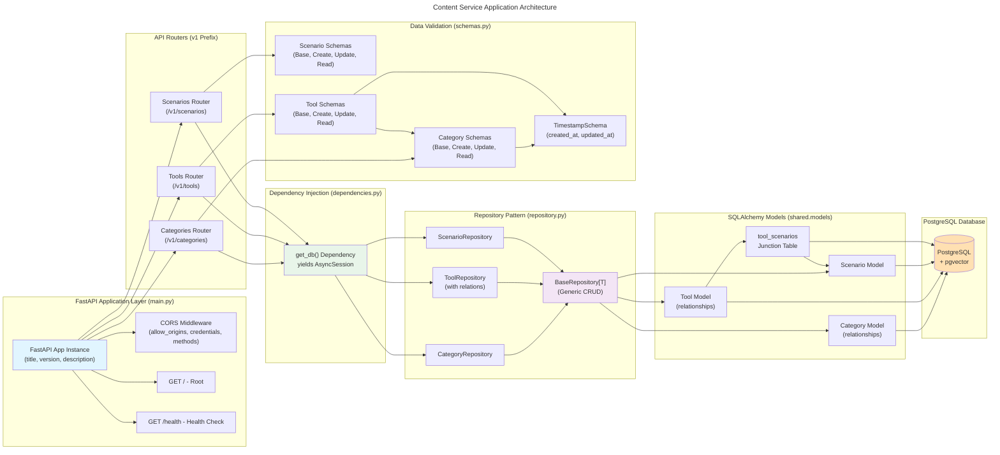
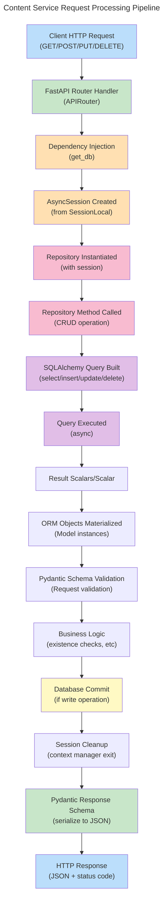
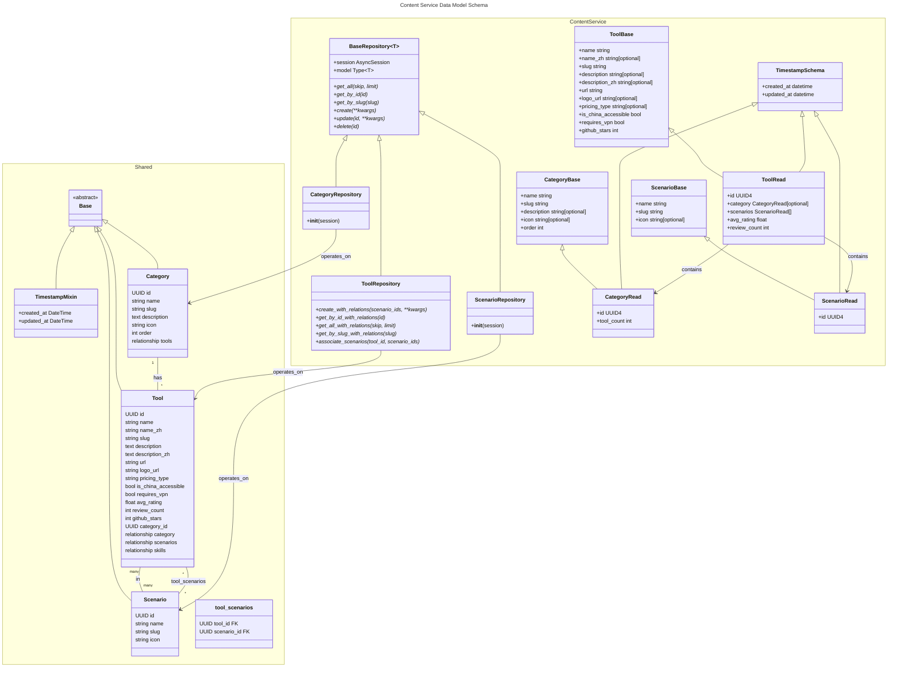
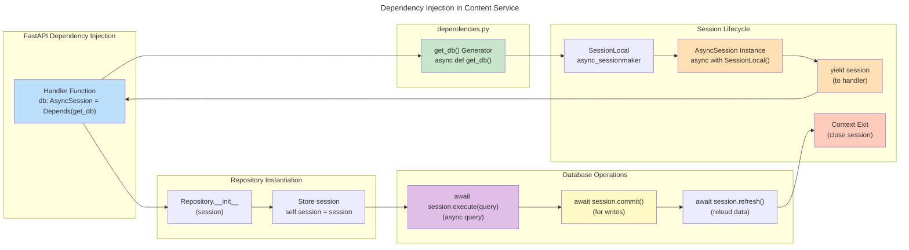
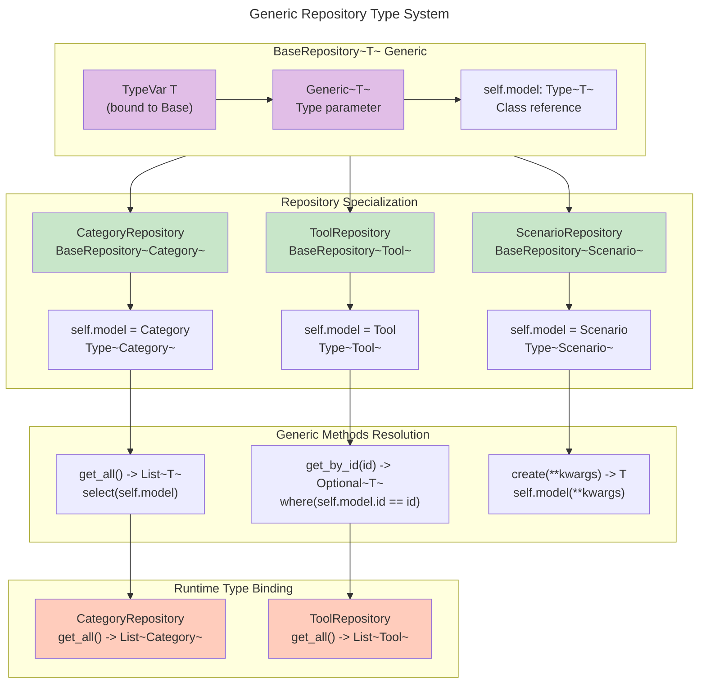

# C4 Code Level: Content Service Core Application

## Overview

- **Name**: Content Service Core Application
- **Description**: FastAPI application core infrastructure, dependency injection, database repository pattern, and Pydantic data schemas for managing AI tools, categories, and scenarios in the AI Navigator platform
- **Location**: `ainav-backend/services/content_service/app/`
- **Language**: Python 3.11+
- **Purpose**: Provides RESTful API endpoints for content management (CRUD operations) with type-safe data validation, async database access, and structured repository pattern for data access

---

## Code Elements

### Main Application Module (`main.py`)

#### FastAPI Application Instance
- **Element**: `app` (FastAPI instance)
  - **Type**: FastAPI application
  - **Location**: `main.py:6-10`
  - **Description**: Core FastAPI application configured with title "AI Navigator - Content Service", version 1.0.0, and comprehensive OpenAPI documentation
  - **Configuration**:
    - Title: "AI Navigator - Content Service"
    - Version: "1.0.0"
    - Description: "Content management API for AI tools, categories, and scenarios"

#### CORS Middleware Configuration
- **Element**: `CORSMiddleware` setup
  - **Type**: ASGI middleware
  - **Location**: `main.py:13-19`
  - **Description**: Cross-Origin Resource Sharing middleware configured to accept requests from configured origins with full support for credentials, all HTTP methods, and all headers
  - **Configuration**:
    - `allow_origins`: Loaded from `settings.CORS_ORIGINS` (default: `["http://localhost:3000"]`)
    - `allow_credentials`: True
    - `allow_methods`: ["*"] (all methods)
    - `allow_headers`: ["*"] (all headers)

#### Router Registration
- **Element**: Router includes
  - **Type**: APIRouter integration
  - **Location**: `main.py:22-24`
  - **Description**: Registers three routers with `/v1` prefix for API versioning
  - **Routers Included**:
    - `categories.router` → `/v1/categories`
    - `tools.router` → `/v1/tools`
    - `scenarios.router` → `/v1/scenarios`

#### API Endpoints

##### Root Endpoint
```python
@app.get("/")
async def root() -> dict[str, str]
```
- **Location**: `main.py:27-29`
- **Description**: Root endpoint returning welcome message
- **Returns**: JSON object with welcome message

##### Health Check Endpoint
```python
@app.get("/health")
async def health_check() -> dict[str, str]
```
- **Location**: `main.py:32-34`
- **Description**: Health check endpoint for monitoring service availability
- **Returns**: JSON object with status "healthy" and service name "content-service"

---

### Dependency Injection Module (`dependencies.py`)

#### Database Session Dependency
```python
async def get_db() -> Generator[AsyncSession, None, None]
```
- **Location**: `dependencies.py:4-6`
- **Parameters**: None
- **Returns**: Generator yielding `AsyncSession` from `SessionLocal`
- **Description**: FastAPI dependency function that provides async database sessions to route handlers. Uses context manager to ensure proper session cleanup after request completion
- **Dependencies**:
  - `SessionLocal` from `shared.database`
  - `AsyncSession` from `sqlalchemy.ext.asyncio`

---

### Repository Pattern Module (`repository.py`)

#### Base Generic Repository Class
```python
class BaseRepository(Generic[T])
```
- **Location**: `repository.py:9-46`
- **Type Parameters**: `T` (bound to `Base` SQLAlchemy model)
- **Description**: Generic base repository class implementing common CRUD operations for all data models using SQLAlchemy async API

##### Constructor
```python
def __init__(self, model: Type[T], session: AsyncSession) -> None
```
- **Parameters**:
  - `model: Type[T]` - SQLAlchemy model class
  - `session: AsyncSession` - Async database session
- **Attributes**:
  - `self.model: Type[T]` - Stored model class
  - `self.session: AsyncSession` - Stored database session

##### Methods

###### Get All Records
```python
async def get_all(self, skip: int = 0, limit: int = 100) -> List[T]
```
- **Location**: `repository.py:14-17`
- **Parameters**:
  - `skip: int` (default 0) - Offset for pagination
  - `limit: int` (default 100) - Max records to return
- **Returns**: `List[T]` - List of model instances
- **Description**: Fetches all records with pagination support

###### Get by ID
```python
async def get_by_id(self, id: any) -> Optional[T]
```
- **Location**: `repository.py:19-22`
- **Parameters**:
  - `id: any` - Primary key value (typically UUID)
- **Returns**: `Optional[T]` - Model instance or None
- **Description**: Retrieves single record by primary key

###### Get by Slug
```python
async def get_by_slug(self, slug: str) -> Optional[T]
```
- **Location**: `repository.py:24-27`
- **Parameters**:
  - `slug: str` - Unique slug identifier
- **Returns**: `Optional[T]` - Model instance or None
- **Description**: Retrieves single record by slug field (URL-friendly identifier)

###### Create Record
```python
async def create(self, **kwargs) -> T
```
- **Location**: `repository.py:29-34`
- **Parameters**:
  - `**kwargs` - Field values for new model instance
- **Returns**: `T` - Created model instance with ID and timestamps
- **Description**: Creates new record in database, commits transaction, and returns refreshed instance
- **Side Effects**: Commits transaction, triggers database INSERT

###### Update Record
```python
async def update(self, id: any, **kwargs) -> Optional[T]
```
- **Location**: `repository.py:36-40`
- **Parameters**:
  - `id: any` - Primary key of record to update
  - `**kwargs` - Field values to update
- **Returns**: `Optional[T]` - Updated model instance or None
- **Description**: Updates record by ID with provided values, commits, and returns updated instance
- **Side Effects**: Commits transaction, triggers database UPDATE

###### Delete Record
```python
async def delete(self, id: any) -> bool
```
- **Location**: `repository.py:42-46`
- **Parameters**:
  - `id: any` - Primary key of record to delete
- **Returns**: `bool` - True if record was deleted, False if not found
- **Description**: Deletes record by ID and commits transaction
- **Side Effects**: Commits transaction, triggers database DELETE

#### Category Repository
```python
class CategoryRepository(BaseRepository[Category])
```
- **Location**: `repository.py:50-52`
- **Description**: Specialized repository for Category model, inherits all CRUD operations from BaseRepository
- **Constructor**: `__init__(self, session: AsyncSession)`

#### Scenario Repository
```python
class ScenarioRepository(BaseRepository[Scenario])
```
- **Location**: `repository.py:54-56`
- **Description**: Specialized repository for Scenario model, inherits all CRUD operations from BaseRepository
- **Constructor**: `__init__(self, session: AsyncSession)`

#### Tool Repository
```python
class ToolRepository(BaseRepository[Tool])
```
- **Location**: `repository.py:58-120`
- **Description**: Specialized repository for Tool model with extended methods for managing tool-scenario relationships and eager loading related data
- **Constructor**: `__init__(self, session: AsyncSession)`

##### Additional Methods for Tool Repository

###### Create with Relations
```python
async def create_with_relations(
    self,
    scenario_ids: List[any] = None,
    **kwargs
) -> Tool
```
- **Location**: `repository.py:62-77`
- **Parameters**:
  - `scenario_ids: List[any]` (optional) - List of scenario IDs to associate
  - `**kwargs` - Field values for new tool
- **Returns**: `Tool` - Created tool with relations loaded
- **Description**: Creates new tool, resolves scenario relationships, and returns fully populated tool instance
- **Side Effects**: Commits transaction, may fetch related scenarios

###### Get by ID with Relations
```python
async def get_by_id_with_relations(self, id: any) -> Optional[Tool]
```
- **Location**: `repository.py:79-86`
- **Parameters**:
  - `id: any` - Tool primary key
- **Returns**: `Optional[Tool]` - Tool with category and scenarios eagerly loaded or None
- **Description**: Retrieves tool by ID with joinedload strategy for category and scenarios relationships
- **Eager Loading**: Uses `joinedload` for single-entity fetch optimization

###### Get All with Relations
```python
async def get_all_with_relations(self, skip: int = 0, limit: int = 100) -> List[Tool]
```
- **Location**: `repository.py:88-95`
- **Parameters**:
  - `skip: int` (default 0) - Pagination offset
  - `limit: int` (default 100) - Max records
- **Returns**: `List[Tool]` - List of tools with relations eagerly loaded
- **Description**: Fetches multiple tools with selectinload strategy for efficient eager loading
- **Eager Loading**: Uses `selectinload` for list fetch optimization (N+1 query prevention)

###### Get by Slug with Relations
```python
async def get_by_slug_with_relations(self, slug: str) -> Optional[Tool]
```
- **Location**: `repository.py:97-104`
- **Parameters**:
  - `slug: str` - Tool slug identifier
- **Returns**: `Optional[Tool]` - Tool with relations loaded or None
- **Description**: Retrieves tool by slug with selectinload strategy for category and scenarios
- **Eager Loading**: Uses `selectinload` for N+1 prevention

###### Associate Scenarios
```python
async def associate_scenarios(self, tool_id: any, scenario_ids: List[any]) -> None
```
- **Location**: `repository.py:106-119`
- **Parameters**:
  - `tool_id: any` - Tool primary key
  - `scenario_ids: List[any]` - List of scenario IDs to associate
- **Returns**: None
- **Description**: Updates tool's scenario associations by fetching specified scenarios and assigning to tool's scenarios relationship
- **Side Effects**: Commits transaction, updates many-to-many relationship through junction table

---

### Pydantic Schemas Module (`schemas.py`)

#### Common Schemas

##### TimestampSchema
```python
class TimestampSchema(BaseModel)
```
- **Location**: `schemas.py:7-11`
- **Configuration**: `ConfigDict(from_attributes=True)` (enables ORM mode)
- **Fields**:
  - `created_at: datetime` - Record creation timestamp
  - `updated_at: datetime` - Record last update timestamp
- **Description**: Base schema providing audit timestamps for all response models

#### Scenario Schemas

##### ScenarioBase
```python
class ScenarioBase(BaseModel)
```
- **Location**: `schemas.py:15-20`
- **Configuration**: `ConfigDict(from_attributes=True)`
- **Fields**:
  - `name: str` - Scenario name (max 100 chars, required)
  - `slug: str` - URL-friendly identifier (max 100 chars, required)
  - `icon: Optional[str]` - Icon URL or emoji (max 255 chars, optional)
- **Description**: Base scenario data shared by create and read schemas

##### ScenarioCreate
```python
class ScenarioCreate(ScenarioBase)
```
- **Location**: `schemas.py:22-23`
- **Description**: Request schema for creating new scenarios, inherits all fields from ScenarioBase

##### ScenarioUpdate
```python
class ScenarioUpdate(BaseModel)
```
- **Location**: `schemas.py:25-28`
- **Fields**:
  - `name: Optional[str]` - Scenario name (max 100 chars)
  - `slug: Optional[str]` - URL identifier (max 100 chars)
  - `icon: Optional[str]` - Icon URL or emoji (max 255 chars)
- **Description**: Request schema for updating scenarios with all optional fields

##### ScenarioRead
```python
class ScenarioRead(ScenarioBase, TimestampSchema)
```
- **Location**: `schemas.py:30-31`
- **Fields**:
  - `id: UUID4` - Unique scenario identifier
  - (inherited from ScenarioBase): `name`, `slug`, `icon`
  - (inherited from TimestampSchema): `created_at`, `updated_at`
- **Description**: Response schema for reading scenarios with all data including ID and timestamps

#### Category Schemas

##### CategoryBase
```python
class CategoryBase(BaseModel)
```
- **Location**: `schemas.py:35-42`
- **Configuration**: `ConfigDict(from_attributes=True)`
- **Fields**:
  - `name: str` - Category name (max 100 chars, required)
  - `slug: str` - URL-friendly identifier (max 100 chars, required)
  - `description: Optional[str]` - Category description (optional)
  - `icon: Optional[str]` - Icon URL (max 255 chars, optional)
  - `order: int` - Display order (default 0)
- **Description**: Base category data shared by create and read schemas

##### CategoryCreate
```python
class CategoryCreate(CategoryBase)
```
- **Location**: `schemas.py:44-45`
- **Description**: Request schema for creating new categories, inherits all fields from CategoryBase

##### CategoryUpdate
```python
class CategoryUpdate(BaseModel)
```
- **Location**: `schemas.py:47-52`
- **Fields**:
  - `name: Optional[str]` - Category name (max 100 chars)
  - `slug: Optional[str]` - URL identifier (max 100 chars)
  - `description: Optional[str]` - Category description
  - `icon: Optional[str]` - Icon URL (max 255 chars)
  - `order: Optional[int]` - Display order
- **Description**: Request schema for updating categories with all optional fields

##### CategoryRead
```python
class CategoryRead(CategoryBase, TimestampSchema)
```
- **Location**: `schemas.py:54-56`
- **Fields**:
  - `id: UUID4` - Unique category identifier
  - (inherited from CategoryBase): `name`, `slug`, `description`, `icon`, `order`
  - (inherited from TimestampSchema): `created_at`, `updated_at`
  - `tool_count: int` - Count of tools in category (default 0)
- **Description**: Response schema for reading categories with all data, timestamps, and tool count

#### Tool Schemas

##### ToolBase
```python
class ToolBase(BaseModel)
```
- **Location**: `schemas.py:60-79`
- **Configuration**: `ConfigDict(from_attributes=True)`
- **Fields**:
  - `name: str` - Tool name in English (max 255 chars, required)
  - `name_zh: Optional[str]` - Tool name in Chinese (max 255 chars, optional)
  - `slug: str` - URL-friendly identifier (max 255 chars, required)
  - `description: Optional[str]` - English description (optional)
  - `description_zh: Optional[str]` - Chinese description (optional)
  - `url: str` - Official tool URL (max 512 chars, required)
  - `logo_url: Optional[str]` - Logo image URL (max 512 chars, optional)
  - `pricing_type: Optional[str]` - Pricing model: "free", "freemium", "paid" (max 50 chars, optional)
  - `is_china_accessible: bool` - Whether accessible in China (default True)
  - `requires_vpn: bool` - Whether VPN required in China (default False)
  - `github_stars: int` - GitHub star count (default 0)
- **Validators**:
  - `coerce_github_stars()` - Converts None to 0 for github_stars field (mode='before')
- **Description**: Base tool data with bilingual support and China-specific accessibility flags

##### ToolCreate
```python
class ToolCreate(ToolBase)
```
- **Location**: `schemas.py:81-83`
- **Additional Fields**:
  - `category_id: Optional[UUID4]` - Category to assign tool to (optional)
  - `scenario_ids: List[UUID4]` - Scenarios to associate (default empty list)
- **Description**: Request schema for creating new tools with category and scenario associations

##### ToolUpdate
```python
class ToolUpdate(BaseModel)
```
- **Location**: `schemas.py:85-95`
- **Fields**:
  - `name: Optional[str]` - Tool name (max 255 chars)
  - `description: Optional[str]` - Description
  - `url: Optional[HttpUrl]` - URL with validation
  - `logo_url: Optional[HttpUrl]` - Logo URL with validation
  - `pricing_type: Optional[str]` - Pricing model (max 50 chars)
  - `is_china_accessible: Optional[bool]` - China accessibility flag
  - `requires_vpn: Optional[bool]` - VPN requirement flag
  - `category_id: Optional[UUID4]` - Category assignment
  - `github_stars: Optional[int]` - GitHub star count
  - `scenario_ids: Optional[List[UUID4]]` - Scenario associations
- **Description**: Request schema for updating tools with all fields optional

##### ToolRead
```python
class ToolRead(ToolBase, TimestampSchema)
```
- **Location**: `schemas.py:97-104`
- **Configuration**: `ConfigDict(from_attributes=True)`
- **Fields**:
  - `id: UUID4` - Unique tool identifier
  - (inherited from ToolBase): all tool properties
  - (inherited from TimestampSchema): `created_at`, `updated_at`
  - `category: Optional[CategoryRead]` - Full category object (optional)
  - `scenarios: List[ScenarioRead]` - List of associated scenarios (default empty list)
  - `avg_rating: float` - Average user rating (default 0.0)
  - `review_count: int` - Number of reviews (default 0)
- **Description**: Complete response schema for reading tools with nested category and scenarios, ratings, and timestamps

#### __init__.py Module
- **Location**: `__init__.py`
- **Content**: Empty (single newline)
- **Description**: Package marker file for Python module discovery

---

## Dependencies

### Internal Dependencies

#### From Shared Package
- `shared.config.Settings` - Application configuration settings
  - `settings.CORS_ORIGINS` - Allowed CORS origins list
  - `settings.DATABASE_URL` - PostgreSQL connection string
  - `settings.DEFAULT_PAGE_SIZE` - Default pagination size
  - `settings.MAX_PAGE_SIZE` - Maximum pagination size

- `shared.database` - Database infrastructure
  - `SessionLocal` - Async session factory from SQLAlchemy
  - `AsyncSession` - SQLAlchemy async session type

- `shared.models` - SQLAlchemy ORM models
  - `Base` - Declarative base for all models
  - `Category` - Category model with relationships
  - `Scenario` - Scenario model
  - `Tool` - Tool model with relationships
  - `tool_scenarios` - Junction table for Tool-Scenario many-to-many

#### From Service Routers
- `app.routers.categories` - Categories router module
- `app.routers.tools` - Tools router module
- `app.routers.scenarios` - Scenarios router module

### External Dependencies

#### FastAPI Framework
- `fastapi.FastAPI` - Core web framework
- `fastapi.APIRouter` - Router for endpoint grouping
- `fastapi.Depends` - Dependency injection mechanism
- `fastapi.HTTPException` - Exception handling
- `fastapi.middleware.cors.CORSMiddleware` - CORS middleware

#### SQLAlchemy ORM (Async)
- `sqlalchemy.ext.asyncio.AsyncSession` - Async database session
- `sqlalchemy.ext.asyncio.create_async_engine` - Async engine factory
- `sqlalchemy.ext.asyncio.async_sessionmaker` - Session factory creator
- `sqlalchemy.future.select` - Modern query builder
- `sqlalchemy.delete` - Delete query builder
- `sqlalchemy.update` - Update query builder
- `sqlalchemy.orm.joinedload` - Eager load strategy for single entities
- `sqlalchemy.orm.selectinload` - Eager load strategy for collections
- `sqlalchemy.ext.declarative.declarative_base` - ORM base class factory

#### Pydantic Data Validation
- `pydantic.BaseModel` - Base class for data schemas
- `pydantic.Field` - Field metadata and validation
- `pydantic.UUID4` - UUID field type
- `pydantic.HttpUrl` - URL validation type
- `pydantic.ConfigDict` - Configuration for models
- `pydantic.field_validator` - Custom field validation decorator

#### Python Standard Library
- `typing.Generator` - Generator type hint
- `typing.Generic` - Generic type support
- `typing.TypeVar` - Type variable definition
- `typing.Type` - Type annotation
- `typing.List` - List type annotation
- `typing.Optional` - Optional type annotation
- `datetime.datetime` - Datetime type

---

## Relationships

### Application Architecture Flow



### Request-Response Flow



### Data Model Relationships



### Dependency Injection Flow



### Repository Generic Type Flow



---

## Query Optimization Strategies

### Eager Loading in Tool Repository

The `ToolRepository` implements two distinct eager loading strategies based on query context:

1. **`joinedload` Strategy** (Single Entity Fetch)
   - Used in `get_by_id_with_relations()` and `get_by_slug_with_relations()`
   - Performs a LEFT OUTER JOIN to load related objects
   - Optimal for single-record queries with limited relationships
   - Reduces database round trips from N+2 to 1

2. **`selectinload` Strategy** (Collection Fetch)
   - Used in `get_all_with_relations()`
   - Performs separate SELECT queries for related collections
   - Optimal for list queries with many-to-many relationships
   - Prevents N+1 query problem without producing large result sets

### Pagination Pattern

All `get_all()` methods support offset-limit pagination:
- Default pagination: `skip=0, limit=100`
- Configurable via route parameters
- Prevents large result sets in memory
- Important for scalability with large datasets

---

## Configuration and Environment

### Settings Integration

The content service integrates with centralized `shared.config.Settings`:

- **CORS Configuration**: Dynamically loaded from `settings.CORS_ORIGINS`
- **Database URL**: Read from `settings.DATABASE_URL` in shared database module
- **Defaults**: Application uses sensible defaults with production overrides via environment

### Session Management

Database sessions are managed through:
1. Factory pattern: `SessionLocal` from `shared.database`
2. Dependency injection: `get_db()` in `dependencies.py`
3. Context manager: Automatic cleanup on request completion
4. Transaction control: `commit()`, `refresh()` on explicit operations

---

## Error Handling

The content service implements error handling at router level:

- **404 Not Found**: `HTTPException(status_code=404, detail="...")`
  - Raised when get/update/delete operations target non-existent records
  - Repositories return `None` and routers translate to 404

- **400 Bad Request**: `HTTPException(status_code=400, detail="...")`
  - Raised on constraint violations (e.g., duplicate slug)
  - Repositories check existing records before create

- **Validation Errors**: Automatic by Pydantic
  - Invalid request data triggers 422 Unprocessable Entity
  - Field validators run on deserialization

---

## API Versioning

All content endpoints are prefixed with `/v1/`:
- Enables future API evolution without breaking clients
- Router-level prefix configuration in `main.py:22-24`
- All routers use consistent versioning scheme

---

## Bilingual Support

The content service supports English and Chinese (Simplified) for tools:

- **Tool Model**:
  - `name` (English) + `name_zh` (Chinese)
  - `description` (English) + `description_zh` (Chinese)

- **Scenario & Category Models**:
  - Single `name` field (primary language)
  - No localized translations in schema

- **Schema Support**:
  - `ToolRead` includes both language fields
  - Routers serialize both fields in responses
  - Clients can display based on user language preference

---

## China-Specific Accessibility Flags

The Tool model and schemas include region-specific metadata:

- **`is_china_accessible: bool`** (default True)
  - Whether tool is accessible from mainland China
  - Helps users identify geo-restricted services

- **`requires_vpn: bool`** (default False)
  - Whether VPN required for China access
  - Complements accessibility flag with usage guidance

- **Filter Support**: Not implemented in base repository
  - Can be added via custom repository methods if needed
  - Would use SQLAlchemy `where()` clause

---

## Notes

- **async/await Throughout**: All database operations use async/await for non-blocking I/O
- **Type Safety**: Full type hints on all functions and methods enable IDE autocomplete and static analysis
- **Pydantic ORM Mode**: `from_attributes=True` config enables schema serialization directly from ORM models without explicit mapping
- **Repository Pattern**: Provides abstraction layer between routers and database, making business logic testable and data access consistent
- **Future Extensibility**: ToolRepository methods show pattern for adding specialized query methods (eager loading, custom filters) to specialized repositories while maintaining generic base
