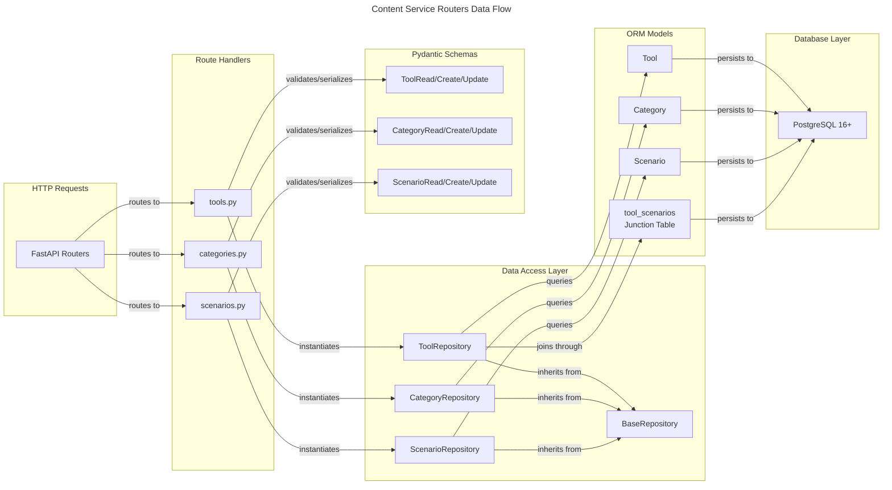
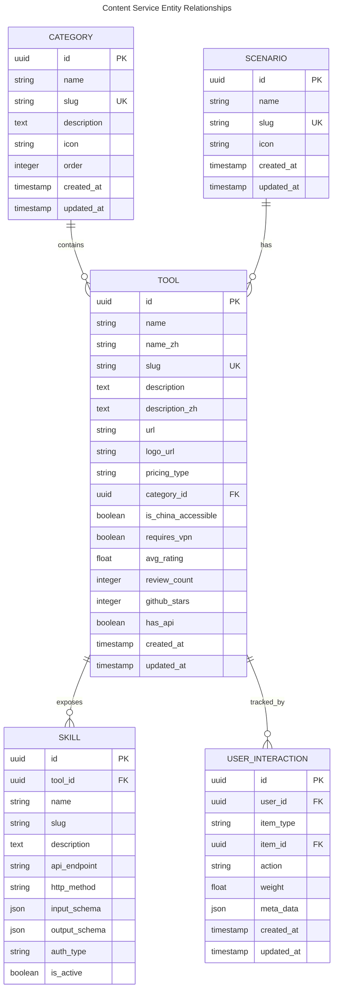

# C4 Code Level: Content Service Routers

## Overview

- **Name**: Content Service Routers
- **Description**: FastAPI route handlers for tool, category, and scenario management in the AI Navigation platform
- **Location**: `/home/dislove/document/ai 导航/ainav-backend/services/content_service/app/routers`
- **Language**: Python 3.11+
- **Purpose**: Provides REST API endpoints for CRUD operations on content entities (Tools, Categories, Scenarios) with relationship management and pagination support

## Code Elements

### Router: Tools (`tools.py`)

#### Route Handlers

1. **`list_tools(skip: int = 0, limit: int = 100, db: AsyncSession) -> List[ToolRead]`**
   - **HTTP Method**: GET
   - **Route**: `/v1/tools/`
   - **Description**: Retrieves paginated list of all tools with their relationships (category, scenarios)
   - **Parameters**:
     - `skip: int` (query) - Number of records to skip for pagination (default: 0)
     - `limit: int` (query) - Maximum records to return per page (default: 100)
     - `db: AsyncSession` (dependency) - Database session injected by FastAPI dependency
   - **Response Model**: `List[ToolRead]` - Array of tool objects with metadata and relationships
   - **Location**: `/home/dislove/document/ai 导航/ainav-backend/services/content_service/app/routers/tools.py:11-14`
   - **Dependencies**: `ToolRepository.get_all_with_relations()`, `get_db()` dependency

2. **`get_tool(slug: str, db: AsyncSession) -> ToolRead`**
   - **HTTP Method**: GET
   - **Route**: `/v1/tools/{slug}`
   - **Description**: Retrieves a single tool by slug with all relationships loaded (category, scenarios)
   - **Parameters**:
     - `slug: str` (path) - Unique slug identifier for the tool
     - `db: AsyncSession` (dependency) - Database session injected by FastAPI dependency
   - **Response Model**: `ToolRead` - Single tool object with full relationships
   - **Error Handling**: Returns HTTP 404 if tool not found
   - **Location**: `/home/dislove/document/ai 导航/ainav-backend/services/content_service/app/routers/tools.py:16-23`
   - **Dependencies**: `ToolRepository.get_by_slug_with_relations()`, `get_db()` dependency

3. **`create_tool(tool_in: ToolCreate, db: AsyncSession) -> ToolRead`**
   - **HTTP Method**: POST
   - **Route**: `/v1/tools/`
   - **Description**: Creates a new tool with optional category assignment and scenario associations
   - **Parameters**:
     - `tool_in: ToolCreate` (body) - Pydantic schema containing tool data including scenario IDs
     - `db: AsyncSession` (dependency) - Database session injected by FastAPI dependency
   - **Request Body Fields**: name, name_zh, slug, description, description_zh, url, logo_url, pricing_type, is_china_accessible, requires_vpn, github_stars, category_id, scenario_ids
   - **Response Model**: `ToolRead` - Created tool with all relationships
   - **Error Handling**: Returns HTTP 400 if slug already exists
   - **Business Logic**:
     - Validates slug uniqueness before creation
     - Extracts scenario_ids from input and associates them via repository
   - **Location**: `/home/dislove/document/ai 导航/ainav-backend/services/content_service/app/routers/tools.py:25-35`
   - **Dependencies**: `ToolRepository.get_by_slug()`, `ToolRepository.create_with_relations()`, `get_db()` dependency

4. **`update_tool(tool_id: UUID4, tool_in: ToolUpdate, db: AsyncSession) -> ToolRead`**
   - **HTTP Method**: PUT
   - **Route**: `/v1/tools/{tool_id}`
   - **Description**: Updates an existing tool's attributes and optionally updates scenario associations
   - **Parameters**:
     - `tool_id: UUID4` (path) - UUID primary key of the tool to update
     - `tool_in: ToolUpdate` (body) - Pydantic schema with optional update fields
     - `db: AsyncSession` (dependency) - Database session injected by FastAPI dependency
   - **Request Body Fields**: name, description, url, logo_url, pricing_type, is_china_accessible, requires_vpn, category_id, github_stars, scenario_ids (all optional)
   - **Response Model**: `ToolRead` - Updated tool with all relationships
   - **Error Handling**: Returns HTTP 404 if tool not found
   - **Business Logic**:
     - Uses `exclude_unset=True` to only update provided fields (partial update)
     - Handles scenario association separately if provided
     - Returns tool with fresh relationship data after update
   - **Location**: `/home/dislove/document/ai 导航/ainav-backend/services/content_service/app/routers/tools.py:37-52`
   - **Dependencies**: `ToolRepository.update()`, `ToolRepository.associate_scenarios()`, `ToolRepository.get_by_id_with_relations()`, `get_db()` dependency

5. **`delete_tool(tool_id: UUID4, db: AsyncSession) -> dict`**
   - **HTTP Method**: DELETE
   - **Route**: `/v1/tools/{tool_id}`
   - **Description**: Deletes a tool and all its associations (cascade delete via ORM relationships)
   - **Parameters**:
     - `tool_id: UUID4` (path) - UUID primary key of the tool to delete
     - `db: AsyncSession` (dependency) - Database session injected by FastAPI dependency
   - **Response Model**: `dict` - Confirmation message `{"message": "Tool deleted successfully"}`
   - **Error Handling**: Returns HTTP 404 if tool not found
   - **Location**: `/home/dislove/document/ai 导航/ainav-backend/services/content_service/app/routers/tools.py:54-61`
   - **Dependencies**: `ToolRepository.delete()`, `get_db()` dependency

#### Router Configuration

- **Prefix**: `/tools`
- **Tags**: `["tools"]` (OpenAPI grouping)
- **Base Route**: `/v1/tools` (combined with service prefix)

---

### Router: Categories (`categories.py`)

#### Route Handlers

1. **`list_categories(skip: int = 0, limit: int = 100, db: AsyncSession) -> List[CategoryRead]`**
   - **HTTP Method**: GET
   - **Route**: `/v1/categories/`
   - **Description**: Retrieves paginated list of all categories with metadata
   - **Parameters**:
     - `skip: int` (query) - Number of records to skip for pagination (default: 0)
     - `limit: int` (query) - Maximum records to return per page (default: 100)
     - `db: AsyncSession` (dependency) - Database session injected by FastAPI dependency
   - **Response Model**: `List[CategoryRead]` - Array of category objects with tool counts
   - **Location**: `/home/dislove/document/ai 导航/ainav-backend/services/content_service/app/routers/categories.py:11-14`
   - **Dependencies**: `CategoryRepository.get_all()`, `get_db()` dependency

2. **`get_category(slug: str, db: AsyncSession) -> CategoryRead`**
   - **HTTP Method**: GET
   - **Route**: `/v1/categories/{slug}`
   - **Description**: Retrieves a single category by slug with metadata
   - **Parameters**:
     - `slug: str` (path) - Unique slug identifier for the category
     - `db: AsyncSession` (dependency) - Database session injected by FastAPI dependency
   - **Response Model**: `CategoryRead` - Single category object
   - **Error Handling**: Returns HTTP 404 if category not found
   - **Location**: `/home/dislove/document/ai 导航/ainav-backend/services/content_service/app/routers/categories.py:16-22`
   - **Dependencies**: `CategoryRepository.get_by_slug()`, `get_db()` dependency

3. **`create_category(category_in: CategoryCreate, db: AsyncSession) -> CategoryRead`**
   - **HTTP Method**: POST
   - **Route**: `/v1/categories/`
   - **Description**: Creates a new category
   - **Parameters**:
     - `category_in: CategoryCreate` (body) - Pydantic schema containing category data
     - `db: AsyncSession` (dependency) - Database session injected by FastAPI dependency
   - **Request Body Fields**: name, slug, description, icon, order
   - **Response Model**: `CategoryRead` - Created category
   - **Error Handling**: Returns HTTP 400 if slug already exists
   - **Business Logic**: Validates slug uniqueness before creation
   - **Location**: `/home/dislove/document/ai 导航/ainav-backend/services/content_service/app/routers/categories.py:24-30`
   - **Dependencies**: `CategoryRepository.get_by_slug()`, `CategoryRepository.create()`, `get_db()` dependency

4. **`update_category(category_id: UUID4, category_in: CategoryCreate, db: AsyncSession) -> CategoryRead`**
   - **HTTP Method**: PUT
   - **Route**: `/v1/categories/{category_id}`
   - **Description**: Updates an existing category's attributes
   - **Parameters**:
     - `category_id: UUID4` (path) - UUID primary key of the category to update
     - `category_in: CategoryCreate` (body) - Pydantic schema with update fields
     - `db: AsyncSession` (dependency) - Database session injected by FastAPI dependency
   - **Request Body Fields**: name, slug, description, icon, order
   - **Response Model**: `CategoryRead` - Updated category
   - **Error Handling**: Returns HTTP 404 if category not found
   - **Location**: `/home/dislove/document/ai 导航/ainav-backend/services/content_service/app/routers/categories.py:32-38`
   - **Dependencies**: `CategoryRepository.update()`, `get_db()` dependency

5. **`delete_category(category_id: UUID4, db: AsyncSession) -> dict`**
   - **HTTP Method**: DELETE
   - **Route**: `/v1/categories/{category_id}`
   - **Description**: Deletes a category
   - **Parameters**:
     - `category_id: UUID4` (path) - UUID primary key of the category to delete
     - `db: AsyncSession` (dependency) - Database session injected by FastAPI dependency
   - **Response Model**: `dict` - Confirmation message `{"message": "Category deleted successfully"}`
   - **Error Handling**: Returns HTTP 404 if category not found
   - **Location**: `/home/dislove/document/ai 导航/ainav-backend/services/content_service/app/routers/categories.py:40-46`
   - **Dependencies**: `CategoryRepository.delete()`, `get_db()` dependency

#### Router Configuration

- **Prefix**: `/categories`
- **Tags**: `["categories"]` (OpenAPI grouping)
- **Base Route**: `/v1/categories` (combined with service prefix)

---

### Router: Scenarios (`scenarios.py`)

#### Route Handlers

1. **`list_scenarios(skip: int = 0, limit: int = 100, db: AsyncSession) -> List[ScenarioRead]`**
   - **HTTP Method**: GET
   - **Route**: `/v1/scenarios/`
   - **Description**: Retrieves paginated list of all scenarios
   - **Parameters**:
     - `skip: int` (query) - Number of records to skip for pagination (default: 0)
     - `limit: int` (query) - Maximum records to return per page (default: 100)
     - `db: AsyncSession` (dependency) - Database session injected by FastAPI dependency
   - **Response Model**: `List[ScenarioRead]` - Array of scenario objects
   - **Location**: `/home/dislove/document/ai 导航/ainav-backend/services/content_service/app/routers/scenarios.py:16-20`
   - **Dependencies**: `ScenarioRepository.get_all()`, `get_db()` dependency

2. **`get_scenario(slug: str, db: AsyncSession) -> ScenarioRead`**
   - **HTTP Method**: GET
   - **Route**: `/v1/scenarios/{slug}`
   - **Description**: Retrieves a single scenario by slug
   - **Parameters**:
     - `slug: str` (path) - Unique slug identifier for the scenario
     - `db: AsyncSession` (dependency) - Database session injected by FastAPI dependency
   - **Response Model**: `ScenarioRead` - Single scenario object
   - **Error Handling**: Returns HTTP 404 if scenario not found
   - **Location**: `/home/dislove/document/ai 导航/ainav-backend/services/content_service/app/routers/scenarios.py:23-30`
   - **Dependencies**: `ScenarioRepository.get_by_slug()`, `get_db()` dependency

3. **`get_tools_by_scenario(slug: str, skip: int = 0, limit: int = 100, db: AsyncSession) -> List[ToolRead]`**
   - **HTTP Method**: GET
   - **Route**: `/v1/scenarios/{slug}/tools`
   - **Description**: Retrieves paginated list of all tools associated with a scenario via junction table
   - **Parameters**:
     - `slug: str` (path) - Unique slug identifier for the scenario
     - `skip: int` (query) - Number of records to skip for pagination (default: 0)
     - `limit: int` (query) - Maximum records to return per page (default: 100)
     - `db: AsyncSession` (dependency) - Database session injected by FastAPI dependency
   - **Response Model**: `List[ToolRead]` - Array of tool objects associated with the scenario
   - **Error Handling**: Returns HTTP 404 if scenario not found
   - **Business Logic**:
     - Queries through `tool_scenarios` junction table
     - Uses SQLAlchemy `selectinload()` to eagerly load tool relationships (category, scenarios)
     - Applies pagination to the result set
   - **Database Query**: Performs JOIN on `tool_scenarios` table with filters on `scenario_id`
   - **Location**: `/home/dislove/document/ai 导航/ainav-backend/services/content_service/app/routers/scenarios.py:33-56`
   - **Dependencies**: `ScenarioRepository.get_by_slug()`, `Tool` model, `tool_scenarios` junction table, `get_db()` dependency

4. **`create_scenario(scenario_in: ScenarioCreate, db: AsyncSession) -> ScenarioRead`**
   - **HTTP Method**: POST
   - **Route**: `/v1/scenarios/`
   - **Description**: Creates a new scenario
   - **Parameters**:
     - `scenario_in: ScenarioCreate` (body) - Pydantic schema containing scenario data
     - `db: AsyncSession` (dependency) - Database session injected by FastAPI dependency
   - **Request Body Fields**: name, slug, icon
   - **Response Model**: `ScenarioRead` - Created scenario
   - **Error Handling**: Returns HTTP 400 if slug already exists
   - **Business Logic**: Validates slug uniqueness before creation
   - **Location**: `/home/dislove/document/ai 导航/ainav-backend/services/content_service/app/routers/scenarios.py:59-66`
   - **Dependencies**: `ScenarioRepository.get_by_slug()`, `ScenarioRepository.create()`, `get_db()` dependency

5. **`update_scenario(scenario_id: UUID4, scenario_in: ScenarioUpdate, db: AsyncSession) -> ScenarioRead`**
   - **HTTP Method**: PUT
   - **Route**: `/v1/scenarios/{scenario_id}`
   - **Description**: Updates an existing scenario's attributes
   - **Parameters**:
     - `scenario_id: UUID4` (path) - UUID primary key of the scenario to update
     - `scenario_in: ScenarioUpdate` (body) - Pydantic schema with optional update fields
     - `db: AsyncSession` (dependency) - Database session injected by FastAPI dependency
   - **Request Body Fields**: name, slug, icon (all optional)
   - **Response Model**: `ScenarioRead` - Updated scenario
   - **Error Handling**: Returns HTTP 404 if scenario not found
   - **Business Logic**: Uses `exclude_unset=True` to only update provided fields (partial update)
   - **Location**: `/home/dislove/document/ai 导航/ainav-backend/services/content_service/app/routers/scenarios.py:68-74`
   - **Dependencies**: `ScenarioRepository.update()`, `get_db()` dependency

6. **`delete_scenario(scenario_id: UUID4, db: AsyncSession) -> dict`**
   - **HTTP Method**: DELETE
   - **Route**: `/v1/scenarios/{scenario_id}`
   - **Description**: Deletes a scenario
   - **Parameters**:
     - `scenario_id: UUID4` (path) - UUID primary key of the scenario to delete
     - `db: AsyncSession` (dependency) - Database session injected by FastAPI dependency
   - **Response Model**: `dict` - Confirmation message `{"message": "Scenario deleted successfully"}`
   - **Error Handling**: Returns HTTP 404 if scenario not found
   - **Location**: `/home/dislove/document/ai 导航/ainav-backend/services/content_service/app/routers/scenarios.py:76-82`
   - **Dependencies**: `ScenarioRepository.delete()`, `get_db()` dependency

#### Router Configuration

- **Prefix**: `/scenarios`
- **Tags**: `["scenarios"]` (OpenAPI grouping)
- **Base Route**: `/v1/scenarios` (combined with service prefix)

---

## Dependencies

### Internal Dependencies

#### Code Module Dependencies

- **Parent Module**: `services.content_service.app`
  - `dependencies.py` - Provides `get_db()` dependency for AsyncSession injection
  - `repository.py` - Provides repository classes:
    - `ToolRepository` - Data access for tools with relationship management
    - `CategoryRepository` - Data access for categories
    - `ScenarioRepository` - Data access for scenarios
  - `schemas.py` - Provides Pydantic data models:
    - `ToolRead`, `ToolCreate`, `ToolUpdate` - Tool schemas
    - `CategoryRead`, `CategoryCreate`, `CategoryUpdate` - Category schemas
    - `ScenarioRead`, `ScenarioCreate`, `ScenarioUpdate` - Scenario schemas

#### Shared Module Dependencies

- `shared.models` - Provides SQLAlchemy ORM models:
  - `Category` - Category entity
  - `Scenario` - Scenario entity
  - `Tool` - Tool entity
  - `tool_scenarios` - Many-to-many junction table
- `shared.database` - Provides `SessionLocal` for database connection pooling

### External Dependencies

#### Framework & Libraries

- **FastAPI** (0.104+) - Web framework
  - `APIRouter` - Router class for endpoint grouping
  - `Depends` - Dependency injection system
  - `HTTPException` - HTTP error responses
  - Response model binding for automatic validation/serialization

- **SQLAlchemy** (2.0+) - ORM & database toolkit
  - `AsyncSession` - Async database session for non-blocking queries
  - `select` - Async query builder
  - `joinedload`, `selectinload` - Relationship eager loading strategies
  - `delete`, `update` - DML operations

- **Pydantic** (2.0+) - Data validation library
  - `UUID4` - UUID type validation
  - `BaseModel` - Schema base class
  - Field validators and model configuration

#### Database & Data

- **PostgreSQL 16+** - Primary relational database (via SQLAlchemy dialect)
- **pgvector** - Vector storage extension (for future agent memory integration)
- **UUID** data type - Primary key generation across all tables

#### Python Standard Library

- `typing` module - Type hints (List, Optional, Generic types)

---

## Relationships

### Data Flow Architecture



### Router to Repository Relationships

```mermaid
---
title: Router Handler to Repository Method Mapping
---
classDiagram
    namespace ToolsRouter {
        class list_tools {
            GET /tools/
            +ToolRepository.get_all_with_relations()
        }
        class get_tool {
            GET /tools/{slug}
            +ToolRepository.get_by_slug_with_relations()
        }
        class create_tool {
            POST /tools/
            +ToolRepository.get_by_slug()
            +ToolRepository.create_with_relations()
        }
        class update_tool {
            PUT /tools/{tool_id}
            +ToolRepository.update()
            +ToolRepository.associate_scenarios()
            +ToolRepository.get_by_id_with_relations()
        }
        class delete_tool {
            DELETE /tools/{tool_id}
            +ToolRepository.delete()
        }
    }

    namespace CategoriesRouter {
        class list_categories {
            GET /categories/
            +CategoryRepository.get_all()
        }
        class get_category {
            GET /categories/{slug}
            +CategoryRepository.get_by_slug()
        }
        class create_category {
            POST /categories/
            +CategoryRepository.get_by_slug()
            +CategoryRepository.create()
        }
        class update_category {
            PUT /categories/{category_id}
            +CategoryRepository.update()
        }
        class delete_category {
            DELETE /categories/{category_id}
            +CategoryRepository.delete()
        }
    }

    namespace ScenariosRouter {
        class list_scenarios {
            GET /scenarios/
            +ScenarioRepository.get_all()
        }
        class get_scenario {
            GET /scenarios/{slug}
            +ScenarioRepository.get_by_slug()
        }
        class get_tools_by_scenario {
            GET /scenarios/{slug}/tools
            +ScenarioRepository.get_by_slug()
            +Direct SQL JOIN
        }
        class create_scenario {
            POST /scenarios/
            +ScenarioRepository.get_by_slug()
            +ScenarioRepository.create()
        }
        class update_scenario {
            PUT /scenarios/{scenario_id}
            +ScenarioRepository.update()
        }
        class delete_scenario {
            DELETE /scenarios/{scenario_id}
            +ScenarioRepository.delete()
        }
    }
```

### Entity Relationship Model



### Request/Response Flow

```mermaid
---
title: HTTP Request Processing Flow
---
flowchart TD
    A["HTTP Request"] -->|FastAPI Router| B{Route Type}

    B -->|GET /tools/| C["list_tools"]
    B -->|GET /tools/{slug}| D["get_tool"]
    B -->|POST /tools/| E["create_tool"]
    B -->|PUT /tools/{id}| F["update_tool"]
    B -->|DELETE /tools/{id}| G["delete_tool"]

    B -->|GET /categories/| H["list_categories"]
    B -->|GET /categories/{slug}| I["get_category"]
    B -->|POST /categories/| J["create_category"]
    B -->|PUT /categories/{id}| K["update_category"]
    B -->|DELETE /categories/{id}| L["delete_category"]

    B -->|GET /scenarios/| M["list_scenarios"]
    B -->|GET /scenarios/{slug}| N["get_scenario"]
    B -->|GET /scenarios/{slug}/tools| O["get_tools_by_scenario"]
    B -->|POST /scenarios/| P["create_scenario"]
    B -->|PUT /scenarios/{id}| Q["update_scenario"]
    B -->|DELETE /scenarios/{id}| R["delete_scenario"]

    C -->|Repository Query| S["PostgreSQL"]
    D -->|Repository Query| S
    E -->|Slug Validation + Insert| S
    F -->|Update + Relationship Sync| S
    G -->|Delete| S

    H -->|Repository Query| S
    I -->|Repository Query| S
    J -->|Slug Validation + Insert| S
    K -->|Update| S
    L -->|Delete| S

    M -->|Repository Query| S
    N -->|Repository Query| S
    O -->|JOIN Query| S
    P -->|Slug Validation + Insert| S
    Q -->|Update| S
    R -->|Delete| S

    S -->|Result Set| T["Pydantic Serialization"]
    T -->|JSON Response| U["HTTP Response"]
```

---

## Code Element Details

### Request/Response Models

#### Tool Schemas

- **ToolCreate** - Input schema for creating tools
  - Includes all ToolBase fields plus `category_id` and `scenario_ids`
  - Scenario IDs extracted and processed separately in router

- **ToolUpdate** - Input schema for updating tools
  - All fields optional
  - Uses partial update pattern with `exclude_unset=True`

- **ToolRead** - Output schema for serializing tool data
  - Includes relationships: `category` (CategoryRead), `scenarios` (List[ScenarioRead])
  - Includes computed fields: `avg_rating`, `review_count`
  - Uses `from_attributes=True` for SQLAlchemy model conversion

#### Category Schemas

- **CategoryCreate** - Input schema for creating categories
  - Fields: name, slug, description, icon, order

- **CategoryUpdate** - Input schema for updating categories
  - All fields optional

- **CategoryRead** - Output schema for serializing category data
  - Includes computed field: `tool_count` (number of associated tools)

#### Scenario Schemas

- **ScenarioCreate** - Input schema for creating scenarios
  - Fields: name, slug, icon

- **ScenarioUpdate** - Input schema for updating scenarios
  - All fields optional

- **ScenarioRead** - Output schema for serializing scenario data

### Error Handling Patterns

All routers implement consistent error handling:

1. **Slug Uniqueness Validation** (Create operations)
   - Query database for existing slug
   - Return HTTP 400 "Slug already exists" if found

2. **Resource Not Found** (Get/Update/Delete operations)
   - Return HTTP 404 "Resource not found" if database query returns null

3. **Default Error Messages**
   - Consistent error detail messages for all routes
   - HTTPException with status_code and detail parameters

### Pagination Implementation

All list endpoints support pagination via query parameters:

- **skip**: Integer offset (default 0)
- **limit**: Maximum records to return (default 100)
- Implemented via SQLAlchemy's `.offset()` and `.limit()` methods
- Passed directly to repository methods

### Relationship Loading Strategies

Different loading strategies used based on use case:

1. **Tools Router** - Uses `get_all_with_relations()` and `get_by_slug_with_relations()`
   - Uses `selectinload()` for eager loading category and scenarios
   - Avoids N+1 query problem for related data

2. **Scenarios Router** - Direct SQL JOIN in `get_tools_by_scenario()`
   - Explicit join with `tool_scenarios` junction table
   - Uses `selectinload()` to eagerly load tool's category and scenarios

3. **Categories Router** - Simple queries without relationships
   - No eager loading of tools relationship in routes
   - Tool count handled at schema level

### Async/Await Pattern

All route handlers are declared as `async` functions:

- Async database operations don't block event loop
- Enables concurrent request handling
- FastAPI automatically runs in thread pool for sync dependencies
- AsyncSession dependency provides async context manager support

---

## API Endpoint Summary

| Method | Route | Handler | Description |
|--------|-------|---------|-------------|
| GET | `/v1/tools/` | `list_tools` | Paginated list of all tools with relationships |
| GET | `/v1/tools/{slug}` | `get_tool` | Get tool by slug with relationships |
| POST | `/v1/tools/` | `create_tool` | Create new tool with scenarios |
| PUT | `/v1/tools/{tool_id}` | `update_tool` | Update tool and manage scenario associations |
| DELETE | `/v1/tools/{tool_id}` | `delete_tool` | Delete tool |
| GET | `/v1/categories/` | `list_categories` | Paginated list of all categories |
| GET | `/v1/categories/{slug}` | `get_category` | Get category by slug |
| POST | `/v1/categories/` | `create_category` | Create new category |
| PUT | `/v1/categories/{category_id}` | `update_category` | Update category |
| DELETE | `/v1/categories/{category_id}` | `delete_category` | Delete category |
| GET | `/v1/scenarios/` | `list_scenarios` | Paginated list of all scenarios |
| GET | `/v1/scenarios/{slug}` | `get_scenario` | Get scenario by slug |
| GET | `/v1/scenarios/{slug}/tools` | `get_tools_by_scenario` | Get paginated tools for scenario |
| POST | `/v1/scenarios/` | `create_scenario` | Create new scenario |
| PUT | `/v1/scenarios/{scenario_id}` | `update_scenario` | Update scenario |
| DELETE | `/v1/scenarios/{scenario_id}` | `delete_scenario` | Delete scenario |

---

## Notes

### Architecture Patterns

1. **Repository Pattern** - Abstraction layer for database access
   - Generic BaseRepository with CRUD operations
   - Specialized repositories for complex queries (e.g., ToolRepository with relationship loading)

2. **Dependency Injection** - FastAPI Depends system
   - Database session injected per request
   - Ensures connection cleanup after response
   - Clean separation of concerns

3. **Pydantic Validation** - Automatic request/response validation
   - Type checking at API boundary
   - Automatic serialization of ORM models via `from_attributes=True`
   - Field validators for domain logic (e.g., github_stars coercion)

4. **Async/Await** - Non-blocking database operations
   - AsyncSession from SQLAlchemy for async ORM queries
   - Concurrent request handling without thread blocking

### Data Consistency Considerations

- **Slug Uniqueness**: Enforced at database constraint and route validation level
- **Cascade Deletes**: ORM relationships configured with cascade delete
- **Relationship Integrity**: Junction table (`tool_scenarios`) maintains referential integrity
- **Partial Updates**: ToolUpdate and ScenarioUpdate support optional fields with `exclude_unset=True`

### Performance Characteristics

- **List Operations**: O(n) with pagination to limit result set
- **Slug Lookups**: O(log n) due to database indexes on slug fields
- **Relationship Loading**: Eager loading prevents N+1 query problems
- **Update Operations**: Partial updates only modify changed fields

### China-Specific Features

Tools include China accessibility attributes:
- `is_china_accessible` - Boolean flag for Great Firewall access
- `requires_vpn` - Boolean flag indicating VPN requirement
- Bilingual support: `name_zh`, `description_zh` fields

### Future Enhancement Opportunities

1. **Skills Integration** - Tools can expose API skills for agent orchestration
2. **Ratings & Reviews** - `avg_rating` and `review_count` fields prepared for review system
3. **Vector Search** - AgentMemory model with pgvector for semantic search on tools
4. **Workflow Integration** - Tools can be composed into agent workflows
5. **Analytics** - UserInteraction tracking for tool recommendation algorithms
