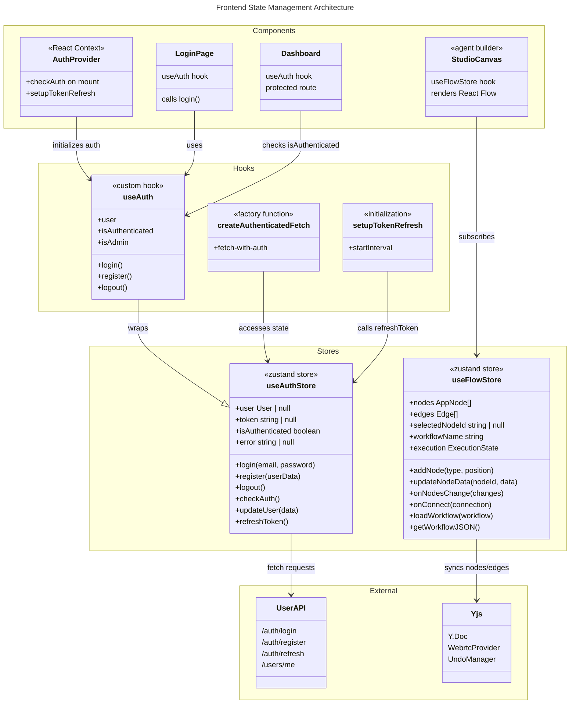
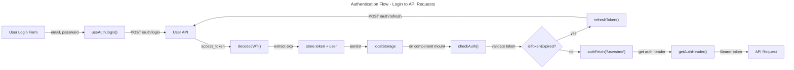
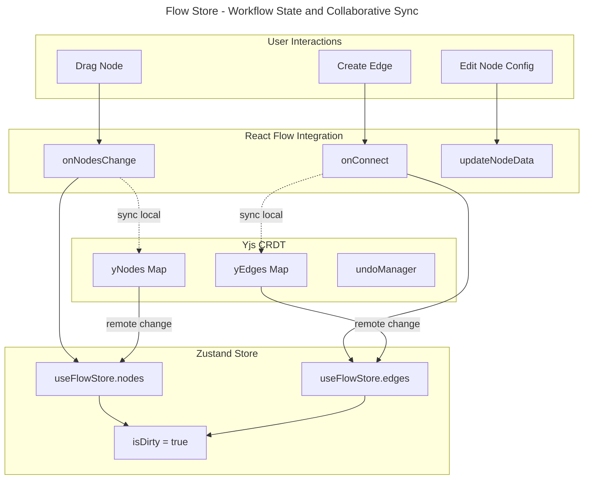

# C4 Code Level: Frontend State Management

## Overview

- **Name**: Frontend State Management Stores
- **Description**: Zustand-based client-side state management for authentication and React Flow workflow builder. Implements persistent storage, JWT token management, and real-time collaborative editing through Yjs CRDT synchronization.
- **Location**: `/home/dislove/document/ai 导航/ainav-web/src/stores/`
- **Language**: TypeScript
- **Purpose**: Centralized state management for user authentication with token lifecycle management and interactive workflow/agent canvas state with collaborative editing capabilities

## Code Elements

### 1. Authentication Store (`authStore.ts`)

#### Type Definitions

**`User`** (Interface)
- **Description**: Represents an authenticated user with profile information
- **Location**: `authStore.ts:8-17`
- **Properties**:
  - `id: string` - User identifier
  - `email: string` - User email address
  - `username: string` - User login name
  - `phone?: string` - Optional phone number
  - `is_active: boolean` - Account active status
  - `is_superuser: boolean` - Admin/superuser flag
  - `created_at: string` - Account creation timestamp (ISO 8601)
  - `updated_at: string` - Last profile update timestamp (ISO 8601)

**`RegisterData`** (Interface)
- **Description**: Input data structure for user registration
- **Location**: `authStore.ts:19-24`
- **Properties**:
  - `email: string` - Email for new account
  - `username: string` - Username for new account
  - `password: string` - Password (hashed server-side)
  - `phone?: string` - Optional phone number

**`LoginResponse`** (Interface)
- **Description**: OAuth2 token response from login endpoint
- **Location**: `authStore.ts:26-30`
- **Properties**:
  - `access_token: string` - JWT bearer token
  - `token_type: string` - Token type (typically "bearer")
  - `expires_in?: number` - Token expiration time in seconds

**`JWTPayload`** (Interface)
- **Description**: Decoded JWT token claims without verification
- **Location**: `authStore.ts:32-38`
- **Properties**:
  - `sub: string` - Subject (user_id claim)
  - `email?: string` - User email claim
  - `username?: string` - Username claim
  - `exp: number` - Expiration timestamp (Unix seconds)
  - `iat?: number` - Issued-at timestamp (Unix seconds)

**`AuthState`** (Interface)
- **Description**: Complete authentication state schema with state variables and action methods
- **Location**: `authStore.ts:40-58`
- **State Properties**:
  - `user: User | null` - Current authenticated user or null
  - `token: string | null` - JWT access token or null
  - `isLoading: boolean` - Async operation in progress flag
  - `isAuthenticated: boolean` - Authentication status boolean
  - `error: string | null` - Last error message or null
  - `tokenExpiry: number | null` - Token expiration Unix timestamp or null
- **Action Methods**:
  - `login(email: string, password: string): Promise<void>` - OAuth2 password flow authentication
  - `register(userData: RegisterData): Promise<void>` - User registration with auto-login
  - `logout(): void` - Clear all auth state and storage
  - `checkAuth(): Promise<void>` - Validate stored token and fetch user profile
  - `clearError(): void` - Reset error state
  - `updateUser(data: Partial<User>): Promise<void>` - Update user profile via PATCH
  - `refreshToken(): Promise<void>` - Refresh expired JWT token
  - `setLoading(loading: boolean): void` - Set loading indicator

#### Store Implementation

**`useAuthStore`** (Zustand Store)
- **Description**: Root authentication store with Zustand create + persist middleware
- **Location**: `authStore.ts:164-424`
- **Middleware**:
  - `persist`: Stores auth state in browser localStorage under key `auth-storage`
  - Selective persistence: only `token`, `user`, and `tokenExpiry` are persisted
  - Rehydration hook validates token expiry on app load
- **Key Implementation Details**:
  - OAuth2 FormData format for login (username/password)
  - JWT decode without verification (validation happens server-side)
  - 30-second buffer before token expiry for refresh
  - Automatic token refresh on checkAuth if expired
  - Fallback user construction from JWT if profile fetch fails

#### Utility Functions

**`decodeJWT(token: string): JWTPayload | null`**
- **Description**: Decode JWT token payload without cryptographic verification
- **Location**: `authStore.ts:75-94`
- **Parameters**: JWT token string
- **Returns**: Decoded payload object or null on error
- **Note**: Verification must occur server-side; client-side decode for expiry checking only
- **Error Handling**: Base64URL decoding errors caught and return null

**`isTokenExpired(token: string): boolean`**
- **Description**: Check if JWT token is expired with 30-second grace period
- **Location**: `authStore.ts:99-106`
- **Parameters**: JWT token string
- **Returns**: true if expired or invalid, false if valid
- **Grace Period**: Adds 30-second buffer before actual expiry for refresh

**`getAuthHeader(): Record<string, string>`**
- **Description**: Retrieve Authorization header from localStorage for authenticated requests
- **Location**: `authStore.ts:111-127`
- **Returns**: Object with `Authorization: "Bearer {token}"` or empty object
- **Client-Only**: Returns empty object during server-side rendering (checks `typeof window`)

**`authFetch<T>(endpoint: string, options?: RequestInit): Promise<T>`**
- **Description**: Fetch wrapper that automatically adds auth headers to requests
- **Location**: `authStore.ts:132-158`
- **Type Parameter**: Generic return type `<T>`
- **Parameters**:
  - `endpoint: string` - API path (e.g., "/users/me")
  - `options?: RequestInit` - Standard fetch options (method, body, headers, etc.)
- **Returns**: Parsed JSON response of type T
- **Features**:
  - Auto-injects `Authorization` header
  - Handles content-type as application/json
  - Throws error on non-200 responses with error detail from API
  - Handles empty response bodies gracefully
- **Used By**: `checkAuth`, `updateUser` actions

#### Custom Hooks

**`useAuth(): AuthApi`**
- **Description**: Simplified hook that re-exports auth store with computed properties
- **Location**: `authStore.ts:433-455`
- **Returns Object**:
  - State: `user`, `token`, `isLoading`, `isAuthenticated`, `error`
  - Actions: `login`, `register`, `logout`, `checkAuth`, `clearError`, `updateUser`
  - Computed: `isAdmin` (boolean, derived from `user?.is_superuser`)
- **Usage**: Preferred pattern for components (`const { user, isAuthenticated, login } = useAuth()`)

**`createAuthenticatedFetch(): <T>(url: string, options?: RequestInit) => Promise<T>`**
- **Description**: Factory function that returns an authenticated fetch function
- **Location**: `authStore.ts:461-505`
- **Features**:
  - Auto-refresh token if expired before request
  - Logout on 401 Unauthorized responses
  - Session expiry error messages
  - Compatible with any async API call
- **Returns**: Async function with same signature as fetch
- **Error Scenarios**:
  - 401 Unauthorized: Logs out user and throws session expired error
  - Token refresh failure: Logs out and throws error
  - Any non-2xx response: Throws API error with detail

**`setupTokenRefresh(intervalMs?: number): () => void`**
- **Description**: Initialize background interval for automatic token refresh
- **Location**: `authStore.ts:511-533`
- **Parameters**: Interval in milliseconds (default: 5 minutes)
- **Returns**: Cleanup function to cancel interval
- **Behavior**:
  - Checks token expiry every interval
  - Refreshes if less than 5 minutes until expiry
  - Logs warning on refresh failure (doesn't logout)
  - Server-only safe (checks `typeof window`)
- **Typical Usage**: Call once in app initialization (layout.tsx or AppProvider)

---

### 2. Flow/Workflow Store (`flowStore.ts`)

#### Type Definitions

**`BaseNodeData`** (Interface)
- **Description**: Base interface for all React Flow node data types
- **Location**: `flowStore.ts:29-31`
- **Extends**: `Record<string, unknown>` (React Flow requirement)
- **Properties**:
  - `label?: string` - Display label for node

**`InputNodeData`** (Interface)
- **Description**: Data schema for input nodes (entry points in workflow)
- **Location**: `flowStore.ts:33-36`
- **Extends**: `BaseNodeData`
- **Properties**:
  - `inputType?: "text" | "number" | "json" | "file"` - Input data type
  - `default?: string` - Default value if no input provided

**`LLMNodeData`** (Interface)
- **Description**: Data schema for LLM (Language Model) nodes
- **Location**: `flowStore.ts:38-44`
- **Extends**: `BaseNodeData`
- **Properties**:
  - `model?: string` - Model identifier (e.g., "deepseek-chat")
  - `prompt?: string` - User prompt/instruction
  - `system_prompt?: string` - System prompt for model behavior
  - `temperature?: number` - Sampling temperature (0-2, controls randomness)
  - `json_output?: boolean` - Enable JSON mode for structured output

**`SkillNodeData`** (Interface)
- **Description**: Data schema for skill/tool invocation nodes
- **Location**: `flowStore.ts:46-60`
- **Extends**: `BaseNodeData`
- **Properties**:
  - `tool?: { id: string; name: string; logo_url?: string }` - Tool metadata
  - `skill?: { id: string; name: string; api_endpoint?: string; http_method?: string; input_schema?: Record<string, unknown>; auth_type?: string }` - Skill/API metadata

**`TransformNodeData`** (Interface)
- **Description**: Data schema for data transformation nodes
- **Location**: `flowStore.ts:62-73`
- **Extends**: `BaseNodeData`
- **Properties**:
  - `transform_type?: "passthrough" | "extract" | "template" | "json_parse" | "json_stringify" | "array_join"` - Transformation operation type
  - `field?: string` - Field to transform (for extract/template)
  - `template?: string` - Template string (for template transformation)
  - `separator?: string` - Separator string (for array_join)

**`OutputNodeData`** (Interface)
- **Description**: Data schema for output nodes (result nodes)
- **Location**: `flowStore.ts:75-77`
- **Extends**: `BaseNodeData`
- **Properties**:
  - `format?: "auto" | "text" | "json" | "markdown"` - Output format

**`NodeData`** (Type Union)
- **Description**: Complete node data type supporting all node types
- **Location**: `flowStore.ts:79-84`
- **Composition**: Intersection of all node data types as partials
- **Usage**: All nodes in the flow use this discriminated union type

**`AppNode`** (Type Alias)
- **Description**: React Flow Node type with NodeData and string type discriminator
- **Location**: `flowStore.ts:86`
- **Equivalent**: `Node<NodeData, string>`

**`ExecutionState`** (Interface)
- **Description**: State tracking workflow execution progress and results
- **Location**: `flowStore.ts:88-94`
- **Properties**:
  - `isRunning: boolean` - Execution in progress flag
  - `currentNodeId?: string` - ID of currently executing node
  - `results: Record<string, unknown>` - Output results by node ID
  - `error?: string` - Execution error message

**`FlowState`** (Interface)
- **Description**: Complete React Flow store state schema
- **Location**: `flowStore.ts:96-161`
- **State Properties**:
  - `nodes: AppNode[]` - Array of all nodes in workflow
  - `edges: Edge[]` - Array of all connections between nodes
  - `selectedNodeId: string | null` - Currently selected node for properties panel
  - `workflowName: string` - User-defined workflow name
  - `workflowId?: string` - Server-stored workflow identifier
  - `isDirty: boolean` - Unsaved changes indicator
  - `execution: ExecutionState` - Current execution state
  - `preview: { nodes: AppNode[]; edges: Edge[]; isVisible: boolean }` - Ghost nodes for preview changes
- **Event Handlers**:
  - `onNodesChange: OnNodesChange` - React Flow node change callback
  - `onEdgesChange: OnEdgesChange` - React Flow edge change callback
  - `onConnect: OnConnect` - React Flow connection creation callback
- **Actions** (35+ methods documented below)

#### Store Actions - Node Management

**`addNode(type: string, position: { x: number; y: number }, data?: Partial<NodeData>): void`**
- **Description**: Add new node to workflow canvas
- **Location**: `flowStore.ts:267-281`
- **Parameters**:
  - `type: string` - Node type (input, llm, skill, transform, output)
  - `position: { x: number; y: number }` - Canvas position
  - `data?: Partial<NodeData>` - Optional initial node data (merged with defaults)
- **Behavior**:
  - Generates unique ID: `{type}-{timestamp}`
  - Merges provided data with `defaultNodeData[type]`
  - Sets `isDirty: true`

**`updateNodeData(nodeId: string, data: Partial<NodeData>): void`**
- **Description**: Update properties of existing node
- **Location**: `flowStore.ts:284-290`
- **Parameters**:
  - `nodeId: string` - Target node ID
  - `data: Partial<NodeData>` - Properties to update (shallow merge)
- **Use Cases**: Edit node configuration in properties panel

**`appendNodeContent(nodeId: string, content: string): void`**
- **Description**: Append content to node (for streaming LLM responses)
- **Location**: `flowStore.ts:293-308`
- **Parameters**:
  - `nodeId: string` - Target node ID
  - `content: string` - Content to append
- **Behavior**:
  - Concatenates to existing node.data.content
  - Sets node.data.status to "streaming"
- **Use Case**: Real-time token streaming from LLM nodes

**`deleteNode(nodeId: string): void`**
- **Description**: Remove node and all connected edges
- **Location**: `flowStore.ts:331-341`
- **Parameters**: `nodeId: string` - Node to delete
- **Cascade Behavior**:
  - Removes all edges where node is source or target
  - Clears selection if deleted node was selected
  - Sets `isDirty: true`

**`selectNode(nodeId: string | null): void`**
- **Description**: Select node for properties panel editing
- **Location**: `flowStore.ts:344-346`
- **Parameters**: `nodeId: string | null` - Node to select or null to deselect

#### Store Actions - Edge Management

**`updateEdgeData(edgeId: string, data: Record<string, unknown>): void`**
- **Description**: Update edge data (labels, styling, etc.)
- **Location**: `flowStore.ts:311-317`
- **Parameters**:
  - `edgeId: string` - Edge identifier
  - `data: Record<string, unknown>` - Properties to merge

**`setAnimatingEdge(edgeId: string | null, isAnimating: boolean): void`**
- **Description**: Toggle animation state on edge(s)
- **Location**: `flowStore.ts:320-328`
- **Parameters**:
  - `edgeId: string | null` - Edge to animate or null for all edges
  - `isAnimating: boolean` - Animation enabled flag
- **Behavior**: If `edgeId` is null, updates isAnimating on all edges

#### Store Actions - React Flow Integration

**`onNodesChange(changes: NodeChange[]): void`**
- **Description**: Apply React Flow node changes (move, select, delete via UI)
- **Location**: `flowStore.ts:224-233`
- **Parameters**: `changes: NodeChange[]` - React Flow internal changes
- **Behavior**:
  - Applies changes via `applyNodeChanges()` from @xyflow/react
  - Syncs updated nodes to Yjs CRDT for collaborative editing
  - Sets `isDirty: true`
- **Called By**: React Flow when user drags/manipulates nodes

**`onEdgesChange(changes: EdgeChange[]): void`**
- **Description**: Apply React Flow edge changes (delete via UI)
- **Location**: `flowStore.ts:236-245`
- **Parameters**: `changes: EdgeChange[]` - React Flow internal edge changes
- **Behavior**:
  - Applies changes via `applyEdgeChanges()`
  - Syncs to Yjs
  - Sets `isDirty: true`

**`onConnect(connection: Connection): void`**
- **Description**: Handle new edge creation between nodes
- **Location**: `flowStore.ts:248-264`
- **Parameters**: `connection: Connection` - Source/target node connection
- **Behavior**:
  - Creates animated edge: `type: "animated"`
  - Initializes edge data: `{ isAnimating: false }`
  - Syncs to Yjs
  - Sets `isDirty: true`

#### Store Actions - Workflow Management

**`setWorkflowName(name: string): void`**
- **Description**: Set or update workflow display name
- **Location**: `flowStore.ts:349-351`
- **Sets**: `isDirty: true`

**`loadWorkflow(workflow: { nodes: AppNode[]; edges: Edge[]; name?: string; id?: string }): void`**
- **Description**: Load a complete workflow from server or storage
- **Location**: `flowStore.ts:354-371`
- **Parameters**:
  - `nodes: AppNode[]` - Workflow nodes
  - `edges: Edge[]` - Workflow connections
  - `name?: string` - Optional workflow name
  - `id?: string` - Optional server workflow ID
- **Behavior**:
  - Clears selection and execution state
  - Sets `isDirty: false` (loaded from storage)
  - Syncs full workflow to Yjs in transaction
  - Replaces entire flow

**`clearWorkflow(): void`**
- **Description**: Reset flow to empty state
- **Location**: `flowStore.ts:374-390`
- **Behavior**:
  - Clears all nodes and edges
  - Resets to default "未命名工作流" name
  - Clears execution state
  - Clears Yjs document

**`getWorkflowJSON(): { nodes: AppNode[]; edges: Edge[] }`**
- **Description**: Export workflow as JSON for API serialization
- **Location**: `flowStore.ts:393-396`
- **Returns**: Object with nodes and edges arrays
- **Use Case**: Send to backend API for persistence

#### Store Actions - Preview Mode

**`setPreview(nodes: AppNode[], edges: Edge[]): void`**
- **Description**: Show ghost nodes/edges as preview before committing
- **Location**: `flowStore.ts:197-205`
- **Use Case**: Visual preview of changes before user confirms
- **Note**: Does not modify main workflow yet

**`commitPreview(): void`**
- **Description**: Apply preview changes to main workflow
- **Location**: `flowStore.ts:207-215`
- **Behavior**:
  - Replaces main nodes/edges with preview
  - Clears preview
  - Sets `isDirty: true`

**`clearPreview(): void`**
- **Description**: Discard preview changes
- **Location**: `flowStore.ts:217-221`

#### Store Actions - History & Execution

**`undo(): void`**
- **Description**: Undo last workflow change via Yjs UndoManager
- **Location**: Interface definition at `flowStore.ts:155`
- **Note**: Implemented via Yjs UndoManager, not in visible store code

**`redo(): void`**
- **Description**: Redo last undone workflow change
- **Location**: Interface definition at `flowStore.ts:156`

**`setExecutionState(state: Partial<ExecutionState>): void`**
- **Description**: Update execution state (merge with existing)
- **Location**: `flowStore.ts:399-403`
- **Parameters**: Partial execution state object
- **Use Case**: Update current node or results during execution

**`resetExecution(): void`**
- **Description**: Clear execution state and results
- **Location**: `flowStore.ts:405-409`

#### Default Node Data

**`defaultNodeData: Record<string, Partial<NodeData>>`**
- **Description**: Template data for each node type
- **Location**: `flowStore.ts:164-175`
- **Defaults**:
  - `input`: `{ label: "输入", inputType: "text" }`
  - `llm`: `{ label: "LLM Core", model: "deepseek-chat", temperature: 0.7, status: "idle" }`
  - `skill`: `{ label: "技能" }`
  - `transform`: `{ label: "转换", transform_type: "passthrough" }`
  - `output`: `{ label: "输出", format: "auto", status: "idle" }`

#### Yjs Collaborative Editing Integration

**`ydoc`** (Global Y.Doc instance)
- **Description**: Shared CRDT document for multi-user collaboration
- **Location**: `flowStore.ts:20`
- **WebRTC Room**: "ainav-workflow-room"
- **Auto-syncs**: Changes from other users appear automatically

**`yNodes`** (Y.Map)
- **Description**: Yjs map storing all workflow nodes
- **Location**: `flowStore.ts:22`
- **Auto-sync**: `onNodesChange` syncs to yNodes, observers sync back to store

**`yEdges`** (Y.Map)
- **Description**: Yjs map storing all workflow edges
- **Location**: `flowStore.ts:23`

**`undoManager`** (Y.UndoManager)
- **Description**: Manages undo/redo history across both nodes and edges
- **Location**: `flowStore.ts:26`
- **Scope**: Tracks both yNodes and yEdges changes

**Yjs Observers** (Lines 412-423)
- **Description**: Bi-directional sync between Yjs and Zustand store
- **Behavior**:
  - Ignores local transactions (`event.transaction.local`)
  - Updates store when remote changes received
  - Enables real-time multi-user collaboration

---

## Dependencies

### Internal Dependencies

**Authentication Module → User Service API**
- Endpoint: `${USER_API}/auth/login` - OAuth2 password flow
- Endpoint: `${USER_API}/auth/register` - User registration
- Endpoint: `${USER_API}/auth/refresh` - Token refresh
- Endpoint: `${USER_API}/users/me` - Fetch current user profile
- Endpoint: `${USER_API}/users/me` - Update user profile (PATCH)

**Flow Module → Agent Service API**
- Implicit: Workflow CRUD via `getWorkflowJSON()` return format
- Expected endpoints: `/v1/workflows/` (POST/GET/PATCH)

**Flow Module → Collaborative Storage**
- Yjs CRDT for distributed state synchronization
- WebRTC provider for peer discovery

### External Dependencies

**Zustand** (`^4.0.0` implied)
- `create()` - Store factory
- `persist()` - Middleware for localStorage persistence
- `createJSONStorage()` - localStorage adapter

**@xyflow/react**
- `Node<NodeData, string>` - React Flow node type
- `Edge` - React Flow edge type
- `Connection` - React Flow connection object
- `OnNodesChange`, `OnEdgesChange`, `OnConnect` - React Flow change handlers
- `applyNodeChanges()`, `applyEdgeChanges()`, `addEdge()` - React Flow utilities
- `NodeChange`, `EdgeChange` - React Flow change type utilities

**yjs** (`^13.0.0+`)
- `Y.Doc()` - CRDT document
- `Y.Map()` - Shared map data structure
- `Y.UndoManager()` - Undo/redo manager
- `.observe()` - Event observer for changes

**y-webrtc** (`^10.0.0+`)
- `WebrtcProvider` - WebRTC-based peer discovery and sync

**Browser APIs (DOM)**
- `localStorage` - Key-value persistence (auth tokens)
- `fetch()` - HTTP requests (auth API)
- `atob()`, `decodeURIComponent()` - JWT decoding
- `Date.now()` - Timestamp tracking

---

## Relationships

### Architecture Diagram - Stores and Components



### Data Flow - Authentication Lifecycle



### Data Flow - Workflow State Synchronization



### Component Integration Patterns

**Pattern 1: Protected Route with Auth Store**

```typescript
// components/providers/auth-provider.tsx
function AuthProvider({ children }) {
  const { checkAuth, setupTokenRefresh } = useAuthStore();

  useEffect(() => {
    checkAuth(); // Validate stored token on mount
    const cleanup = setupTokenRefresh(5 * 60 * 1000); // Auto-refresh every 5 min
    return cleanup;
  }, []);

  return children;
}
```

**Pattern 2: Login with Error Handling**

```typescript
// components/auth/login-form.tsx
function LoginForm() {
  const { login, isLoading, error, clearError } = useAuth();

  const handleSubmit = async (email, password) => {
    try {
      await login(email, password);
      // Navigate to dashboard
    } catch (err) {
      // Error already in auth store
    }
  };

  return (
    <form onSubmit={handleSubmit}>
      {error && <Alert>{error}</Alert>}
      <button disabled={isLoading}>
        {isLoading ? "登录中..." : "登录"}
      </button>
    </form>
  );
}
```

**Pattern 3: Workflow Canvas with Real-time Collaboration**

```typescript
// components/studio/agent-canvas.tsx
function AgentCanvas() {
  const {
    nodes, edges, addNode, onNodesChange, onEdgesChange, onConnect,
    updateNodeData, selectedNodeId, selectNode
  } = useFlowStore();

  return (
    <ReactFlow
      nodes={nodes}
      edges={edges}
      onNodesChange={onNodesChange}
      onEdgesChange={onEdgesChange}
      onConnect={onConnect}
    >
      {/* Changes auto-sync to Yjs for multi-user editing */}
    </ReactFlow>
  );
}
```

**Pattern 4: Authenticated API Calls**

```typescript
// Approach 1: authFetch helper
const user = await authFetch<User>("/users/me");

// Approach 2: createAuthenticatedFetch
const fetch = createAuthenticatedFetch();
const result = await fetch("/v1/workflows", { method: "GET" });

// Approach 3: Direct header construction
const headers = getAuthHeader();
const response = await fetch(url, { headers });
```

### Persistence Strategy

**Authentication Store Persistence**

| State | Persisted | Storage | Lifetime | Validation |
|-------|-----------|---------|----------|-----------|
| `token` | Yes | localStorage | Until logout | Expiry check on load |
| `user` | Yes | localStorage | Until logout | Profile fetch on checkAuth |
| `tokenExpiry` | Yes | localStorage | Until logout | 30-sec buffer check |
| `isLoading` | No | Memory | Until next action | Ephemeral |
| `isAuthenticated` | No | Memory | Until action | Recomputed from token |
| `error` | No | Memory | Until clearError | Ephemeral |

**Flow Store Persistence**

| State | Persisted | Storage | Lifetime | Use Case |
|-------|-----------|---------|----------|----------|
| `nodes` | No | Memory | Session | Build workflow |
| `edges` | No | Memory | Session | Build workflow |
| `workflowName` | No | Memory | Session | Display name |
| `isDirty` | No | Memory | Session | Save indicator |
| Workflow JSON | Yes | Server API | Permanent | `loadWorkflow` / persist |
| Collaborative state | Yes | Yjs CRDT | Session | Multi-user sync |

**Note**: Flow state is intentionally NOT persisted in localStorage. Users must explicitly save workflows to server via agent service API.

### Error Handling Strategy

**Authentication Store**

```
Login Failure
  ├─ HTTP 400/401 → error.detail → show to user
  ├─ Invalid JWT → throw "无效的认证令牌"
  └─ Network error → throw generic "登录失败"

Token Expiry
  ├─ Check: isTokenExpired() (30-sec buffer)
  ├─ Auto-refresh via checkAuth() or createAuthenticatedFetch()
  └─ Logout if refresh fails (401 response)

Profile Update Failure
  └─ Set error state, throw error, let component handle

Session Timeout
  └─ Auto-logout on 401, prompt re-login
```

**Flow Store**

```
Workflow Load
  ├─ Clear and populate store
  └─ Sync to Yjs

Node/Edge Changes
  ├─ Apply React Flow changes
  ├─ Mark isDirty
  └─ Sync to Yjs (for remote users)

Yjs Sync Error
  └─ Log but continue (eventual consistency)
```

### File Locations and Cross-References

| Component | Location | Uses | Notes |
|-----------|----------|------|-------|
| useAuthStore | `ainav-web/src/stores/authStore.ts:164-424` | User API | Zustand + persist |
| useAuth hook | `ainav-web/src/stores/authStore.ts:433-455` | useAuthStore | Custom hook wrapper |
| useFlowStore | `ainav-web/src/stores/flowStore.ts:177-410` | Yjs, @xyflow/react | Collaborative editing |
| AuthProvider | `ainav-web/src/components/providers/auth-provider.tsx` | useAuthStore | App initialization |
| StudioCanvas | `ainav-web/src/components/studio/agent-canvas.tsx` | useFlowStore | React Flow integration |
| Login Page | `ainav-web/src/app/login/page.tsx` | useAuth | User authentication |
| Dashboard | `ainav-web/src/app/dashboard/page.tsx` | useAuth | Protected route |

---

## Implementation Notes

### Key Design Decisions

1. **Selective Persistence**: Auth state persists only essential tokens and user data. Ephemeral states like `isLoading` and `error` intentionally NOT persisted to avoid stale error states.

2. **Token Validation Strategy**:
   - Client-side decode for expiry checking (30-sec buffer)
   - Server-side signature verification (implicit)
   - Profile fetch confirms token validity

3. **Automatic Token Refresh**:
   - `setupTokenRefresh()` runs background interval (default 5 min)
   - `createAuthenticatedFetch()` refreshes before each request if needed
   - Dual-layer ensures tokens stay fresh

4. **Yjs for Collaboration**:
   - Real-time multi-user workflow editing
   - WebRTC peer discovery (decentralized)
   - Automatic conflict resolution via CRDT
   - Undo/redo works across users

5. **Preview Pattern**: Allows users to preview changes before committing to main workflow. Useful for multi-step operations.

6. **Node Type System**: Union type `NodeData` supports all node kinds (input, llm, skill, transform, output) with type-safe discriminated unions.

### Performance Considerations

- **Memory**: Entire workflow graph in memory (suitable for typical agent workflows with <100 nodes)
- **Network**: Yjs batches changes for efficient WebRTC transmission
- **Token Refresh**: 5-minute interval configurable; balance between refresh overhead and session security
- **Lazy Loading**: `useAuth()` hook only reads from store at call time (no unnecessary subscriptions if not used)

### Security Considerations

- **JWT Verification**: Client-side decode NOT verified; server validates signature on every API call
- **Token Storage**: localStorage (vulnerable to XSS); XSS protection via CSP and input sanitization required
- **CSRF**: Likely handled server-side via tokens in headers (not cookies)
- **Session Expiry**: 30-sec buffer + auto-refresh prevents expired tokens from reaching API
- **Logout**: Clears all persisted state and memory

---

## Summary

The **Frontend State Management** stores provide:

1. **Authentication (`useAuthStore`)**: Complete OAuth2 JWT lifecycle with auto-refresh, token validation, and user profile management
2. **Workflow Builder (`useFlowStore`)**: React Flow canvas state with 35+ actions for node/edge management, preview mode, and Yjs-powered collaborative editing
3. **Custom Hooks**: `useAuth`, `createAuthenticatedFetch`, `setupTokenRefresh` for ergonomic component integration
4. **Persistence Layer**: Selective localStorage for auth, Yjs CRDT + WebRTC for workflow collaboration, Server API for permanent storage

Together, these stores enable a complete, collaborative, and secure state management system for the AI navigation platform.
