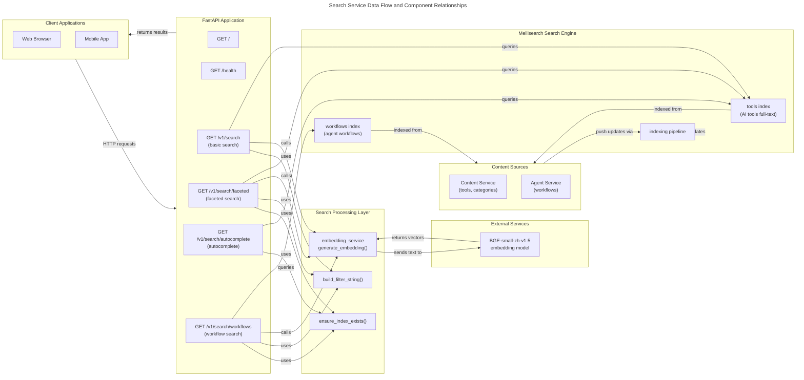

# C4 Code Level: Search Service Core Application

## Overview

- **Name:** Search Service Core Application
- **Description:** FastAPI application providing multi-modal full-text search across AI tools and agent workflows using Meilisearch with hybrid semantic and keyword search capabilities
- **Location:** `/ainav-backend/services/search_service/app/`
- **Language:** Python 3.11+
- **Purpose:** Enterprise-grade search functionality with faceting, autocomplete, and semantic search for the AI Navigator platform

## Architecture Overview

The Search Service is a microservice component within the AI Navigator backend that provides comprehensive search capabilities across two primary indices:

1. **Tools Index** - Full-text and semantic search for AI tools with faceted filtering
2. **Workflows Index** - Discovery and search for agent workflows with popularity sorting

The service employs a hybrid search strategy combining:
- **Keyword Search** - Meilisearch's full-text indexing for exact matches and relevance
- **Semantic Search** - BGE embeddings for intent-based and conceptual matching
- **Faceted Navigation** - Dynamic filtering by pricing, accessibility, APIs, and categories

## Code Elements

### FastAPI Application Initialization

#### `FastAPI` Application Instance
- **Location:** `/ainav-backend/services/search_service/app/main.py:4`
- **Purpose:** Core FastAPI application for HTTP server
- **Configuration:**
  ```python
  app = FastAPI(title="AI Navigator - Search Service")
  ```
- **Features:**
  - HTTP server with automatic OpenAPI/Swagger documentation
  - Request/response validation via Pydantic
  - Async I/O support for non-blocking operations
- **Dependencies:** `fastapi`

#### Root Endpoint
- **Function:** `root()`
- **Location:** `/ainav-backend/services/search_service/app/main.py:8-10`
- **Route:** `GET /`
- **Response:** `{"message": "Welcome to AI Navigator Search Service"}`
- **Purpose:** Service welcome message and basic connectivity verification

#### Health Check Endpoint
- **Function:** `health_check()`
- **Location:** `/ainav-backend/services/search_service/app/main.py:12-14`
- **Route:** `GET /health`
- **Response:** `{"status": "healthy"}`
- **Purpose:** Kubernetes/Docker health probe for service availability
- **Used by:** Load balancers, orchestration systems, monitoring

### Router Integration

#### Search Router Module
- **Location:** `/ainav-backend/services/search_service/app/routers/search.py`
- **Purpose:** Contains all search-related endpoints and business logic
- **Prefix:** `/v1/search`
- **Integration:** Included in main.py via `app.include_router(search.router, prefix="/v1/search", tags=["search"])`
- **Namespace:** `"search"` tag for OpenAPI documentation

### Search Endpoints

#### 1. Basic Tool Search Endpoint
- **Function:** `search_tools()`
- **Location:** `/ainav-backend/services/search_service/app/routers/search.py:88-149`
- **Route:** `GET /v1/search` (or `GET /v1/search/`)
- **HTTP Method:** GET
- **Parameters:**
  - `q: str` (Query) - Search query string (default: empty)
  - `category: Optional[str]` - Filter by category slug
  - `scenario: Optional[str]` - Filter by scenario slug
  - `page: int` - Page number, minimum 1 (default: 1)
  - `page_size: int` - Results per page, 1-100 (default: 20)
- **Response:** Raw Meilisearch response dict with search results
- **Purpose:** Legacy endpoint for basic keyword and hybrid search
- **Features:**
  - Keyword search with HTML highlighting (`<mark>` tags)
  - Hybrid search combining semantic and keyword results
  - Automatic vector embedding generation via `embedding_service`
  - Semantic ratio 0.5 for balanced keyword/semantic weighting
  - Graceful fallback to keyword-only search if embedding fails
- **Dependencies:**
  - `shared.embedding.embedding_service` - Vector embedding generation
  - `shared.config.settings` - Meilisearch configuration
- **Error Handling:**
  - HTTP 500 if search engine error occurs
  - Logs errors with context using logger

#### 2. Faceted Search Endpoint
- **Function:** `faceted_search()`
- **Location:** `/ainav-backend/services/search_service/app/routers/search.py:156-273`
- **Route:** `GET /v1/search/faceted`
- **HTTP Method:** GET
- **Parameters:**
  - `q: str` (Query) - Search query (default: empty)
  - `pricing_type: Optional[str]` - Filter by "free", "freemium", or "paid"
  - `is_china_accessible: Optional[bool]` - Filter by China accessibility
  - `has_api: Optional[bool]` - Filter by API availability
  - `category: Optional[str]` - Filter by category slug
  - `page: int` - Page number, minimum 1 (default: 1)
  - `page_size: int` - Results per page, 1-100 (default: 20)
- **Response:** `FacetedSearchResponse` (Pydantic model)
- **Response Structure:**
  ```python
  FacetedSearchResponse(
      hits: List[dict],              # Search result documents
      query: str,                    # Original query string
      processing_time_ms: int,       # Meilisearch processing time
      estimated_total_hits: int,     # Total matching documents
      facets: FacetCounts,          # Aggregated filter distributions
      page: int,                    # Current page number
      page_size: int               # Results per page
  )
  ```
- **Facet Counts Structure:**
  ```python
  FacetCounts(
      pricing_type: dict[str, int],           # e.g. {"free": 145, "paid": 89, "freemium": 34}
      is_china_accessible: dict[str, int],    # {"accessible": 150, "not_accessible": 118}
      has_api: dict[str, int],                # {"with_api": 200, "without_api": 68}
      category_slug: dict[str, int]           # {"ai-writing": 45, "ai-design": 32, ...}
  )
  ```
- **Purpose:** Advanced search with filter distribution for UI construction
- **Features:**
  - Multi-facet filtering with count aggregation
  - Boolean facet normalization (true/false → readable labels)
  - HTML highlight support for search terms
  - Hybrid search support with semantic ranking
  - Index existence validation
  - Query-time embedding generation
- **Dependencies:**
  - `shared.embedding.embedding_service` - Vector embedding
  - `shared.config.settings` - Meilisearch configuration
- **Error Handling:**
  - HTTP 503 if index unavailable
  - HTTP 502 for Meilisearch API errors
  - HTTP 500 for unexpected errors
  - Comprehensive error logging with context

#### 3. Autocomplete Endpoint
- **Function:** `autocomplete()`
- **Location:** `/ainav-backend/services/search_service/app/routers/search.py:280-338`
- **Route:** `GET /v1/search/autocomplete`
- **HTTP Method:** GET
- **Parameters:**
  - `q: str` (Query, required) - Search prefix, minimum 1 character
  - `limit: int` - Maximum suggestions, 1-20 (default: 10)
- **Response:** `AutocompleteResponse` (Pydantic model)
- **Response Structure:**
  ```python
  AutocompleteResponse(
      suggestions: List[AutocompleteItem],  # [{name: str, slug: str}, ...]
      query: str,                           # Original query
      processing_time_ms: int              # Response time from Meilisearch
  )
  ```
- **Purpose:** Real-time prefix-based suggestions for typeahead UI
- **Features:**
  - Optimized performance with minimal field retrieval
  - Bilingual support (name_zh fallback to name)
  - Fast response for real-time interactions
  - Filtered retrieval (only name and slug fields)
  - Case-insensitive prefix matching
- **Dependencies:**
  - `shared.config.settings` - Meilisearch configuration
- **Error Handling:**
  - HTTP 503 if index unavailable
  - HTTP 502 for Meilisearch API errors
  - HTTP 500 for unexpected errors
  - Error logging with stack traces

#### 4. Workflow Search Endpoint
- **Function:** `search_workflows()`
- **Location:** `/ainav-backend/services/search_service/app/routers/search.py:345-447`
- **Route:** `GET /v1/search/workflows`
- **HTTP Method:** GET
- **Parameters:**
  - `q: str` (Query) - Search query for workflow name/description (default: empty)
  - `public_only: bool` - Show only public workflows (default: True)
  - `is_template: Optional[bool]` - Filter by template status
  - `trigger_type: Optional[str]` - Filter by "manual", "schedule", or "webhook"
  - `page: int` - Page number, minimum 1 (default: 1)
  - `page_size: int` - Results per page, 1-100 (default: 20)
- **Response:** `WorkflowSearchResponse` (Pydantic model)
- **Response Structure:**
  ```python
  WorkflowSearchResponse(
      hits: List[dict],              # Workflow documents with all metadata
      query: str,                    # Original query
      processing_time_ms: int,       # Meilisearch processing time
      estimated_total_hits: int,     # Total matching workflows
      page: int,
      page_size: int
  )
  ```
- **Retrieved Fields:**
  - `id`, `name`, `name_zh`, `slug`, `description`, `description_zh`
  - `icon`, `trigger_type`, `is_public`, `is_template`
  - `fork_count`, `run_count`, `star_count` (for sorting)
  - `user_id`, `created_at`, `updated_at`
- **Purpose:** Discovery and browsing of shared agent workflows
- **Features:**
  - Public/private filtering with default to public only
  - Template filtering for reusable workflows
  - Trigger type classification (manual, schedule, webhook)
  - Popularity sorting (stars first, then run count)
  - Graceful degradation if workflows index not yet created
  - Hybrid search support for semantic matching
  - HTML highlight for matched terms
- **Dependencies:**
  - `shared.embedding.embedding_service` - Vector embedding
  - `shared.config.settings` - Meilisearch configuration
- **Error Handling:**
  - Graceful empty results if index doesn't exist (new deployments)
  - HTTP 502 for Meilisearch API errors
  - HTTP 500 for unexpected errors
  - Warning/error logging with context

### Response Models (Pydantic)

#### `FacetCounts`
- **Location:** `/ainav-backend/services/search_service/app/routers/search.py:19-24`
- **Purpose:** Pydantic model for facet distribution aggregation
- **Fields:**
  - `pricing_type: dict[str, int]` - Count by pricing model
  - `is_china_accessible: dict[str, int]` - Count by accessibility
  - `has_api: dict[str, int]` - Count by API availability
  - `category_slug: dict[str, int]` - Count by category
- **Default:** Empty dicts if no facets

#### `FacetedSearchResponse`
- **Location:** `/ainav-backend/services/search_service/app/routers/search.py:27-35`
- **Purpose:** Complete faceted search response structure
- **Fields:**
  - `hits: List[dict]` - Search result documents
  - `query: str` - Search query string
  - `processing_time_ms: int` - Execution time
  - `estimated_total_hits: int` - Total available results
  - `facets: FacetCounts` - Aggregated filter counts
  - `page: int` - Current page (1-indexed)
  - `page_size: int` - Results per page

#### `AutocompleteItem`
- **Location:** `/ainav-backend/services/search_service/app/routers/search.py:38-41`
- **Purpose:** Single autocomplete suggestion
- **Fields:**
  - `name: str` - Display name (bilingual)
  - `slug: str` - URL-safe identifier

#### `AutocompleteResponse`
- **Location:** `/ainav-backend/services/search_service/app/routers/search.py:44-48`
- **Purpose:** Autocomplete endpoint response
- **Fields:**
  - `suggestions: List[AutocompleteItem]` - Matching suggestions
  - `query: str` - Original search query
  - `processing_time_ms: int` - Response time

#### `WorkflowSearchResponse`
- **Location:** `/ainav-backend/services/search_service/app/routers/search.py:51-58`
- **Purpose:** Workflow search results
- **Fields:**
  - `hits: List[dict]` - Workflow documents
  - `query: str` - Search query
  - `processing_time_ms: int` - Execution time
  - `estimated_total_hits: int` - Total matches
  - `page: int` - Current page
  - `page_size: int` - Results per page

### Helper Functions

#### `ensure_index_exists(index_name: str) -> bool`
- **Location:** `/ainav-backend/services/search_service/app/routers/search.py:65-74`
- **Purpose:** Validate Meilisearch index availability
- **Parameters:**
  - `index_name: str` - Name of index to check
- **Returns:**
  - `bool` - True if index exists, False if not found
- **Behavior:**
  - Returns True if index exists without exception
  - Returns False if "index_not_found" error occurs
  - Re-raises unexpected Meilisearch API errors
  - Logs warnings for missing indices
- **Used by:** faceted_search, autocomplete, search_workflows

#### `build_filter_string(filters: List[str]) -> Optional[str]`
- **Location:** `/ainav-backend/services/search_service/app/routers/search.py:77-81`
- **Purpose:** Construct Meilisearch filter syntax from conditions
- **Parameters:**
  - `filters: List[str]` - List of filter condition strings
- **Returns:**
  - `Optional[str]` - Joined filter string with " AND " or None if empty
- **Example:**
  ```python
  filters = ['pricing_type = "free"', 'is_china_accessible = true']
  result = 'pricing_type = "free" AND is_china_accessible = true'
  ```

### Module-Level Configuration

#### Router Instance
- **Variable:** `router`
- **Type:** `APIRouter`
- **Location:** `/ainav-backend/services/search_service/app/routers/search.py:11`
- **Purpose:** FastAPI router for all search endpoints
- **Prefix:** `/v1/search` (applied in main.py)

#### Meilisearch Client
- **Variable:** `client`
- **Type:** `meilisearch.Client`
- **Location:** `/ainav-backend/services/search_service/app/routers/search.py:12`
- **Initialization:** `Client(settings.MEILISEARCH_URL, settings.MEILISEARCH_KEY)`
- **Purpose:** Singleton connection to Meilisearch server
- **Configuration Source:**
  - URL from `shared.config.settings.MEILISEARCH_URL`
  - API key from `shared.config.settings.MEILISEARCH_KEY`
- **Usage:** All search operations interact through this client instance

#### Logger Instance
- **Variable:** `logger`
- **Type:** `logging.Logger`
- **Location:** `/ainav-backend/services/search_service/app/routers/search.py:9`
- **Purpose:** Structured logging for debugging and monitoring
- **Levels Used:**
  - `debug()` - Autocomplete suggestion counts
  - `info()` - Hybrid search initialization
  - `warning()` - Index not found, embedding failures, workflow index missing
  - `error()` - Search exceptions, API errors

### Module Package

#### `__init__.py`
- **Location:** `/ainav-backend/services/search_service/app/__init__.py`
- **Content:** Empty (marks directory as Python package)
- **Purpose:** Package initialization marker

## Dependencies

### Internal Dependencies

#### Shared Configuration Module
- **Import:** `from shared.config import settings`
- **Location:** `shared/config.py`
- **Used for:**
  - `settings.MEILISEARCH_URL` - Meilisearch server URL
  - `settings.MEILISEARCH_KEY` - Meilisearch API key
- **Settings Class:** Pydantic `BaseSettings` with environment variable loading

#### Shared Embedding Service
- **Import:** `from shared.embedding import embedding_service`
- **Location:** `shared/embedding.py`
- **Used by:** search_tools, faceted_search, search_workflows
- **Key Method:** `embedding_service.generate_embedding(text: str) -> list[float]`
- **Model:** BAAI/bge-small-zh-v1.5 (multilingual BGE)
- **Output:** 384-dimensional normalized embedding vectors
- **Purpose:** Vector generation for semantic search and hybrid ranking

#### Router Module
- **Import:** `from .routers import search`
- **Location:** `routers/search.py`
- **Exported:** `search.router` - APIRouter with all search endpoints

### External Dependencies

#### FastAPI
- **Version:** Latest (implicit from requirements.txt)
- **Components Used:**
  - `FastAPI()` - Application class
  - `APIRouter()` - Endpoint routing
  - `Query()` - Query parameter validation and documentation
  - `HTTPException()` - Error responses
- **Purpose:** HTTP server framework with OpenAPI auto-documentation

#### Pydantic
- **Components Used:**
  - `BaseModel` - Response model validation
- **Models Defined:**
  - FacetCounts
  - FacetedSearchResponse
  - AutocompleteItem
  - AutocompleteResponse
  - WorkflowSearchResponse
- **Purpose:** Data validation and serialization

#### Meilisearch Python Client
- **Module:** `meilisearch`
- **Components Used:**
  - `Client` - Main search client
  - `meilisearch.errors.MeilisearchApiError` - Exception handling
- **Operations:**
  - `client.index(name)` - Access index
  - `client.get_index(name)` - Check index existence
  - `index.search(query, params)` - Execute search
- **Search Parameters Supported:**
  - `filter` - Meilisearch filter syntax
  - `offset` / `limit` - Pagination
  - `vector` - Embedding vector for semantic search
  - `hybrid` - Hybrid search configuration with semanticRatio
  - `facets` - Facet aggregation list
  - `attributesToRetrieve` - Field selection
  - `attributesToHighlight` - Highlight configuration
  - `sort` - Result sorting
- **Response Keys:**
  - `hits` - Search result documents
  - `processingTimeMs` - Query execution time
  - `estimatedTotalHits` - Total matching documents
  - `facetDistribution` - Facet aggregation results

#### Python Standard Library
- **logging** - Structured logging
- **typing** - Type hints (List, Optional, dict)

## Relationships

### Data Flow Architecture



### Meilisearch Integration

**Index Mapping:**
- **Tools Index:**
  - Source: Content Service database (tools, categories, scenarios)
  - Fields: name, name_zh, description, description_zh, category_slug, scenario_slugs, pricing_type, is_china_accessible, has_api, slug, id
  - Facet Fields: pricing_type, is_china_accessible, has_api, category_slug
  - Searchable Fields: name, name_zh, description, description_zh
  - Vector Field: embedding (384-dim BGE vectors)

- **Workflows Index:**
  - Source: Agent Service database (agent workflows)
  - Fields: id, name, name_zh, slug, description, description_zh, icon, trigger_type, is_public, is_template, fork_count, run_count, star_count, user_id, created_at, updated_at
  - Filter Fields: is_public, is_template, trigger_type
  - Sort Fields: star_count, run_count
  - Vector Field: embedding (384-dim BGE vectors for semantic search)

### Hybrid Search Strategy

The service implements a **balanced hybrid search** combining:

1. **Keyword Search (Full-Text Indexing)**
   - Meilisearch's inverted index for exact term matches
   - Relevance based on term frequency and field weighting
   - Case-insensitive and tokenization-aware
   - Fast for common queries

2. **Semantic Search (Vector-Based)**
   - BGE-small-zh-v1.5 embeddings for semantic understanding
   - Cosine similarity matching of query and document vectors
   - Better for synonym queries and conceptual matches
   - Handles Chinese and English equally well

3. **Hybrid Configuration**
   - `semanticRatio: 0.5` means 50% semantic, 50% keyword
   - Results ranked by combination of both signals
   - Graceful fallback to keyword-only if embedding generation fails

### Error Handling Patterns

**Validation & Availability Checks:**
- Index existence validated before search (faceted_search, autocomplete, search_workflows)
- Service returns graceful degradation (empty results) for missing workflow index
- HTTP 503 (Service Unavailable) if critical tool index missing

**Error Recovery:**
- Embedding generation failures trigger fallback to keyword-only search
- Unexpected exceptions logged with full context for debugging
- API errors converted to appropriate HTTP status codes

**Logging Strategy:**
- `debug`: Low-level operation details (autocomplete counts)
- `info`: Normal operation milestones (hybrid search activation)
- `warning`: Recoverable issues (embedding failures, missing indices)
- `error`: Failures requiring investigation (API errors, search exceptions)

### API Documentation

All endpoints are automatically documented via FastAPI's OpenAPI integration:
- **Swagger UI:** Available at service `/docs` endpoint
- **ReDoc:** Available at service `/redoc` endpoint
- **OpenAPI Schema:** Available at service `/openapi.json`

Each endpoint includes:
- Method and path
- Query parameters with type, validation, and description
- Response model schema
- Example usage in docstrings

## Technology Stack

| Layer | Technology | Purpose |
|-------|-----------|---------|
| **Framework** | FastAPI 0.100+ | HTTP server with async support |
| **Validation** | Pydantic v2 | Request/response schemas |
| **Search Engine** | Meilisearch 1.7+ | Full-text and vector search |
| **Embeddings** | Sentence-Transformers | BGE-small-zh-v1.5 multilingual vectors |
| **Configuration** | Pydantic BaseSettings | Environment-based settings |
| **Logging** | Python logging | Structured application logs |
| **HTTP Client** | Built-in | Meilisearch HTTP API client |

## Configuration

The service is configured via environment variables loaded through `shared.config.Settings`:

```python
MEILISEARCH_URL = "http://localhost:7700"      # Meilisearch server endpoint
MEILISEARCH_KEY = "masterKey"                  # API key for authentication
```

Default configuration is suitable for development; override for production deployments.

## Performance Characteristics

**Search Response Times:**
- **Keyword Search:** ~5-50ms depending on query complexity
- **Hybrid Search:** ~100-200ms with embedding generation
- **Autocomplete:** <20ms (optimized field retrieval)
- **Faceted Search:** ~30-100ms with aggregation

**Scalability:**
- Meilisearch handles millions of documents efficiently
- Vector search optimized via approximate nearest neighbor algorithms
- Stateless service design enables horizontal scaling
- Connection pooling to Meilisearch backend

**Optimization Techniques:**
- Attribute filtering in autocomplete (only name, slug)
- Facet pre-computation by Meilisearch
- Graceful degradation on failures
- Embedding caching via sentence-transformers

## Notes

### Development Considerations

1. **Embedding Model Loading:**
   - BGE model (~100MB) loads on first use
   - Cached locally after first initialization
   - Set `SENTENCE_TRANSFORMERS_HOME` to customize cache location

2. **Hybrid Search Tuning:**
   - `semanticRatio: 0.5` is a balanced default
   - Adjust to 0.7+ for more semantic emphasis
   - Set to 0.3 or lower for keyword-heavy results

3. **Filter Syntax:**
   - Meilisearch uses specific filter string syntax
   - String values must be quoted: `pricing_type = "free"`
   - Boolean values are lowercase: `is_china_accessible = true`
   - Multiple conditions joined with ` AND `

4. **Graceful Degradation:**
   - Workflows index is optional (new deployments)
   - Missing indices cause service graceful downgrade
   - All searches fallback to keyword-only if embeddings fail

### Testing Endpoints

**Local Development:**
```bash
# Basic search
curl "http://localhost:8002/v1/search?q=chatgpt"

# Faceted search
curl "http://localhost:8002/v1/search/faceted?q=ai&pricing_type=free"

# Autocomplete
curl "http://localhost:8002/v1/search/autocomplete?q=chat"

# Workflow search
curl "http://localhost:8002/v1/search/workflows?q=automation&public_only=true"

# Health check
curl "http://localhost:8002/health"
```

### Integration Points

1. **With Content Service:**
   - Content Service manages tool/category data
   - Search Service indexes this data in Meilisearch
   - Typically via background job or webhook on content updates

2. **With Agent Service:**
   - Agent Service manages workflow definitions
   - Search Service indexes workflow metadata
   - Discovery UI uses search endpoints for browsing

3. **With Frontend:**
   - Web app calls `/v1/search/autocomplete` for typeahead
   - Web app calls `/v1/search/faceted` for advanced search UI
   - Mobile app uses same API endpoints

### Future Enhancements

- **Personalization:** User history-based ranking
- **Analytics:** Query analytics and trending searches
- **Caching:** Redis-based result caching for popular queries
- **Synonyms:** Custom synonym configuration for domain terms
- **Multi-language:** Explicit language detection and filtering
