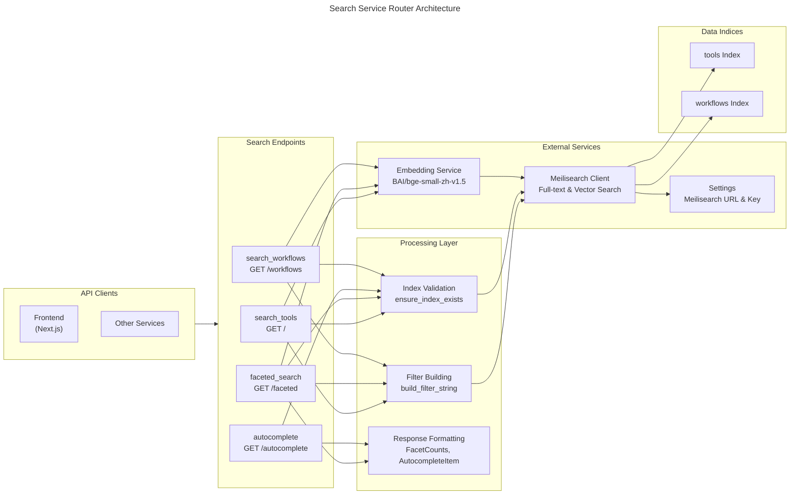
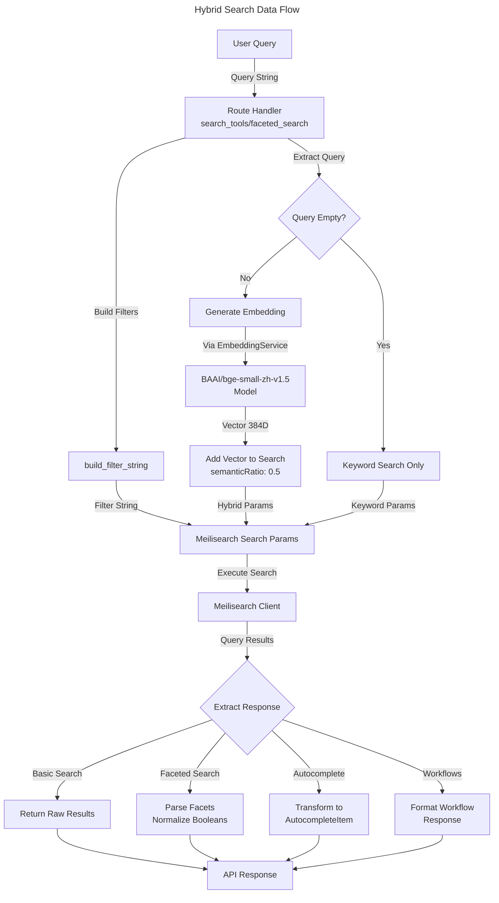

# C4 Code Level: Search Service Routers

## Overview

- **Name**: Search Service Routers
- **Description**: FastAPI route handlers providing full-text and semantic search capabilities for AI tools and agent workflows using Meilisearch integration with hybrid search (keyword + vector embeddings)
- **Location**: `/home/dislove/document/ai 导航/ainav-backend/services/search_service/app/routers`
- **Language**: Python 3.11+
- **Purpose**: Expose search API endpoints for discovering AI tools, browsing workflows, and autocomplete suggestions with advanced filtering and faceted search capabilities

---

## Code Elements

### Router Module

**`search.py`** - FastAPI router module with 4 search endpoints
- **Location**: `/home/dislove/document/ai 导航/ainav-backend/services/search_service/app/routers/search.py`
- **Description**: Core search router implementing basic search, faceted search, autocomplete, and workflow search endpoints with Meilisearch client integration

---

### Response Models (Pydantic)

#### `FacetCounts`
- **Location**: search.py, lines 19-24
- **Type**: Pydantic BaseModel
- **Fields**:
  - `pricing_type: dict[str, int]` - Counts of tools by pricing model (free, freemium, paid)
  - `is_china_accessible: dict[str, int]` - Counts by China accessibility (accessible, not_accessible)
  - `has_api: dict[str, int]` - Counts by API availability (with_api, without_api)
  - `category_slug: dict[str, int]` - Counts of tools by category
- **Purpose**: Represent aggregated facet distributions for dynamic filter UI construction

#### `FacetedSearchResponse`
- **Location**: search.py, lines 27-35
- **Type**: Pydantic BaseModel
- **Fields**:
  - `hits: List[dict]` - Search result documents
  - `query: str` - Original search query string
  - `processing_time_ms: int` - Meilisearch processing time
  - `estimated_total_hits: int` - Total matching documents count
  - `facets: FacetCounts` - Aggregated facet distributions
  - `page: int` - Current page number
  - `page_size: int` - Results per page
- **Purpose**: Complete response for faceted search endpoint with filter options

#### `AutocompleteItem`
- **Location**: search.py, lines 38-41
- **Type**: Pydantic BaseModel
- **Fields**:
  - `name: str` - Tool name (preferring Chinese if available)
  - `slug: str` - URL-friendly tool identifier
- **Purpose**: Lightweight suggestion item for typeahead/autocomplete functionality

#### `AutocompleteResponse`
- **Location**: search.py, lines 44-48
- **Type**: Pydantic BaseModel
- **Fields**:
  - `suggestions: List[AutocompleteItem]` - List of autocomplete items
  - `query: str` - Original search query
  - `processing_time_ms: int` - Query processing time
- **Purpose**: Response for prefix-based autocomplete endpoint

#### `WorkflowSearchResponse`
- **Location**: search.py, lines 51-58
- **Type**: Pydantic BaseModel
- **Fields**:
  - `hits: List[dict]` - Workflow documents matching the query
  - `query: str` - Search query string
  - `processing_time_ms: int` - Query processing time
  - `estimated_total_hits: int` - Total matching workflows
  - `page: int` - Current page number
  - `page_size: int` - Results per page
- **Purpose**: Response for workflow discovery and search endpoint

---

### Helper Functions

#### `ensure_index_exists(index_name: str) -> bool`
- **Location**: search.py, lines 65-74
- **Signature**: `async def ensure_index_exists(index_name: str) -> bool`
- **Parameters**:
  - `index_name: str` - Name of Meilisearch index to verify (e.g., "tools", "workflows")
- **Returns**: `bool` - True if index exists, False if not found
- **Purpose**: Check if a Meilisearch index exists before executing search operations; logs warning if missing
- **Error Handling**: Catches `MeilisearchApiError`, distinguishes between "index_not_found" and other API errors
- **Dependencies**:
  - `client` (module-level Meilisearch Client instance)
  - `logger` (Python logging module)

#### `build_filter_string(filters: List[str]) -> Optional[str]`
- **Location**: search.py, lines 77-81
- **Signature**: `def build_filter_string(filters: List[str]) -> Optional[str]`
- **Parameters**:
  - `filters: List[str]` - List of filter conditions (e.g., `['pricing_type = "free"'`, `'is_china_accessible = true'`)
- **Returns**: `Optional[str]` - Joined filter string with " AND " operator, or None if filters list is empty
- **Purpose**: Construct Meilisearch filter syntax from individual filter conditions; graceful handling of empty filters
- **Algorithm**: Joins filter conditions with " AND " logical operator

---

### FastAPI Route Handlers

#### `search_tools` - Basic Search Endpoint
- **Location**: search.py, lines 88-149
- **Route**: `GET /` (prefix: `/v1/search`)
- **Full Path**: `/v1/search`
- **Signature**:
  ```python
  async def search_tools(
      q: str = Query("", description="Search query"),
      category: Optional[str] = Query(None, description="Filter by category slug"),
      scenario: Optional[str] = Query(None, description="Filter by scenario slug"),
      page: int = Query(1, ge=1),
      page_size: int = Query(20, ge=1, le=100)
  )
  ```
- **Parameters**:
  - `q: str` - Search query string (defaults to empty string)
  - `category: Optional[str]` - Filter by category slug
  - `scenario: Optional[str]` - Filter by scenario slug (array field in Meilisearch)
  - `page: int` - 1-indexed page number (minimum 1)
  - `page_size: int` - Results per page (1-100, default 20)
- **Returns**: `dict` - Raw Meilisearch response with hits, processing time, etc.
- **Purpose**: Perform basic keyword search on AI tools with optional filtering and pagination
- **Features**:
  - Hybrid search (keyword + semantic) when query provided with vector embeddings
  - HTML highlighting with `<mark>` tags
  - Pagination support
  - Category and scenario filtering
- **Error Handling**: Catches generic Exception, logs error, returns HTTP 500 with "Search engine error"
- **Flow**:
  1. Initialize Meilisearch "tools" index
  2. Build filter conditions from category/scenario parameters
  3. Prepare search parameters including offset, limit, highlighting
  4. If query not empty, generate embedding and add vector search parameters
  5. Execute Meilisearch search
  6. Return raw results or error on exception

#### `faceted_search` - Faceted Search with Aggregations
- **Location**: search.py, lines 156-273
- **Route**: `GET /faceted` (prefix: `/v1/search`)
- **Full Path**: `/v1/search/faceted`
- **Response Model**: `FacetedSearchResponse`
- **Signature**:
  ```python
  async def faceted_search(
      q: str = Query("", description="Search query"),
      pricing_type: Optional[str] = Query(None, description="Filter by pricing type (free, freemium, paid)"),
      is_china_accessible: Optional[bool] = Query(None, description="Filter by China accessibility"),
      has_api: Optional[bool] = Query(None, description="Filter by API availability"),
      category: Optional[str] = Query(None, description="Filter by category slug"),
      page: int = Query(1, ge=1, description="Page number (1-indexed)"),
      page_size: int = Query(20, ge=1, le=100, description="Results per page")
  )
  ```
- **Parameters**:
  - `q: str` - Search query (empty string default)
  - `pricing_type: Optional[str]` - Filter: "free", "freemium", or "paid"
  - `is_china_accessible: Optional[bool]` - Filter: True or False
  - `has_api: Optional[bool]` - Filter: True or False
  - `category: Optional[str]` - Filter by category slug
  - `page: int` - 1-indexed page number (minimum 1)
  - `page_size: int` - Results per page (1-100, default 20)
- **Returns**: `FacetedSearchResponse` - Structured response with hits and facet distributions
- **Purpose**: Search AI tools with faceted filtering and aggregated counts for dynamic filter UI
- **Features**:
  - Multi-facet aggregation (pricing, China accessibility, API availability, categories)
  - Boolean facet normalization (string "true"/"false" to "accessible"/"not_accessible", "with_api"/"without_api")
  - Hybrid semantic + keyword search
  - HTML highlighting
- **Index Check**: Verifies "tools" index exists; returns HTTP 503 if unavailable
- **Error Handling**:
  - `MeilisearchApiError`: Returns HTTP 502 with "Search engine error"
  - Generic Exception: Returns HTTP 500 with "Internal server error"
- **Flow**:
  1. Check "tools" index existence
  2. Build filter conditions from all provided parameters
  3. Prepare search with facet aggregations on 4 facets
  4. Add hybrid search if query provided
  5. Execute Meilisearch search
  6. Parse and normalize facet distributions
  7. Return structured `FacetedSearchResponse`

#### `autocomplete` - Typeahead Autocomplete
- **Location**: search.py, lines 280-338
- **Route**: `GET /autocomplete` (prefix: `/v1/search`)
- **Full Path**: `/v1/search/autocomplete`
- **Response Model**: `AutocompleteResponse`
- **Signature**:
  ```python
  async def autocomplete(
      q: str = Query(..., min_length=1, description="Search prefix (at least 1 character)"),
      limit: int = Query(10, ge=1, le=20, description="Maximum number of suggestions")
  )
  ```
- **Parameters**:
  - `q: str` - Search prefix (required, minimum 1 character)
  - `limit: int` - Number of suggestions to return (1-20, default 10)
- **Returns**: `AutocompleteResponse` - List of lightweight suggestions with names and slugs
- **Purpose**: Fast prefix-based autocomplete for tool discovery typeahead UI
- **Features**:
  - Optimized for performance: only retrieves name and slug fields
  - Bilingual support: prefers Chinese name if available, falls back to English
  - Filters search to name fields only (name, name_zh)
  - No HTML highlighting to minimize response size
- **Index Check**: Verifies "tools" index exists; returns HTTP 503 if unavailable
- **Error Handling**:
  - `MeilisearchApiError`: Returns HTTP 502 with "Search engine error"
  - Generic Exception: Returns HTTP 500 with "Internal server error"
- **Flow**:
  1. Check "tools" index existence
  2. Prepare lightweight search parameters (only name, slug fields)
  3. Limit search to name fields (name, name_zh)
  4. Execute Meilisearch search with user-specified limit
  5. Transform results: prefer Chinese name, include slug
  6. Return `AutocompleteResponse` with suggestions list

#### `search_workflows` - Workflow Discovery Search
- **Location**: search.py, lines 345-447
- **Route**: `GET /workflows` (prefix: `/v1/search`)
- **Full Path**: `/v1/search/workflows`
- **Response Model**: `WorkflowSearchResponse`
- **Signature**:
  ```python
  async def search_workflows(
      q: str = Query("", description="Search query for workflow name/description"),
      public_only: bool = Query(True, description="Only return public workflows (default: True)"),
      is_template: Optional[bool] = Query(None, description="Filter by template status"),
      trigger_type: Optional[str] = Query(None, description="Filter by trigger type (manual, schedule, webhook)"),
      page: int = Query(1, ge=1, description="Page number (1-indexed)"),
      page_size: int = Query(20, ge=1, le=100, description="Results per page")
  )
  ```
- **Parameters**:
  - `q: str` - Workflow search query (name/description)
  - `public_only: bool` - Filter to public workflows only (default True)
  - `is_template: Optional[bool]` - Filter by template status
  - `trigger_type: Optional[str]` - Filter: "manual", "schedule", or "webhook"
  - `page: int` - 1-indexed page number (minimum 1)
  - `page_size: int` - Results per page (1-100, default 20)
- **Returns**: `WorkflowSearchResponse` - Workflow results with metadata
- **Purpose**: Discover and browse public agent workflows with filtering by type and trigger configuration
- **Features**:
  - Public/private filtering
  - Template vs. user workflow filtering
  - Trigger type filtering (manual, schedule, webhook)
  - Results sorted by popularity (star_count, run_count descending)
  - Bilingual name/description support
  - Hybrid semantic + keyword search
- **Index Check**: Graceful degradation if "workflows" index missing (returns empty results, no error)
- **Retrieved Fields**: id, name, name_zh, slug, description, description_zh, icon, trigger_type, is_public, is_template, fork_count, run_count, star_count, user_id, created_at, updated_at
- **Error Handling**:
  - `MeilisearchApiError`: Returns HTTP 502 with "Search engine error"
  - Generic Exception: Returns HTTP 500 with "Internal server error"
- **Flow**:
  1. Check "workflows" index; return empty results if missing
  2. Build filter conditions: is_public, is_template, trigger_type
  3. Prepare search with specific attribute retrieval and sorting
  4. Add hybrid search if query provided
  5. Execute Meilisearch search
  6. Return `WorkflowSearchResponse` with results

---

## Dependencies

### Module-Level Globals

- **`router: APIRouter`** (line 11)
  - FastAPI router instance for route registration

- **`client: Client`** (line 12)
  - Meilisearch client initialized with `settings.MEILISEARCH_URL` and `settings.MEILISEARCH_KEY`
  - Singleton instance used across all route handlers

- **`logger: Logger`** (line 9)
  - Python logging logger for this module

---

### Internal Dependencies

**Direct Imports from ainav-backend codebase:**

1. **`shared.config.settings`** (line 6)
   - **Module**: `/home/dislove/document/ai 导航/ainav-backend/shared/config.py`
   - **Provides**:
     - `MEILISEARCH_URL: str` - Meilisearch server URL (default: "http://localhost:7700")
     - `MEILISEARCH_KEY: str` - Meilisearch API key (default: "masterKey")
   - **Usage**: Initialize Meilisearch client (line 12)

2. **`shared.embedding.embedding_service`** (lines 127-128, 228-229, 423-424)
   - **Module**: `/home/dislove/document/ai 导航/ainav-backend/shared/embedding.py`
   - **Provides**: `embedding_service.generate_embedding(text: str) -> list[float]`
   - **Purpose**: Generate vector embeddings for hybrid search
   - **Model**: BAAI/bge-small-zh-v1.5 (lightweight multilingual Chinese/English model)
   - **Usage**: Called conditionally in all search endpoints when query provided

---

### External Dependencies (Third-party Libraries)

**FastAPI Framework:**
- `fastapi.APIRouter` - Router class for grouping related routes
- `fastapi.Query` - Query parameter dependency for OpenAPI validation
- `fastapi.HTTPException` - Exception for HTTP error responses

**Pydantic (Data Validation):**
- `pydantic.BaseModel` - Base class for response models with automatic OpenAPI schema generation

**Meilisearch (Full-text Search Engine):**
- `meilisearch.Client` - Meilisearch Python SDK client for executing searches
- `meilisearch.errors.MeilisearchApiError` - Exception for Meilisearch API errors

**Python Standard Library:**
- `typing.List`, `typing.Optional` - Type hints
- `logging` - Logger instantiation and configuration

---

### Data Models (ORM/Pydantic)

Referenced from `shared.models.py`:

1. **Tool** (SQLAlchemy ORM model)
   - Indexed in Meilisearch as "tools" index
   - Fields searched: name, name_zh, description, description_zh
   - Faceted fields: pricing_type, is_china_accessible, has_api, category_slug
   - Retrieved fields: All tool attributes

2. **AgentWorkflow** (SQLAlchemy ORM model)
   - Indexed in Meilisearch as "workflows" index
   - Fields: name, name_zh, description, description_zh, trigger_type, is_public, is_template, stats (fork_count, run_count, star_count)
   - Sorting: By star_count and run_count (descending)

---

### Environment Configuration

- **MEILISEARCH_URL**: Backend server URL
- **MEILISEARCH_KEY**: API key for authentication
- Both loaded from environment variables via `shared.config.Settings`

---

## Architecture Patterns & Design

### Search Architecture

```
FastAPI Router
    ↓
Four Endpoints:
├── search_tools (basic search)
├── faceted_search (with aggregations)
├── autocomplete (lightweight typeahead)
└── search_workflows (workflow discovery)
    ↓
Meilisearch Client
    ├── Keyword Search (BM25)
    ├── Vector Search (Semantic)
    └── Hybrid Search (0.5 semantic ratio)
    ↓
Embedding Service
    └── BAAI/bge-small-zh-v1.5 model
```

### Hybrid Search Strategy

- **Keyword Component**: Meilisearch BM25 algorithm (exact match, typo tolerance)
- **Semantic Component**: Vector embeddings from `shared.embedding.embedding_service`
- **Combination**: `semanticRatio: 0.5` means 50% semantic, 50% keyword scoring
- **Fallback**: If embedding generation fails, gracefully fallback to keyword-only search

### Error Handling Strategy

| Error Type | Endpoint Handling | HTTP Status | Response |
|------------|------------------|------------|----------|
| Index not found (tools) | HTTP exception | 503 | "Search index not available" |
| Index not found (workflows) | Graceful degradation | 200 | Empty results |
| MeilisearchApiError | Caught and logged | 502 | "Search engine error" |
| Generic Exception | Caught and logged | 500 | "Internal server error" |

### Performance Optimizations

1. **Autocomplete Endpoint**:
   - Only retrieves name and slug fields (reduced payload)
   - Limits search to name fields only
   - Small default limit (10 suggestions)

2. **Faceted Search**:
   - Pre-computed facet aggregations from Meilisearch
   - Normalized boolean facets to readable labels

3. **All Endpoints**:
   - Pagination with configurable page size
   - HTML highlighting for query terms in results

---

## Relationships

### Mermaid Diagram: Search Router Architecture



### Data Flow: Hybrid Search Query



---

## Integration Points

### With Main Service Application

**Location**: `/home/dislove/document/ai 导航/ainav-backend/services/search_service/app/main.py`

```python
app.include_router(search.router, prefix="/v1/search", tags=["search"])
```

- Routes registered under `/v1/search` prefix
- All endpoints tagged as "search" in OpenAPI documentation
- Integrated into FastAPI application instance

---

## Notes

### Design Considerations

1. **Graceful Degradation**: Workflows endpoint returns empty results if index doesn't exist, allowing graceful feature rollout
2. **Bilingual Support**: All endpoints prefer Chinese names/descriptions when available; falls back to English
3. **Hybrid Search**: Balances exact keyword matching with semantic understanding via embeddings
4. **Index Abstraction**: Helper functions abstract away low-level Meilisearch API details
5. **Pagination**: All endpoints support configurable pagination with reasonable defaults (20 per page, max 100)

### Performance Characteristics

- **Autocomplete**: Optimized for real-time typeahead (minimal fields, no highlighting)
- **Basic Search**: Balanced for keyword + semantic with highlighting
- **Faceted Search**: Leverages Meilisearch built-in facet aggregation for efficient counting
- **Workflow Search**: Sorted by popularity metrics (stars, run count) for discovery UI

### Error Recovery

- Embedding failures fall back to keyword-only search gracefully
- Missing indices return appropriate HTTP status codes
- All errors logged with context for debugging

### Future Extensibility

- New search endpoints can reuse `ensure_index_exists()` and `build_filter_string()` helpers
- Additional facets can be easily added to faceted_search endpoint
- Hybrid search semantic ratio configurable via query parameter in future versions
