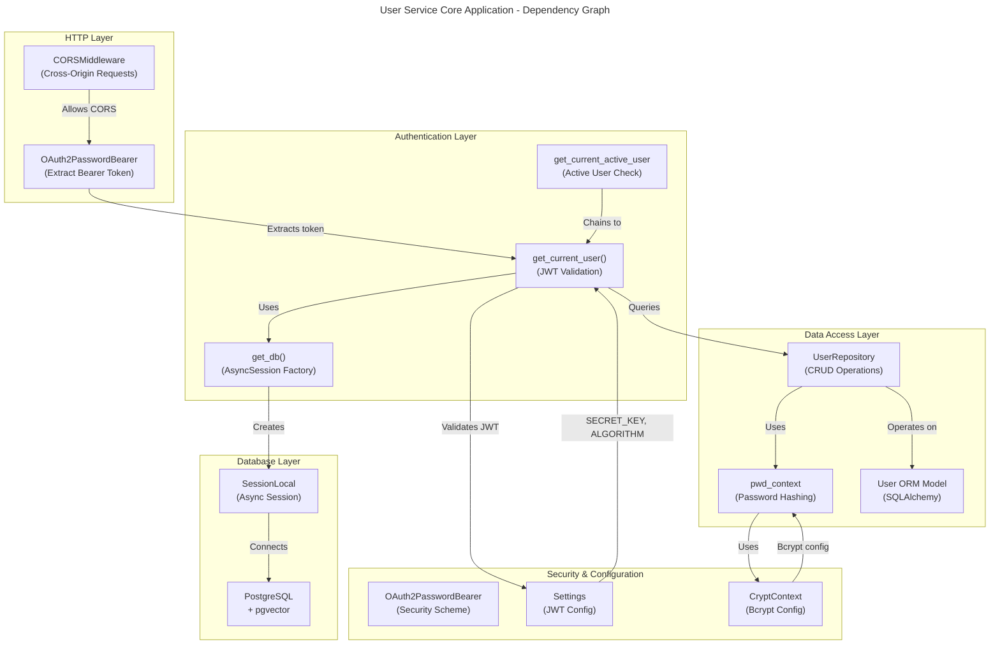

# C4 Code Level: User Service Core Application

## Overview

- **Name:** User Service Core Application
- **Description:** FastAPI application core with JWT authentication, user management, and OAuth support. Implements token-based authentication, password hashing, user CRUD operations, and dependency injection for protected endpoints.
- **Location:** `/home/dislove/document/ai 导航/ainav-backend/services/user_service/app/`
- **Language:** Python 3.11+
- **Purpose:** Provide centralized user authentication, authorization, and profile management for the AI Navigation platform. Handles user registration, login, password management, and integration with OAuth providers (GitHub, WeChat).

## Code Elements

### Module: `main.py`

**File Location:** `/home/dislove/document/ai 导航/ainav-backend/services/user_service/app/main.py`

**Purpose:** FastAPI application initialization, middleware configuration, and router registration.

#### Variables

- `logger: logging.Logger`
  - Description: Logger instance for recording application events and security warnings
  - Type: `logging.Logger`
  - Location: Line 7

- `app: FastAPI`
  - Description: Main FastAPI application instance for the User Service
  - Type: `FastAPI`
  - Location: Line 17
  - Configuration: Title "AI Navigator - User Service"

#### Functions

- `app.add_middleware(CORSMiddleware, ...)`
  - Description: Configures CORS middleware for OAuth redirect flows
  - Parameters:
    - `allow_origins`: List of allowed origins (localhost development)
    - `allow_credentials`: Boolean flag for credential handling
    - `allow_methods`: String wildcard for all HTTP methods
    - `allow_headers`: String wildcard for all headers
  - Location: Lines 20-26
  - Purpose: Enable cross-origin requests for OAuth callback handling

- `app.include_router(router, prefix: str) -> None`
  - Description: Registers route modules with the FastAPI application
  - Calls:
    - `auth.router` at prefix `/v1` (authentication endpoints)
    - `users.router` at prefix `/v1` (user management endpoints)
    - `personalization.router` at prefix `/v1/personalization` (user preferences)
    - `oauth.router` at prefix `/v1` (OAuth provider integration)
  - Location: Lines 28-31

- `health_check() -> dict[str, str]`
  - **Type:** Async HTTP Handler
  - **Signature:** `async def health_check() -> dict[str, str]`
  - **Description:** Health check endpoint for service readiness and liveness probes
  - **HTTP Method:** GET
  - **Route:** `/health`
  - **Return:** Dictionary with status "healthy"
  - **Location:** Lines 33-35
  - **Dependencies:** None

#### Initialization Sequence

1. **Security Validation** (Lines 9-15)
   - Calls `settings.validate_security_settings()` to enforce security constraints
   - Logs warning if running in non-production mode with default SECRET_KEY
   - Ensures production deployments use strong encryption keys

2. **Application Creation** (Line 17)
   - Instantiates FastAPI application with descriptive title

3. **Middleware Setup** (Lines 20-26)
   - Configures CORS for localhost development (ports 3000, 127.0.0.1:3000)
   - Enables credentials in cross-origin requests for OAuth flows

4. **Router Registration** (Lines 28-31)
   - Mounts all service routers with `/v1` API versioning prefix
   - Establishes modular endpoint structure

---

### Module: `dependencies.py`

**File Location:** `/home/dislove/document/ai 导航/ainav-backend/services/user_service/app/dependencies.py`

**Purpose:** Dependency injection for database connections, JWT authentication, and current user extraction.

#### Variables

- `oauth2_scheme: OAuth2PasswordBearer`
  - Description: OAuth2 password flow security scheme for token extraction from Authorization headers
  - Type: `OAuth2PasswordBearer`
  - Token URL: `v1/auth/login`
  - Location: Line 12
  - Purpose: Automatically extracts Bearer tokens from HTTP headers in protected routes

#### Functions

- `get_db() -> AsyncGenerator[AsyncSession, None]`
  - **Type:** Async Generator (Dependency)
  - **Signature:** `async def get_db() -> AsyncGenerator[AsyncSession, None]`
  - **Description:** Database session factory for dependency injection. Creates async SQLAlchemy session for each request.
  - **Yields:** `AsyncSession` - Active database session
  - **Location:** Lines 14-16
  - **Usage Pattern:** Used as `Depends(get_db)` in route handlers
  - **Context Manager:** Uses `SessionLocal()` async context manager
  - **Scope:** Request-scoped (session closed after request completes)

- `get_current_user(db: AsyncSession, token: str) -> User`
  - **Type:** Async Dependency Injector
  - **Signature:** `async def get_current_user(db: AsyncSession = Depends(get_db), token: str = Depends(oauth2_scheme)) -> User`
  - **Description:** Extracts and validates JWT token, retrieves authenticated user from database
  - **Parameters:**
    - `db: AsyncSession` - Injected database session from `get_db()`
    - `token: str` - Injected Bearer token from `oauth2_scheme`
  - **Returns:** `User` - Authenticated user object from database
  - **Raises:** `HTTPException(401)` - If token is invalid, expired, or user not found
  - **Location:** Lines 18-40
  - **Implementation Details:**
    1. Validates JWT token using `settings.SECRET_KEY` and HS256 algorithm
    2. Extracts username from token's `sub` (subject) claim
    3. Queries database for user by username via `UserRepository.get_by_username()`
    4. Raises 401 Unauthorized if token is invalid or user doesn't exist
    5. Returns authenticated `User` object for use in protected endpoints

- `get_current_active_user(current_user: User) -> User`
  - **Type:** Async Dependency Injector (Chained)
  - **Signature:** `async def get_current_active_user(current_user: User = Depends(get_current_user)) -> User`
  - **Description:** Validates that authenticated user has active status. Chains `get_current_user` dependency.
  - **Parameters:**
    - `current_user: User` - Injected from `get_current_user()` dependency
  - **Returns:** `User` - Active user object
  - **Raises:** `HTTPException(400)` - If user's `is_active` flag is False
  - **Location:** Lines 42-47
  - **Purpose:** Prevents inactive/disabled users from accessing protected endpoints
  - **Dependency Chain:** `oauth2_scheme` → `get_db()` → `get_current_user()` → `get_current_active_user()`

#### Token Validation Flow

```
Client Request with Bearer Token
    ↓
oauth2_scheme extracts token from Authorization header
    ↓
get_current_user receives token
    ↓
jwt.decode() validates signature & expiration
    ↓
Extract username from "sub" claim
    ↓
UserRepository queries database by username
    ↓
Return User object or raise HTTPException(401)
    ↓
get_current_active_user checks is_active flag
    ↓
Return authenticated, active User or raise HTTPException(400)
```

#### Error Handling

- **Invalid Token Signature:** JWTError caught, returns 401 with "Could not validate credentials"
- **Missing Sub Claim:** Returns 401 with "Could not validate credentials"
- **User Not Found:** Returns 401 with "Could not validate credentials"
- **Inactive User:** Returns 400 with "Inactive user"

#### Security Headers

- Returns `WWW-Authenticate: Bearer` header in 401 responses (HTTP spec compliance)

---

### Module: `repository.py`

**File Location:** `/home/dislove/document/ai 导航/ainav-backend/services/user_service/app/repository.py`

**Purpose:** Data access layer for user CRUD operations with password hashing and SQLAlchemy async ORM integration.

#### Variables

- `pwd_context: CryptContext`
  - Description: Passlib context for secure bcrypt password hashing and verification
  - Type: `CryptContext`
  - Hash Algorithm: bcrypt (with auto-deprecation of legacy schemes)
  - Location: Line 8
  - Purpose: Provides consistent password hashing/verification throughout the repository

#### Class: `UserRepository`

**Description:** Data access object implementing user database operations with async SQLAlchemy.

**Location:** Lines 10-53

**Constructor**

- `__init__(self, session: AsyncSession) -> None`
  - **Signature:** `def __init__(self, session: AsyncSession)`
  - **Parameters:**
    - `session: AsyncSession` - SQLAlchemy async session instance
  - **Location:** Lines 11-12
  - **Purpose:** Initialize repository with database session
  - **Attributes Created:**
    - `self.session: AsyncSession` - Stores session for query execution

**Methods**

- `get_by_id(user_id: any) -> Optional[User]`
  - **Type:** Async Query Method
  - **Signature:** `async def get_by_id(self, user_id: any) -> Optional[User]`
  - **Description:** Retrieve user by primary key UUID
  - **Parameters:**
    - `user_id: any` - User's UUID primary key
  - **Returns:** `Optional[User]` - User object or None if not found
  - **Location:** Lines 14-17
  - **Query:** `SELECT * FROM users WHERE id = ?`
  - **Index:** Uses primary key index on `users.id`

- `get_by_email(email: str) -> Optional[User]`
  - **Type:** Async Query Method
  - **Signature:** `async def get_by_email(self, email: str) -> Optional[User]`
  - **Description:** Retrieve user by email address (unique constraint)
  - **Parameters:**
    - `email: str` - User's email address
  - **Returns:** `Optional[User]` - User object or None if not found
  - **Location:** Lines 19-22
  - **Query:** `SELECT * FROM users WHERE email = ?`
  - **Index:** Uses unique index on `users.email`
  - **Use Cases:** Registration validation, password reset, OAuth linking

- `get_by_username(username: str) -> Optional[User]`
  - **Type:** Async Query Method
  - **Signature:** `async def get_by_username(self, username: str) -> Optional[User]`
  - **Description:** Retrieve user by username (unique constraint)
  - **Parameters:**
    - `username: str` - User's login username
  - **Returns:** `Optional[User]` - User object or None if not found
  - **Location:** Lines 24-27
  - **Query:** `SELECT * FROM users WHERE username = ?`
  - **Index:** Uses unique index on `users.username`
  - **Use Cases:** JWT validation in `get_current_user()`, login endpoint

- `create(user_in: UserCreate) -> User`
  - **Type:** Async Create Method
  - **Signature:** `async def create(self, user_in: UserCreate) -> User`
  - **Description:** Create new user with hashed password
  - **Parameters:**
    - `user_in: UserCreate` - Pydantic schema with email, username, phone, password
  - **Returns:** `User` - Created user object with populated UUID and timestamps
  - **Location:** Lines 29-40
  - **Implementation Steps:**
    1. Hash plaintext password using bcrypt via `pwd_context.hash()`
    2. Create `User` ORM object with email, username, phone, hashed_password
    3. Add user to session with `session.add()`
    4. Commit transaction with `session.commit()`
    5. Refresh user object to populate `id`, `created_at`, `updated_at`
    6. Return populated user object
  - **Database Constraints Enforced:**
    - Unique email (raises IntegrityError if duplicate)
    - Unique username (raises IntegrityError if duplicate)
    - Unique phone (raises IntegrityError if duplicate)
  - **Fields Set to Defaults:**
    - `is_active = True`
    - `is_superuser = False`
    - `id` = UUID4 (generated)
    - `created_at` = Current timestamp
    - `updated_at` = Current timestamp

- `update(db_user: User, user_in: UserUpdate) -> User`
  - **Type:** Async Update Method
  - **Signature:** `async def update(self, db_user: User, user_in: UserUpdate) -> User`
  - **Description:** Update existing user fields with optional password change
  - **Parameters:**
    - `db_user: User` - Existing user object (typically from `get_*` methods)
    - `user_in: UserUpdate` - Pydantic schema with optional email, username, phone, password
  - **Returns:** `User` - Updated user object
  - **Location:** Lines 42-53
  - **Implementation Steps:**
    1. Extract provided fields from `UserUpdate` using `model_dump(exclude_unset=True)`
    2. If `password` field is present:
       - Hash new password with bcrypt
       - Remove `password` from dict
       - Add `hashed_password` to dict
    3. Apply each field to user object with `setattr()`
    4. Add user to session with `session.add()`
    5. Commit transaction with `session.commit()`
    6. Refresh user object to sync database state
    7. Return updated user object
  - **Features:**
    - Only updates provided fields (partial update support)
    - Automatic password hashing for password changes
    - Preserves unmodified fields
  - **Atomicity:** Single transaction ensures consistency
  - **Use Cases:** Profile updates, password changes, email updates

#### Query Patterns

All methods use SQLAlchemy Future API style:

```python
query = select(User).where(condition)
result = await self.session.execute(query)
return result.scalar_one_or_none()
```

#### Password Security

- **Algorithm:** bcrypt with automatic salt generation
- **Context:** Configured to deprecate legacy hashing schemes
- **Usage:** Password hashed at creation and update
- **Verification:** Not implemented in repository (done in auth router)

---

### Module: `schemas.py`

**File Location:** `/home/dislove/document/ai 导航/ainav-backend/services/user_service/app/schemas.py`

**Purpose:** Pydantic data validation schemas for user operations, authentication, and password management.

#### Class: `UserBase`

**Description:** Base user schema with common fields for all user-related operations.

**Location:** Lines 6-9

**Fields:**

| Field | Type | Validation | Required | Description |
|-------|------|-----------|----------|-------------|
| `email` | `EmailStr` | RFC 5321 email validation | Yes | User's email address (unique) |
| `username` | `str` | - | Yes | User's login username (unique) |
| `phone` | `Optional[str]` | - | No | User's phone number (optional, unique) |

#### Class: `UserCreate`

**Description:** Schema for user registration with password requirement.

**Inherits From:** `UserBase`

**Location:** Lines 11-12

**Additional Fields:**

| Field | Type | Validation | Required | Description |
|-------|------|-----------|----------|-------------|
| `password` | `str` | - | Yes | User's plaintext password (hashed before storage) |

**Use Cases:** POST `/v1/auth/register` endpoint

#### Class: `UserUpdate`

**Description:** Schema for user profile updates with optional fields.

**Location:** Lines 14-18

**Fields:**

| Field | Type | Validation | Required | Description |
|-------|------|-----------|----------|-------------|
| `email` | `Optional[EmailStr]` | RFC 5321 validation | No | New email address |
| `username` | `Optional[str]` | - | No | New username |
| `phone` | `Optional[str]` | - | No | New phone number |
| `password` | `Optional[str]` | - | No | New password (hashed before storage) |

**Features:**
- All fields optional for partial updates
- Pydantic's `exclude_unset=True` in repository ensures only provided fields are updated
- Supports password changes without updating other fields

**Use Cases:** PATCH `/v1/users/{user_id}` endpoint

#### Class: `UserOut`

**Description:** Public user response schema for API responses (excludes sensitive fields).

**Inherits From:** `UserBase`

**Location:** Lines 20-28

**Fields:**

| Field | Type | Description |
|-------|------|-------------|
| `id` | `UUID` | User's unique identifier |
| `is_active` | `bool` | Account active status (excludes inactive users from certain operations) |
| `is_superuser` | `bool` | Admin privilege flag |
| `created_at` | `datetime` | Account creation timestamp |
| `updated_at` | `datetime` | Last update timestamp |

**Configuration:**

```python
class Config:
    from_attributes = True  # Enables ORM mode for SQLAlchemy model conversion
```

**Purpose:** Converts SQLAlchemy `User` ORM objects to JSON responses without exposing `hashed_password`

**Use Cases:**
- GET `/v1/users/me` - Current user profile
- GET `/v1/users/{user_id}` - User details
- POST `/v1/auth/login` - Login response (with token)

#### Class: `Token`

**Description:** JWT access token response schema.

**Location:** Lines 30-32

**Fields:**

| Field | Type | Description |
|-------|------|-------------|
| `access_token` | `str` | JWT token string |
| `token_type` | `str` | Token type (typically "bearer") |

**Token Structure:**
- Header: `{"alg": "HS256", "typ": "JWT"}`
- Payload: `{"sub": username, "exp": expiration_timestamp}`
- Signature: HMAC-SHA256 with `settings.SECRET_KEY`

**Use Cases:**
- POST `/v1/auth/login` response
- POST `/v1/auth/register` response

#### Class: `TokenData`

**Description:** Extracted JWT claims schema for token validation.

**Location:** Lines 34-35

**Fields:**

| Field | Type | Validation | Required | Description |
|-------|------|-----------|----------|-------------|
| `username` | `Optional[str]` | - | No | Username from JWT "sub" claim |

**Usage:** Intermediate schema in `get_current_user()` for token validation

#### Class: `ForgotPasswordRequest`

**Description:** Schema for password reset initiation request.

**Location:** Lines 38-39

**Fields:**

| Field | Type | Validation | Required | Description |
|-------|------|-----------|----------|-------------|
| `email` | `EmailStr` | RFC 5321 validation | Yes | User's email for password reset |

**Use Cases:** POST `/v1/auth/forgot-password` endpoint

#### Class: `ResetPasswordRequest`

**Description:** Schema for completing password reset with token.

**Location:** Lines 41-43

**Fields:**

| Field | Type | Validation | Required | Description |
|-------|------|-----------|----------|-------------|
| `token` | `str` | - | Yes | Password reset token (from email link) |
| `new_password` | `str` | Min 8 characters | Yes | New password for user account |

**Validation Rules:**
- `new_password`: Minimum 8 characters (enforced by Pydantic `Field(..., min_length=8)`)

**Use Cases:** POST `/v1/auth/reset-password` endpoint

#### Class: `ChangePasswordRequest`

**Description:** Schema for authenticated users to change their password.

**Location:** Lines 45-47

**Fields:**

| Field | Type | Validation | Required | Description |
|-------|------|-----------|----------|-------------|
| `current_password` | `str` | - | Yes | User's existing password for verification |
| `new_password` | `str` | Min 8 characters | Yes | New password |

**Usage Flow:**
1. Authenticated user provides current password
2. API verifies against stored `hashed_password`
3. If valid, hash new password and update
4. If invalid, return 401 error

**Use Cases:** POST `/v1/users/change-password` endpoint

#### Class: `MessageResponse`

**Description:** Generic response schema for endpoints returning only a message.

**Location:** Lines 49-50

**Fields:**

| Field | Type | Description |
|-------|------|-------------|
| `message` | `str` | Response message text |

**Use Cases:**
- Password reset confirmation responses
- Account creation success messages
- Generic operation confirmations

#### Pydantic Configuration

All schemas use **Pydantic v2** configuration:
- **Validation Mode:** Strict by default
- **JSON Serialization:** Automatic for datetime fields
- **ORM Mode:** `UserOut` uses `from_attributes = True` for SQLAlchemy compatibility

---

### Module: `__init__.py`

**File Location:** `/home/dislove/document/ai 导航/ainav-backend/services/user_service/app/__init__.py`

**Content:** Empty file (package marker)

**Purpose:** Marks the `app` directory as a Python package for imports

---

## Dependencies

### Internal Dependencies

#### Shared Modules

- **`shared.models.User`**
  - Type: SQLAlchemy ORM Model
  - Location: `/home/dislove/document/ai 导航/ainav-backend/shared/models.py:25-41`
  - Fields Used:
    - `id: UUID` - Primary key
    - `email: str` - Unique email address
    - `username: str` - Unique username
    - `phone: Optional[str]` - Optional unique phone
    - `hashed_password: str` - Bcrypt hashed password
    - `is_active: bool` - Account status flag
    - `is_superuser: bool` - Admin privilege flag
    - `created_at: datetime` - Timestamp from `TimestampMixin`
    - `updated_at: datetime` - Timestamp from `TimestampMixin`
    - `github_id: Optional[str]` - GitHub OAuth provider ID
    - `wechat_id: Optional[str]` - WeChat OAuth provider ID

- **`shared.config.Settings`**
  - Type: Pydantic Settings class
  - Location: `/home/dislove/document/ai 导航/ainav-backend/shared/config.py`
  - Settings Used:
    - `SECRET_KEY: str` - JWT signing key (min 32 chars in production)
    - `ALGORITHM: str` - JWT algorithm (HS256)
    - `ACCESS_TOKEN_EXPIRE_MINUTES: int` - Token TTL (60 minutes)
    - `ENVIRONMENT: str` - Deployment environment
  - Methods Used:
    - `validate_security_settings()` - Security constraint validation

- **`shared.database.SessionLocal`**
  - Type: Async SQLAlchemy Session factory
  - Location: `/home/dislove/document/ai 导航/ainav-backend/shared/database.py`
  - Purpose: Creates async database sessions for dependency injection
  - Pattern: Async context manager (`async with SessionLocal() as session`)

### External Dependencies

#### FastAPI & Web Framework

- **`fastapi`** (v0.100+)
  - `FastAPI` - ASGI application framework
  - `Depends` - Dependency injection mechanism
  - `HTTPException` - HTTP error responses
  - `status` - HTTP status code constants

- **`fastapi.middleware.cors.CORSMiddleware`**
  - CORS middleware for cross-origin request handling
  - Configured for OAuth callback flows

- **`fastapi.security.OAuth2PasswordBearer`**
  - OAuth2 password flow security scheme
  - Extracts Bearer tokens from Authorization headers

#### Cryptography & Security

- **`passlib`** (v1.7.4+)
  - `passlib.context.CryptContext` - Password hashing/verification context
  - Algorithm: bcrypt (with auto-deprecation)
  - Used for: Password hashing at creation, verification in auth router

- **`python-jose`** (v3.3+)
  - `jose.jwt` - JWT token encoding/decoding
  - `jose.JWTError` - JWT validation exceptions
  - Algorithm: HS256 (HMAC-SHA256)
  - Uses `settings.SECRET_KEY` for signing

#### ORM & Database

- **`sqlalchemy`** (v2.0+)
  - `sqlalchemy.future.select` - Modern SQLAlchemy query builder
  - `sqlalchemy.ext.asyncio.AsyncSession` - Async database session
  - Async drivers: `asyncpg` for PostgreSQL

- **`sqlalchemy.orm`**
  - ORM model base class and relationships
  - Object serialization via `from_attributes` config

#### Data Validation

- **`pydantic`** (v2.0+)
  - `BaseModel` - Data validation base class
  - `EmailStr` - Email address validation with RFC 5321
  - `Field` - Field constraints (min_length, description, etc.)

- **`pydantic-settings`** (v2.0+)
  - `BaseSettings` - Environment variable configuration

#### Type Hints

- **`typing`**
  - `Optional[T]` - Nullable type annotation
  - `AsyncGenerator` - Async generator type for dependencies
  - Standard type hints for function signatures

#### Standard Library

- **`logging`**
  - `logging.getLogger()` - Logger creation
  - Used for: Application startup messages, security warnings

- **`datetime`**
  - `datetime` type - Timestamp fields in schemas

- **`uuid`**
  - `UUID` type - User ID primary key

---

## Relationships

### Authentication Flow Architecture

```
User Registration Flow
├─ POST /v1/auth/register
├─ FastAPI validates UserCreate schema
├─ UserRepository.create()
│  ├─ Hash password with bcrypt
│  ├─ Insert User to database
│  └─ Return created user
└─ Response: Token (access_token + token_type)

User Login Flow
├─ POST /v1/auth/login
├─ Validate credentials
├─ Create JWT token with username in "sub" claim
└─ Response: Token (access_token + token_type)

Protected Request Flow
├─ Client sends: Authorization: Bearer {access_token}
├─ oauth2_scheme extracts token
├─ get_current_user()
│  ├─ jwt.decode() validates signature
│  ├─ Extract username from "sub" claim
│  ├─ UserRepository.get_by_username()
│  │  └─ Query: SELECT * FROM users WHERE username = ?
│  └─ Return User object
├─ get_current_active_user() checks is_active
└─ Endpoint receives authenticated User object

Password Reset Flow
├─ POST /v1/auth/forgot-password
├─ Verify email exists via UserRepository.get_by_email()
├─ Generate reset token (typically time-limited)
├─ Send reset link via email
├─ POST /v1/auth/reset-password
├─ Validate token
├─ UserRepository.update() with new hashed password
└─ Return success message

Password Change Flow
├─ POST /v1/users/change-password (authenticated)
├─ Get current user via get_current_active_user()
├─ Verify current_password against hashed_password
├─ UserRepository.update() with new hashed password
└─ Return success message
```

### Dependency Injection Chain

```
Route Handler
│
└─ Depends(get_current_active_user)
   │
   └─ Depends(get_current_user)
      ├─ Depends(oauth2_scheme) → Extracts Bearer token
      └─ Depends(get_db) → Creates AsyncSession
         │
         └─ UserRepository(db) → Database queries
            │
            └─ pwd_context → Password operations

Result: Authenticated User object injected into handler
```

### Data Flow for User Updates

```
PATCH /v1/users/{user_id}
│
├─ FastAPI validates UserUpdate schema (partial)
├─ Retrieve current user: get_current_user() → User
├─ UserRepository.get_by_id(user_id) → Existing User
├─ UserRepository.update(existing_user, user_in)
│  ├─ model_dump(exclude_unset=True) → Only provided fields
│  ├─ Password hashing if password in update_data
│  ├─ setattr() each field on User object
│  ├─ session.commit() → Write to database
│  └─ session.refresh() → Sync with database state
└─ Response: UserOut (excludes hashed_password)
```

### JWT Token Structure

```
Access Token (HS256)
├─ Header: {
│    "alg": "HS256",
│    "typ": "JWT"
│  }
├─ Payload: {
│    "sub": "username",
│    "exp": <expiration_timestamp>,
│    "iat": <issued_at_timestamp>
│  }
└─ Signature: HMAC-SHA256(header.payload, SECRET_KEY)

Token Validation in get_current_user():
├─ jwt.decode(token, SECRET_KEY, algorithms=["HS256"])
├─ Check "exp" claim (auto-validated by jwt.decode)
├─ Extract "sub" claim → username
└─ Query User by username
```

### User Model Relationships

```
User (ORM Model from shared.models)
├─ Attributes (used by this service):
│  ├─ id: UUID (primary key)
│  ├─ email: str (unique, indexed)
│  ├─ username: str (unique, indexed)
│  ├─ phone: Optional[str] (unique, indexed)
│  ├─ hashed_password: str
│  ├─ is_active: bool (for get_current_active_user)
│  ├─ is_superuser: bool (authorization checks)
│  ├─ github_id: Optional[str] (OAuth integration)
│  ├─ wechat_id: Optional[str] (OAuth integration)
│  ├─ created_at: datetime (timestamp mixin)
│  └─ updated_at: datetime (timestamp mixin)
│
└─ Relationships (defined in shared.models):
   ├─ workflows: AgentWorkflow[] (user's workflows)
   └─ interactions: UserInteraction[] (user activity logs)
```

### Error Response Patterns

```
Invalid Credentials (401)
├─ Cause: Invalid token, expired token, user not found
├─ Exception: HTTPException(status_code=401)
├─ Headers: {"WWW-Authenticate": "Bearer"}
└─ Detail: "Could not validate credentials"

Inactive User (400)
├─ Cause: User.is_active = False
├─ Exception: HTTPException(status_code=400)
└─ Detail: "Inactive user"

Validation Error (422)
├─ Cause: Invalid request schema (Pydantic)
├─ Response: Automatic from FastAPI
└─ Detail: List of validation errors
```

---

## Architecture Diagram



---

## Code Execution Paths

### Path 1: User Registration

```python
# Route Handler (in routers/auth.py)
@app.post("/v1/auth/register")
async def register(user_in: UserCreate, db: AsyncSession = Depends(get_db)):
    │
    ├─ FastAPI validates UserCreate schema
    │  ├─ email: EmailStr → RFC 5321 validation
    │  ├─ username: str → Required
    │  └─ password: str → Plaintext (will be hashed)
    │
    ├─ repo = UserRepository(db)
    │
    ├─ repo.create(user_in)
    │  ├─ pwd_context.hash(user_in.password)
    │  │  └─ Bcrypt generates salt + hash
    │  │
    │  ├─ db_user = User(...)
    │  ├─ session.add(db_user)
    │  ├─ session.commit()
    │  │  └─ INSERT into users table
    │  │
    │  ├─ session.refresh(db_user)
    │  │  └─ Populate id, created_at, updated_at
    │  │
    │  └─ return db_user
    │
    └─ Generate JWT token
       ├─ payload = {"sub": username, "exp": expiration}
       ├─ jwt.encode(payload, SECRET_KEY, "HS256")
       └─ return Token(access_token, token_type="bearer")
```

### Path 2: Protected Endpoint Access

```python
# Route Handler (in routers/users.py)
@app.get("/v1/users/me")
async def get_me(current_user: User = Depends(get_current_active_user)):
    │
    ├─ FastAPI invokes get_current_active_user dependency
    │
    ├─ get_current_active_user(current_user = Depends(get_current_user))
    │  │
    │  └─ get_current_user(db, token)
    │     │
    │     ├─ oauth2_scheme extracts token from header
    │     │  └─ Authorization: Bearer {access_token}
    │     │
    │     ├─ jwt.decode(token, SECRET_KEY, ["HS256"])
    │     │  ├─ Validate signature
    │     │  ├─ Validate expiration
    │     │  └─ Extract claims
    │     │
    │     ├─ token_data = TokenData(username=payload["sub"])
    │     │
    │     ├─ repo = UserRepository(db)
    │     │
    │     ├─ user = await repo.get_by_username(token_data.username)
    │     │  └─ SELECT * FROM users WHERE username = ?
    │     │
    │     └─ return user or HTTPException(401)
    │
    └─ current_user.is_active check
       └─ return user or HTTPException(400)

# Handler receives authenticated User object
return UserOut(current_user)
```

### Path 3: User Profile Update

```python
# Route Handler (in routers/users.py)
@app.patch("/v1/users/{user_id}")
async def update_user(
    user_id: UUID,
    user_in: UserUpdate,
    current_user: User = Depends(get_current_active_user),
    db: AsyncSession = Depends(get_db)
):
    │
    ├─ Verify authorization (current_user.id == user_id or is_superuser)
    │
    ├─ repo = UserRepository(db)
    │
    ├─ db_user = await repo.get_by_id(user_id)
    │  └─ SELECT * FROM users WHERE id = ?
    │
    ├─ repo.update(db_user, user_in)
    │  │
    │  ├─ update_data = user_in.model_dump(exclude_unset=True)
    │  │  └─ Only include provided fields
    │  │
    │  ├─ if "password" in update_data:
    │  │  │
    │  │  ├─ hashed = pwd_context.hash(update_data["password"])
    │  │  │  └─ Bcrypt hashing
    │  │  │
    │  │  └─ update_data["hashed_password"] = hashed
    │  │     remove update_data["password"]
    │  │
    │  ├─ for field, value in update_data.items():
    │  │     setattr(db_user, field, value)
    │  │
    │  ├─ session.add(db_user)
    │  ├─ session.commit()
    │  │  └─ UPDATE users SET ... WHERE id = ?
    │  │
    │  ├─ session.refresh(db_user)
    │  │  └─ Sync with database state
    │  │
    │  └─ return db_user
    │
    └─ return UserOut(updated_user)
       └─ JSON response (excludes hashed_password)
```

---

## Data Models Summary

### User Model (Shared)

| Field | Type | Constraints | Used By |
|-------|------|-----------|---------|
| `id` | UUID | Primary Key, Default | All queries, JWT subject |
| `email` | String(255) | Unique, Indexed | Registration, Password reset |
| `username` | String(50) | Unique, Indexed | JWT claims, get_current_user() |
| `phone` | String(20) | Unique, Indexed, Nullable | Profile updates |
| `hashed_password` | String(255) | - | Password verification (in routers) |
| `is_active` | Boolean | Default=True | get_current_active_user() |
| `is_superuser` | Boolean | Default=False | Authorization checks |
| `github_id` | String(50) | Unique, Nullable | OAuth provider linking |
| `wechat_id` | String(50) | Unique, Nullable | OAuth provider linking |
| `created_at` | DateTime | Server Default, Timezone | Audit trail |
| `updated_at` | DateTime | Server Default, OnUpdate | Audit trail |

### Request/Response Schemas

| Schema | Purpose | Fields | Used By |
|--------|---------|--------|---------|
| `UserCreate` | User registration | email, username, phone, password | POST /auth/register |
| `UserUpdate` | Profile updates | email?, username?, phone?, password? | PATCH /users/{id} |
| `UserOut` | API responses | id, email, username, phone, is_active, is_superuser, created_at, updated_at | All user endpoints |
| `Token` | Authentication response | access_token, token_type | POST /auth/login, /auth/register |
| `TokenData` | JWT payload | username | Token validation |
| `ForgotPasswordRequest` | Password reset init | email | POST /auth/forgot-password |
| `ResetPasswordRequest` | Password reset complete | token, new_password | POST /auth/reset-password |
| `ChangePasswordRequest` | Authenticated password change | current_password, new_password | POST /users/change-password |
| `MessageResponse` | Status messages | message | Generic responses |

---

## Security Features

### Authentication Mechanisms

1. **JWT Bearer Token Authentication**
   - Scheme: OAuth2 PasswordBearer
   - Algorithm: HS256 (HMAC-SHA256)
   - Key: `settings.SECRET_KEY` (min 32 chars in production)
   - Claims: `sub` (username), `exp` (expiration), `iat` (issued at)
   - TTL: 60 minutes (configurable via `ACCESS_TOKEN_EXPIRE_MINUTES`)

2. **Password Security**
   - Hashing: Bcrypt with auto-generated salt
   - Context: CryptContext with deprecation handling
   - Never stored in plaintext
   - Hashed at creation and on update

3. **Dependency Chain Security**
   - Database session scoped to request
   - User lookup performed on every protected request
   - Token validation before database query
   - Active status check before endpoint access

### Authorization Checks

- `get_current_user()`: Validates token and user existence
- `get_current_active_user()`: Enforces active account status
- Route handlers: Typically verify ownership or superuser privileges

### CORS Configuration

- Restricted to localhost for development (ports 3000, 127.0.0.1:3000)
- OAuth callback redirect support
- Production should override to actual frontend domain

### Production Security Validation

- `settings.validate_security_settings()` enforces:
  - SECRET_KEY minimum 32 characters
  - No default/weak key patterns
  - Raises `ValueError` if constraints violated

---

## Integration Points

### With Other Services

1. **Agent Service** (ainav-backend/services/agent_service/)
   - Consumes authenticated User via `get_current_active_user()`
   - Uses User.id for agent workflow associations

2. **Content Service** (ainav-backend/services/content_service/)
   - Validates tokens from User Service
   - May consume User.id for personalization

3. **Search Service** (ainav-backend/services/search_service/)
   - May validate User context for personalized results
   - Consumes User.id if authentication required

### OAuth Providers

1. **GitHub OAuth** (routers/oauth.py)
   - Uses `GITHUB_CLIENT_ID`, `GITHUB_CLIENT_SECRET`
   - Links to User.github_id field
   - Callback: `/v1/oauth/github/callback`

2. **WeChat OAuth** (routers/oauth.py)
   - Uses `WECHAT_APP_ID`, `WECHAT_APP_SECRET`
   - Links to User.wechat_id field
   - Callback: `/v1/oauth/wechat/callback`

### Frontend Integration

- Base URL: `FRONTEND_URL` setting (default: http://localhost:3000)
- Token storage: LocalStorage or cookies (frontend decision)
- Token usage: `Authorization: Bearer {access_token}` header

---

## Testing Patterns

### Unit Testing Dependencies

```python
# Mock database session
mock_db = AsyncMock(spec=AsyncSession)

# Mock repository
repo = UserRepository(mock_db)

# Mock password context
with patch('repository.pwd_context'):
    # Test password hashing
    pass

# Mock JWT token
mock_token = jwt.encode(
    {"sub": "testuser", "exp": datetime.utcnow() + timedelta(hours=1)},
    "test-secret",
    "HS256"
)
```

### Integration Testing

```python
# Create test user via repository
user = await repo.create(UserCreate(
    email="test@example.com",
    username="testuser",
    password="testpass123"
))

# Test authenticated request
response = await client.get(
    "/v1/users/me",
    headers={"Authorization": f"Bearer {token}"}
)

# Verify JWT validation
with pytest.raises(HTTPException):
    await get_current_user(db, "invalid-token")
```

---

## Performance Considerations

### Database Queries

- **Indexed lookups:** `get_by_id()`, `get_by_email()`, `get_by_username()` use indexed columns
- **Connection pooling:** AsyncSession from SessionLocal connection pool
- **Async I/O:** Non-blocking database operations

### Caching Opportunities

- User lookups in `get_current_user()` could be cached (Redis) for high-traffic scenarios
- Password context initialization could be cached (already done as module-level variable)

### Scalability

- Stateless design: No in-memory user cache
- Horizontal scaling: Multiple instances can share PostgreSQL backend
- Token validation: Decentralized (no token blacklist needed for expiration)

---

## Notes

- All timestamps use timezone-aware `DateTime(timezone=True)` from PostgreSQL
- Email and phone fields have unique constraints enforced at database level
- Password field never exposed in `UserOut` schema (only `hashed_password` in ORM)
- JWT tokens are not revoked on logout (client-side token deletion); implement blacklist for logout support
- User model includes OAuth provider IDs (`github_id`, `wechat_id`) for social authentication
- Update operations use `exclude_unset=True` pattern for partial updates
- All async operations use `await` syntax for proper async/await semantics
