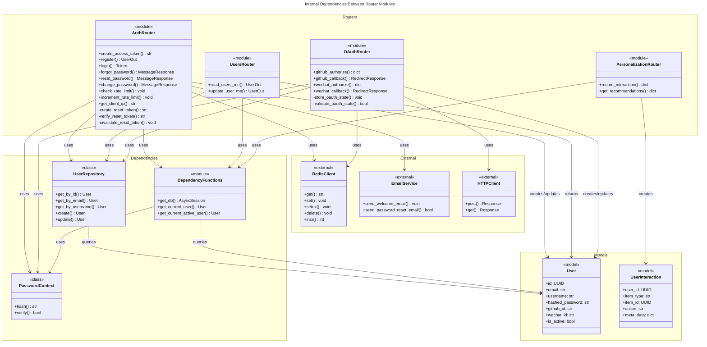

# C4 Code Level: User Service Routers

## Overview

- **Name**: User Service Routers
- **Description**: FastAPI route handlers providing authentication, user management, and OAuth2 social login endpoints for the AI Navigation Platform
- **Location**: `/ainav-backend/services/user_service/app/routers`
- **Language**: Python 3.11+
- **Purpose**: Handle user registration, authentication (JWT), password management, OAuth2 flows (GitHub, WeChat), user profile management, and user interaction tracking

## Code Elements

### Router Modules

#### `auth.py` - Authentication Router
- **Purpose**: Core authentication endpoints for user registration, login, and password management
- **Location**: `/ainav-backend/services/user_service/app/routers/auth.py`
- **Endpoints**:

| Endpoint | Method | Description | Authentication |
|----------|--------|-------------|-----------------|
| `/auth/register` | POST | Register new user account | None (public) |
| `/auth/login` | POST | Authenticate user via username/password | OAuth2PasswordRequestForm |
| `/auth/forgot-password` | POST | Request password reset token | None (public) |
| `/auth/reset-password` | POST | Reset password using token | Token validation |
| `/auth/change-password` | POST | Change password for authenticated user | JWT token required |

**Rate Limiting**:
- Register: 5 requests per hour per IP
- Login: 5 attempts per minute per username, 20 attempts per minute per IP
- Forgot Password: 3 requests per 5 minutes per IP/email

#### `users.py` - User Management Router
- **Purpose**: User profile endpoints for retrieving and updating authenticated user data
- **Location**: `/ainav-backend/services/user_service/app/routers/users.py`
- **Endpoints**:

| Endpoint | Method | Description | Authentication |
|----------|--------|-------------|-----------------|
| `/users/me` | GET | Get current authenticated user profile | JWT token required |
| `/users/me` | PUT | Update current user profile | JWT token required |

#### `oauth.py` - OAuth2 Social Login Router
- **Purpose**: OAuth2 providers (GitHub, WeChat) authentication and user creation/linking
- **Location**: `/ainav-backend/services/user_service/app/routers/oauth.py`
- **Endpoints**:

| Endpoint | Method | Description | Authentication | CSRF Protection |
|----------|--------|-------------|-----------------|---|
| `/oauth/github/authorize` | GET | Redirect to GitHub OAuth authorization page | None (public) | State token (Redis) |
| `/oauth/github/callback` | GET | Handle GitHub OAuth callback, create/update user | Authorization code | State validation |
| `/oauth/wechat/authorize` | GET | Redirect to WeChat OAuth authorization page | None (public) | State token (Redis) |
| `/oauth/wechat/callback` | GET | Handle WeChat OAuth callback, create/update user | Authorization code | State validation |

**OAuth Features**:
- CSRF protection via Redis-stored state tokens (10-minute expiry)
- One-time use state validation
- Automatic user creation on first OAuth login
- Email verification for GitHub (both public and private emails)
- WeChat user identification via unionid/openid

#### `personalization.py` - User Interactions & Recommendations Router
- **Purpose**: Track user interactions and provide personalized recommendations based on activity history
- **Location**: `/ainav-backend/services/user_service/app/routers/personalization.py`
- **Endpoints**:

| Endpoint | Method | Description | Authentication |
|----------|--------|-------------|-----------------|
| `/interactions` | POST | Record user interaction (view, click, run, etc.) | User ID required |
| `/recommendations` | GET | Get personalized recommendations | User ID required |

### Core Functions

#### Authentication Functions

**`create_access_token(data: dict, expires_delta: timedelta = None) -> str`**
- **Location**: `/ainav-backend/services/user_service/app/routers/auth.py:95-107`
- **Description**: Create JWT access token with configurable expiry
- **Parameters**:
  - `data` (dict): Claims to encode in JWT (typically `{"sub": username}`)
  - `expires_delta` (timedelta, optional): Token expiry duration (default: 15 minutes)
- **Returns**: `str` - Encoded JWT token
- **Dependencies**: `jose.jwt`, `settings.SECRET_KEY`, `settings.ALGORITHM`, `settings.get_utc_now()`

**`register(user_in: UserCreate, request: Request, db: AsyncSession) -> UserOut`**
- **Location**: `/ainav-backend/services/user_service/app/routers/auth.py:111-148`
- **Description**: Register new user with rate limiting by IP and email/username validation
- **Parameters**:
  - `user_in` (UserCreate): Registration request (email, username, password)
  - `request` (Request): HTTP request for client IP extraction
  - `db` (AsyncSession): Database session
- **Returns**: `UserOut` - Created user object
- **Raises**:
  - `HTTPException 400`: Email already registered
  - `HTTPException 400`: Username already taken
  - `HTTPException 429`: Rate limit exceeded
- **Side Effects**: Sends welcome email (non-blocking), increments rate limit counter
- **Dependencies**: `UserRepository`, `email_service`, `check_rate_limit()`, `increment_rate_limit()`, `get_client_ip()`

**`login(request: Request, db: AsyncSession, form_data: OAuth2PasswordRequestForm) -> Token`**
- **Location**: `/ainav-backend/services/user_service/app/routers/auth.py:152-193`
- **Description**: Authenticate user and return JWT token with rate limiting (brute force protection)
- **Parameters**:
  - `request` (Request): HTTP request for client IP extraction
  - `db` (AsyncSession): Database session
  - `form_data` (OAuth2PasswordRequestForm): Username and password credentials
- **Returns**: `Token` - Object with `access_token` and `token_type: "bearer"`
- **Raises**:
  - `HTTPException 401`: Invalid username or password
  - `HTTPException 429`: Rate limit exceeded (per-username or per-IP)
- **Dependencies**: `UserRepository`, `check_rate_limit()`, `increment_rate_limit()`, `create_access_token()`, `pwd_context`

**`create_reset_token(email: str) -> str` (async)**
- **Location**: `/ainav-backend/services/user_service/app/routers/auth.py:197-209`
- **Description**: Create secure password reset token stored in Redis with 1-hour expiry
- **Parameters**:
  - `email` (str): User email address (stored as Redis value)
- **Returns**: `str` - 32-byte URL-safe random token
- **Storage**: Redis key `password_reset:{token}` with 3600-second TTL
- **Dependencies**: `redis.asyncio`, `secrets.token_urlsafe()`

**`verify_reset_token(token: str) -> str` (async)**
- **Location**: `/ainav-backend/services/user_service/app/routers/auth.py:213-230`
- **Description**: Validate password reset token and return associated email
- **Parameters**:
  - `token` (str): Password reset token to verify
- **Returns**: `str` - Associated email address
- **Raises**: `HTTPException 400` - Invalid or expired token
- **Dependencies**: `redis.asyncio`

**`invalidate_reset_token(token: str) -> None` (async)**
- **Location**: `/ainav-backend/services/user_service/app/routers/auth.py:234-244`
- **Description**: Delete password reset token from Redis (one-time use enforcement)
- **Parameters**:
  - `token` (str): Token to invalidate
- **Dependencies**: `redis.asyncio`

#### Password Management Endpoints

**`forgot_password(forgot_request: ForgotPasswordRequest, request: Request, db: AsyncSession) -> MessageResponse`**
- **Location**: `/ainav-backend/services/user_service/app/routers/auth.py:247-287`
- **Description**: Request password reset token with rate limiting and optional email sending
- **Parameters**:
  - `forgot_request` (ForgotPasswordRequest): Email address for reset
  - `request` (Request): HTTP request for IP extraction
  - `db` (AsyncSession): Database session
- **Returns**: `MessageResponse` - Generic message (no email enumeration)
- **Rate Limiting**: 3 requests per 5 minutes per IP and email
- **Email**: Calls `email_service.send_password_reset_email()` if configured
- **Development Mode**: Token returned in response for testing
- **Dependencies**: `UserRepository`, `create_reset_token()`, `email_service`, `check_rate_limit()`, `increment_rate_limit()`

**`reset_password(request: ResetPasswordRequest, db: AsyncSession) -> MessageResponse`**
- **Location**: `/ainav-backend/services/user_service/app/routers/auth.py:291-321`
- **Description**: Reset password using valid reset token (one-time use)
- **Parameters**:
  - `request` (ResetPasswordRequest): Reset token and new password
  - `db` (AsyncSession): Database session
- **Returns**: `MessageResponse` - Confirmation message
- **Raises**:
  - `HTTPException 400`: Invalid or expired token
  - `HTTPException 404`: User not found (edge case)
- **Side Effects**: Hashes new password, invalidates token (one-time use)
- **Dependencies**: `UserRepository`, `verify_reset_token()`, `invalidate_reset_token()`, `pwd_context`

**`change_password(request: ChangePasswordRequest, current_user: User, db: AsyncSession) -> MessageResponse`**
- **Location**: `/ainav-backend/services/user_service/app/routers/auth.py:325-351`
- **Description**: Change password for authenticated user with current password verification
- **Parameters**:
  - `request` (ChangePasswordRequest): Current password and new password
  - `current_user` (User): Authenticated user from JWT token
  - `db` (AsyncSession): Database session
- **Returns**: `MessageResponse` - Confirmation message
- **Raises**: `HTTPException 401` - Current password is incorrect
- **Dependencies**: `pwd_context`, `get_current_active_user` dependency

#### User Profile Endpoints

**`read_users_me(current_user: User) -> UserOut`**
- **Location**: `/ainav-backend/services/user_service/app/routers/users.py:10-12`
- **Description**: Get authenticated user's profile information
- **Parameters**:
  - `current_user` (User): Authenticated user from JWT token (dependency)
- **Returns**: `UserOut` - User profile data (id, email, username, timestamps, etc.)
- **Authentication**: JWT token required
- **Dependencies**: `get_current_active_user` dependency

**`update_user_me(user_in: UserUpdate, current_user: User, db: AsyncSession) -> UserOut`**
- **Location**: `/ainav-backend/services/user_service/app/routers/users.py:14-21`
- **Description**: Update authenticated user's profile (email, username, phone, password)
- **Parameters**:
  - `user_in` (UserUpdate): Partial user update data (all fields optional)
  - `current_user` (User): Authenticated user from JWT token
  - `db` (AsyncSession): Database session
- **Returns**: `UserOut` - Updated user object
- **Authentication**: JWT token required
- **Dependencies**: `UserRepository`, `get_current_active_user` dependency

#### OAuth2 Functions (GitHub)

**`github_authorize() -> dict`**
- **Location**: `/ainav-backend/services/user_service/app/routers/oauth.py:97-124`
- **Description**: Redirect user to GitHub OAuth authorization page with CSRF protection
- **Returns**: `dict` with `authorize_url` and `state`
- **CSRF Protection**: Random state token stored in Redis (10-minute expiry)
- **Raises**: `HTTPException 501` - GitHub OAuth not configured
- **Dependencies**: `store_oauth_state()`, `secrets.token_urlsafe()`
- **External**: GitHub OAuth endpoint: `https://github.com/login/oauth/authorize`

**`github_callback(code: str, state: str, db: AsyncSession) -> RedirectResponse`**
- **Location**: `/ainav-backend/services/user_service/app/routers/oauth.py:128-211`
- **Description**: Handle GitHub OAuth callback, exchange code for token, and create/update user
- **Parameters**:
  - `code` (str): Authorization code from GitHub
  - `state` (str): CSRF state for validation
  - `db` (AsyncSession): Database session
- **Returns**: `RedirectResponse` - Redirect to frontend with JWT token in URL
- **Process**:
  1. Validate CSRF state against Redis
  2. Exchange code for GitHub access token
  3. Fetch user info and emails from GitHub API
  4. Find or create user in database
  5. Generate JWT token
  6. Redirect to frontend with token
- **Raises**:
  - `HTTPException 400`: Invalid state, failed token exchange, missing email
  - `HTTPException 501`: GitHub OAuth not configured
- **User Creation**: Auto-creates user with random password, GitHub ID stored for future logins
- **Dependencies**: `validate_oauth_state()`, `UserRepository`, `create_access_token()`, `httpx.AsyncClient`, `pwd_context`
- **External APIs**:
  - Token endpoint: `https://github.com/login/oauth/access_token`
  - User endpoint: `https://api.github.com/user`
  - Emails endpoint: `https://api.github.com/user/emails`

#### OAuth2 Functions (WeChat)

**`wechat_authorize() -> dict`**
- **Location**: `/ainav-backend/services/user_service/app/routers/oauth.py:225-257`
- **Description**: Redirect user to WeChat OAuth authorization page with CSRF protection
- **Returns**: `dict` with `authorize_url` and `state`
- **CSRF Protection**: Random state token stored in Redis (10-minute expiry)
- **Note**: Requires WeChat Open Platform registration and approval for website login
- **Raises**: `HTTPException 501` - WeChat OAuth not configured
- **Dependencies**: `store_oauth_state()`, `secrets.token_urlsafe()`
- **External**: WeChat OAuth endpoint: `https://open.weixin.qq.com/connect/qrconnect`

**`wechat_callback(code: str, state: str, db: AsyncSession) -> RedirectResponse`**
- **Location**: `/ainav-backend/services/user_service/app/routers/oauth.py:261-353`
- **Description**: Handle WeChat OAuth callback with user creation/lookup (implementation note: requires wechat_id field in User model)
- **Parameters**:
  - `code` (str): Authorization code from WeChat
  - `state` (str): CSRF state for validation
  - `db` (AsyncSession): Database session
- **Returns**: `RedirectResponse` - Redirect to frontend with JWT token in URL
- **Process**:
  1. Validate CSRF state against Redis
  2. Exchange code for WeChat access token
  3. Fetch user info from WeChat API using unionid/openid
  4. Find or create user using placeholder email (`wechat_{unionid}@placeholder.local`)
  5. Generate JWT token
  6. Redirect to frontend with token
- **Raises**:
  - `HTTPException 400`: Invalid state, WeChat API errors
  - `HTTPException 501`: WeChat OAuth not configured
- **Note**: Uses `unionid` for cross-platform identification (fallback to `openid`)
- **Dependencies**: `validate_oauth_state()`, `UserRepository`, `create_access_token()`, `httpx.AsyncClient`, `pwd_context`
- **External APIs**:
  - Token endpoint: `https://api.weixin.qq.com/sns/oauth2/access_token`
  - User endpoint: `https://api.weixin.qq.com/sns/userinfo`

#### OAuth2 Helper Functions

**`store_oauth_state(state: str, provider: str) -> None` (async)**
- **Location**: `/ainav-backend/services/user_service/app/routers/oauth.py:64-66`
- **Description**: Store OAuth state in Redis for CSRF validation
- **Parameters**:
  - `state` (str): Random state token
  - `provider` (str): OAuth provider name ("github" or "wechat")
- **Storage**: Redis key `oauth_state:{state}` with value `provider`, 10-minute TTL
- **Dependencies**: `redis.asyncio`

**`validate_oauth_state(state: str, expected_provider: str) -> bool` (async)**
- **Location**: `/ainav-backend/services/user_service/app/routers/oauth.py:70-92`
- **Description**: Validate OAuth state from Redis with one-time use enforcement
- **Parameters**:
  - `state` (str): State parameter from OAuth callback
  - `expected_provider` (str): Expected provider ("github" or "wechat")
- **Returns**: `bool` - True if valid
- **Raises**: `HTTPException 400` - Missing, invalid, or mismatched state
- **Side Effects**: Deletes state from Redis after validation (one-time use)
- **Dependencies**: `redis.asyncio`

#### Rate Limiting Functions

**`check_rate_limit(key: str, limit_type: str, identifier: str) -> None` (async)**
- **Location**: `/ainav-backend/services/user_service/app/routers/auth.py:37-57`
- **Description**: Check rate limit using sliding window counter in Redis
- **Parameters**:
  - `key` (str): Unused parameter (for future extensibility)
  - `limit_type` (str): Type of rate limit ("login", "login_ip", "forgot_password", "register")
  - `identifier` (str): Identifier to rate limit (username, IP, email)
- **Raises**: `HTTPException 429` - Rate limit exceeded with Retry-After header
- **Rate Limit Config**:
  - login: 5 per minute
  - login_ip: 20 per minute
  - forgot_password: 3 per 5 minutes
  - register: 5 per hour
- **Dependencies**: `redis.asyncio`, `RATE_LIMITS` config

**`increment_rate_limit(limit_type: str, identifier: str) -> None` (async)**
- **Location**: `/ainav-backend/services/user_service/app/routers/auth.py:60-74`
- **Description**: Increment rate limit counter with automatic expiry on first increment
- **Parameters**:
  - `limit_type` (str): Type of rate limit
  - `identifier` (str): Identifier to rate limit
- **Storage**: Redis key `rate_limit:{limit_type}:{identifier}` with TTL based on window size
- **Dependencies**: `redis.asyncio`

**`get_client_ip(request: Request) -> str`**
- **Location**: `/ainav-backend/services/user_service/app/routers/auth.py:77-82`
- **Description**: Extract client IP from request, handling X-Forwarded-For proxy headers
- **Parameters**:
  - `request` (Request): HTTP request object
- **Returns**: `str` - Client IP address (or "unknown")
- **Proxy Support**: Extracts first IP from X-Forwarded-For header if present

#### User Interaction Functions

**`record_interaction(interaction: InteractionCreate, user_id: UUID, db: AsyncSession) -> dict`**
- **Location**: `/ainav-backend/services/user_service/app/routers/personalization.py:21-35`
- **Description**: Record user interaction with tools/agents (view, click, run, etc.)
- **Parameters**:
  - `interaction` (InteractionCreate): Interaction data (item_type, item_id, action, meta_data)
  - `user_id` (UUID): User ID (TODO: should use current_user dependency)
  - `db` (AsyncSession): Database session
- **Returns**: `dict` - `{"status": "success"}`
- **Side Effects**: Creates and commits UserInteraction record
- **Note**: TODO - Should authenticate via JWT token instead of accepting user_id
- **Dependencies**: `UserInteraction` model

**`get_recommendations(user_id: UUID, db: AsyncSession) -> dict`**
- **Location**: `/ainav-backend/services/user_service/app/routers/personalization.py:38-60`
- **Description**: Get personalized recommendations based on recent interaction history
- **Parameters**:
  - `user_id` (UUID): User ID (TODO: should use current_user dependency)
  - `db` (AsyncSession): Database session
- **Returns**: `dict` - Message with recent interactions or empty recommendations
- **Algorithm**: Currently returns last 20 interactions; real app would use collaborative filtering or vector search
- **Note**: TODO - Should authenticate via JWT token and implement ML-based recommendations
- **Dependencies**: `UserInteraction`, `SQLAlchemy` query builder

## Dependencies

### Internal Dependencies

**User Service Modules**:
- `shared.models.User` - User ORM model
- `shared.models.UserInteraction` - Interaction tracking model
- `shared.models.Tool` - Tool model (referenced in recommendations)
- `shared.models.AgentWorkflow` - Workflow model (user has workflows)
- `shared.config.settings` - Configuration object
- `shared.email.email_service` - Email sending service
- `shared.database.SessionLocal` - Async database session factory
- `app.repository.UserRepository` - User data access layer
- `app.repository.pwd_context` - Password hashing context
- `app.schemas.*` - Pydantic request/response models
- `app.dependencies.get_db` - Database session dependency
- `app.dependencies.get_current_user` - JWT token validation
- `app.dependencies.get_current_active_user` - Active user validation

### External Dependencies

**FastAPI & Web**:
- `fastapi.APIRouter` - Route grouping
- `fastapi.Depends` - Dependency injection
- `fastapi.HTTPException` - HTTP error responses
- `fastapi.status` - HTTP status codes
- `fastapi.Request` - HTTP request object
- `fastapi.responses.RedirectResponse` - HTTP redirect
- `fastapi.security.OAuth2PasswordRequestForm` - OAuth2 form parsing
- `fastapi.Query` - Query parameter extraction

**Database**:
- `sqlalchemy.ext.asyncio.AsyncSession` - Async database sessions
- `sqlalchemy.future.select` - SQL query builder
- `sqlalchemy.orm.relationship` - ORM relationships

**Security & Authentication**:
- `jose.jwt` - JWT encoding/decoding (PyJWT)
- `jose.JWTError` - JWT validation exceptions
- `passlib.context.CryptContext` - Password hashing (bcrypt)

**Caching & Rate Limiting**:
- `redis.asyncio` - Async Redis client (pyredis)

**HTTP Requests**:
- `httpx.AsyncClient` - Async HTTP client (for OAuth API calls)

**Utilities**:
- `secrets.token_urlsafe()` - Cryptographic random token generation
- `datetime.timedelta` - Time duration calculation
- `logging` - Application logging
- `typing.Optional` - Type hints
- `uuid.UUID` - UUID type handling

**External Services**:
- GitHub OAuth API (`https://github.com/login/oauth/`)
- GitHub User API (`https://api.github.com/user`)
- WeChat OAuth API (`https://open.weixin.qq.com/`)
- WeChat User API (`https://api.weixin.qq.com/sns/`)
- Email service (SMTP via `shared.email.email_service`)
- Redis server (for state/token storage)
- PostgreSQL database (via SQLAlchemy)

## Relationships

### Authentication Flow Diagram

```mermaid
---
title: Authentication Flows for User Service
---
flowchart TB
    subgraph Registration["Registration & Login"]
        RegisterEndpoint["/auth/register"]
        RegisterEndpoint -->|user_in| ValidateEmail{Email<br/>unique?}
        ValidateEmail -->|yes| ValidateUsername{Username<br/>unique?}
        ValidateUsername -->|yes| CreateUser["Create User<br/>Hash password"]
        ValidateUsername -->|no| ErrorUser["HTTPException 400<br/>Username taken"]
        ValidateEmail -->|no| ErrorEmail["HTTPException 400<br/>Email registered"]
        CreateUser -->|UserOut| SendEmail["Send Welcome Email<br/>shared.email_service"]

        LoginEndpoint["/auth/login"]
        LoginEndpoint -->|form_data| RateCheckLogin["Rate Limit Check<br/>Per username & IP"]
        RateCheckLogin -->|exceeded| Error429["HTTPException 429<br/>Too Many Requests"]
        RateCheckLogin -->|ok| FindUser["Find User by<br/>Username"]
        FindUser -->|not found| ErrorAuth["HTTPException 401<br/>Invalid credentials"]
        FindUser -->|found| VerifyPwd["Verify Password<br/>pwd_context"]
        VerifyPwd -->|invalid| IncRateLimit["Increment Rate Limit"]
        IncRateLimit --> ErrorAuth
        VerifyPwd -->|valid| CreateToken["create_access_token<br/>JWT"]
        CreateToken -->|Token| ReturnToken["Return access_token<br/>& token_type"]
    end

    subgraph PasswordReset["Password Reset Flow"]
        ForgotEndpoint["/auth/forgot-password"]
        ForgotEndpoint -->|ForgotPasswordRequest| RateCheckReset["Rate Limit Check<br/>Per IP & Email"]
        RateCheckReset -->|exceeded| Error429Reset["HTTPException 429"]
        RateCheckReset -->|ok| CheckEmail{User<br/>exists?}
        CheckEmail -->|found| CreateResetToken["create_reset_token<br/>Random token"]
        CreateResetToken -->|store in Redis| StoreToken["Redis key:<br/>password_reset:token<br/>TTL: 3600s"]
        CheckEmail -->|not found| SilentReturn["Return same message<br/>for all responses<br/>Prevent enumeration"]
        StoreToken -->|email configured| SendReset["Send Email<br/>email_service"]
        SendReset --> ReturnForgot["Return MessageResponse"]
        StoreToken -->|dev mode| ReturnTokenInDev["Include token in<br/>response for testing"]

        ResetEndpoint["/auth/reset-password"]
        ResetEndpoint -->|ResetPasswordRequest| VerifyToken["verify_reset_token<br/>Query Redis"]
        VerifyToken -->|invalid/expired| ErrorToken["HTTPException 400<br/>Invalid token"]
        VerifyToken -->|valid| FindUserReset["Find User by<br/>Email"]
        FindUserReset -->|not found| ErrorNotFound["HTTPException 404"]
        FindUserReset -->|found| HashNewPwd["Hash new password<br/>pwd_context"]
        HashNewPwd -->|update| UpdateDB["Update User in DB<br/>Commit"]
        UpdateDB -->|invalidate| DeleteToken["invalidate_reset_token<br/>Delete from Redis"]
        DeleteToken -->|success| SuccessReset["Return MessageResponse<br/>Password reset successfully"]

        ChangeEndpoint["/auth/change-password"]
        ChangeEndpoint -->|authenticated user| VerifyCurrentPwd["Verify current password<br/>pwd_context"]
        VerifyCurrentPwd -->|invalid| ErrorCurrentPwd["HTTPException 401<br/>Current password incorrect"]
        VerifyCurrentPwd -->|valid| HashAndUpdate["Hash new password<br/>Update User"]
        HashAndUpdate -->|success| SuccessChange["Return MessageResponse<br/>Password changed"]
    end

    subgraph OAuth2Flow["OAuth2 Social Login"]
        GHAuthorize["/oauth/github/authorize"]
        GHAuthorize -->|generate state| GenState["secrets.token_urlsafe<br/>32 bytes"]
        GenState -->|store| StoreGHState["store_oauth_state<br/>Redis oauth_state:state<br/>TTL: 600s"]
        StoreGHState -->|build URL| BuildGHURL["GitHub OAuth URL<br/>client_id, scope,<br/>redirect_uri, state"]
        BuildGHURL -->|redirect| RedirectGH["Return authorize_url<br/>to client"]

        GHCallback["/oauth/github/callback"]
        GHCallback -->|state + code| ValidateState["validate_oauth_state<br/>Check Redis"]
        ValidateState -->|invalid| ErrorState["HTTPException 400<br/>Invalid/expired state"]
        ValidateState -->|valid| DeleteState["Delete from Redis<br/>one-time use"]
        DeleteState -->|exchange code| TokenExchange["POST GitHub token URL<br/>code -> access_token"]
        TokenExchange -->|failed| ErrorTokenEx["HTTPException 400<br/>Token exchange failed"]
        TokenExchange -->|success| FetchGHUser["GET GitHub /user API<br/>Access-token header"]
        FetchGHUser -->|failed| ErrorGHUser["HTTPException 400"]
        FetchGHUser -->|success| GetEmail["Get email from user<br/>or /user/emails API"]
        GetEmail -->|not found| ErrorEmail2["HTTPException 400<br/>No email available"]
        GetEmail -->|success| FindOrCreate["Find user by email<br/>or create new"]
        FindOrCreate -->|new user| CreateOAuthUser["Create User<br/>github_id, random password"]
        FindOrCreate -->|exists| UpdateGHID["Update github_id<br/>if not set"]
        CreateOAuthUser -->|commit| GenJWT["create_access_token<br/>JWT for user"]
        UpdateGHID -->|commit| GenJWT
        GenJWT -->|build redirect| RedirectFront["Redirect to frontend<br/>with token in URL"]

        WeChatAuthorize["/oauth/wechat/authorize"]
        WeChatAuthorize -->|generate state| GenWCState["secrets.token_urlsafe<br/>32 bytes"]
        GenWCState -->|store| StoreWCState["store_oauth_state<br/>Redis oauth_state:state<br/>TTL: 600s"]
        StoreWCState -->|build URL| BuildWCURL["WeChat OAuth URL<br/>appid, scope,<br/>redirect_uri, state"]
        BuildWCURL -->|redirect| RedirectWC["Return authorize_url<br/>to client"]

        WeChatCallback["/oauth/wechat/callback"]
        WeChatCallback -->|state + code| ValidateWCState["validate_oauth_state<br/>Check Redis"]
        ValidateWCState -->|invalid| ErrorWCState["HTTPException 400"]
        ValidateWCState -->|valid| DeleteWCState["Delete from Redis<br/>one-time use"]
        DeleteWCState -->|exchange code| WCTokenEx["GET WeChat token URL<br/>code -> access_token"]
        WCTokenEx -->|failed| ErrorWCTokenEx["HTTPException 400"]
        WCTokenEx -->|success| FetchWCUser["GET WeChat /userinfo<br/>access_token"]
        FetchWCUser -->|failed| ErrorWCUser["HTTPException 400"]
        FetchWCUser -->|success| GetUnionID["Extract unionid/openid<br/>WeChat user identity"]
        GetUnionID -->|lookup| FindWCUser["Find user by<br/>wechat_id or placeholder email"]
        FindWCUser -->|not found| CreateWCUser["Create User<br/>wechat_id, random password"]
        FindWCUser -->|exists| NoUpdate["User already exists"]
        CreateWCUser -->|commit| GenWCJWT["create_access_token<br/>JWT for user"]
        NoUpdate -->|commit| GenWCJWT
        GenWCJWT -->|build redirect| RedirectWCFront["Redirect to frontend<br/>with token in URL"]
    end

    subgraph Personalization["User Interactions & Recommendations"]
        RecordEndpoint["/interactions"]
        RecordEndpoint -->|InteractionCreate| CreateInteraction["Create UserInteraction<br/>user_id, item_type,<br/>item_id, action"]
        CreateInteraction -->|add| CommitInteraction["db.add & commit"]
        CommitInteraction -->|success| ReturnSuccess["Return status: success"]

        RecEndpoint["/recommendations"]
        RecEndpoint -->|user_id| QueryRecent["Query UserInteraction<br/>WHERE user_id = ?<br/>ORDER BY created_at DESC<br/>LIMIT 20"]
        QueryRecent -->|empty| ReturnEmpty["Return empty<br/>recommendations"]
        QueryRecent -->|found| ReturnRecent["Return recent interactions<br/>as recommendations<br/>TODO: ML filtering"]
    end

    style RegisterEndpoint fill:#e1f5ff
    style LoginEndpoint fill:#e1f5ff
    style ForgotEndpoint fill:#fff3e0
    style ResetEndpoint fill:#fff3e0
    style ChangeEndpoint fill:#e8f5e9
    style GHAuthorize fill:#f3e5f5
    style GHCallback fill:#f3e5f5
    style WeChatAuthorize fill:#fce4ec
    style WeChatCallback fill:#fce4ec
    style RecordEndpoint fill:#f1f8e9
    style RecEndpoint fill:#f1f8e9
```

### Module Dependency Graph

## Notes

### Implementation Status

- **Auth endpoints**: Fully implemented with production-ready features
- **User endpoints**: Basic CRUD operations implemented
- **OAuth2 (GitHub)**: Fully implemented and tested
- **OAuth2 (WeChat)**: Implementation complete, requires WeChat Open Platform registration
- **Personalization**: Basic interaction tracking implemented; recommendations use simple heuristic (TODO: implement ML-based filtering)

### TODO Items

- **Personalization**: `record_interaction()` and `get_recommendations()` should use `get_current_active_user` dependency instead of accepting `user_id` parameter
- **Personalization**: Implement ML-based recommendation algorithm (collaborative filtering or vector search)
- **Email Service**: Consider async task queue for email sending
- **WeChat**: Add `wechat_id` field to User model if not already present
- **OAuth**: Implement account linking when user logs in with different provider (GitHub vs WeChat)
- **Rate Limiting**: Consider implementing distributed rate limiting with user-level quotas

### Configuration

These routes require the following environment variables:
- `SECRET_KEY`: JWT signing key (minimum 32 characters, generated via `secrets.token_urlsafe(32)`)
- `ALGORITHM`: JWT algorithm (default: "HS256")
- `ACCESS_TOKEN_EXPIRE_MINUTES`: JWT expiry (default: 15)
- `REDIS_URL`: Redis connection string
- `FRONTEND_URL`: Frontend application URL for OAuth redirects
- `GITHUB_CLIENT_ID`, `GITHUB_CLIENT_SECRET`, `GITHUB_REDIRECT_URI`: GitHub OAuth credentials
- `WECHAT_APP_ID`, `WECHAT_APP_SECRET`, `WECHAT_REDIRECT_URI`: WeChat OAuth credentials
- `SMTP_*`: Email service configuration (optional, falls back to logging)

### Error Handling

- **400 Bad Request**: Invalid input, missing required fields, token validation failures
- **401 Unauthorized**: Authentication failures, invalid credentials, inactive users
- **404 Not Found**: User not found (edge cases)
- **429 Too Many Requests**: Rate limit exceeded with `Retry-After` header
- **501 Not Implemented**: OAuth provider not configured

All errors are returned as JSON with descriptive messages. Password enumeration attacks are prevented by returning generic messages for password reset requests.
