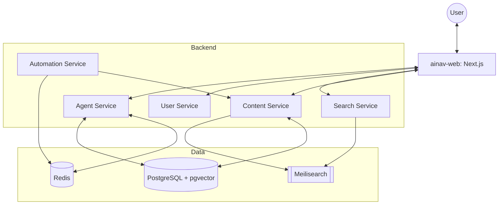

# System Overview: AI Navigation Platform

2026 中国 AI 生态导航平台是一个面向中国用户的下一代 AI 工具导航与智能认知中枢。本项目采用微服务架构，结合自动化内容管线和 agentic 创作平台，旨在构建最完整的 AI 生殖系统。

## 🏗 System Architecture

平台由多个核心微服务组成，运行在容器化环境中：

### 核心微服务 (Core Services)

| Service                | Port | Responsibility                                     |
| ---------------------- | ---- | -------------------------------------------------- |
| **Content Service**    | 8001 | 管理 AI 工具、分类、应用场景的核心数据。           |
| **Search Service**     | 8002 | 提供基于 Meilisearch 的高性能全文检索和向量搜索。  |
| **User Service**       | 8003 | 处理用户认证、个人档案及收藏夹。                   |
| **Automation Service** | 8004 | 自动化内容爬取（GitHub, Product Hunt）和数据清洗。 |
| **Agent Service**      | 8005 | 基于 LangGraph 的 Agent 编排与执行引擎。           |

## 🛠 Technology Stack

### Frontend

- **Framework**: Next.js 15 (App Router)
- **Styling**: Tailwind CSS 4.0 + shadcn/ui
- **State**: TanStack Query + Zustand

### Backend

- **Framework**: FastAPI (Async)
- **ORM**: SQLAlchemy 2.0
- **Task Queue**: Celery + Redis
- **Search**: Meilisearch

### Infrastructure

- **Database**: PostgreSQL 16 with `pgvector`
- **Container**: Docker & Docker Compose
- **AI Engine**: DeepSeek API + LangChain/LangGraph

## 🔄 Core Workflows

1.  **内容自动化 (Content Automation)**:
    - Automation Service 定时轮询外部平台。
    - 数据推送到 Content Service 进行入库。
    - 触发 Meilisearch 索引同步。
2.  **Agent 创作流程 (Agentic Creation)**:
    - 用户在 Web 端可视化编辑 Agent Workflow。
    - Agent Service 存储并在沙箱中执行 LangGraph。
    - 运行结果实时流式返回给用户。

---

_Last Updated: 2026-01-09_
